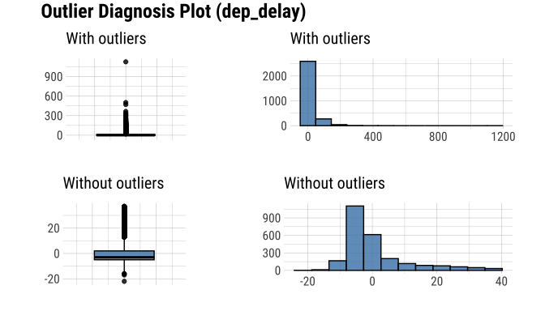
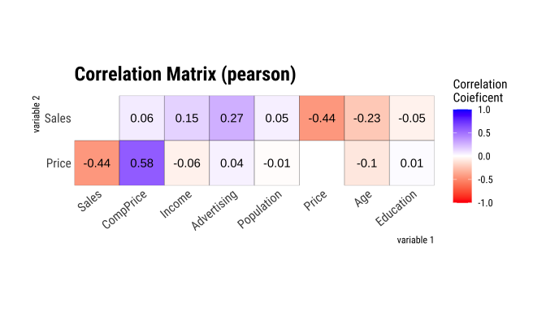
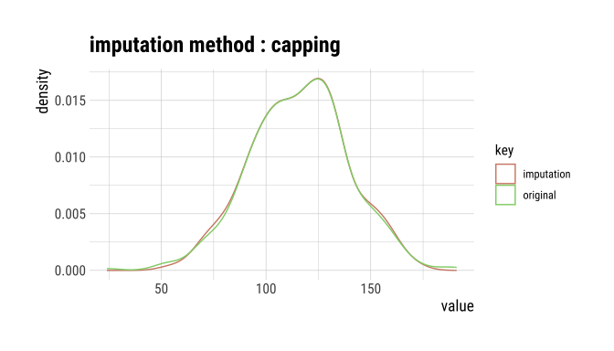
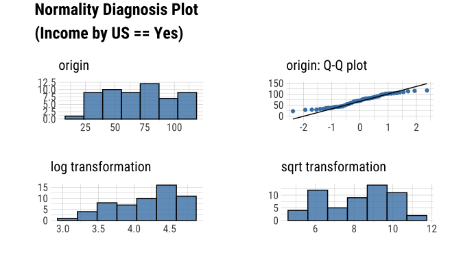
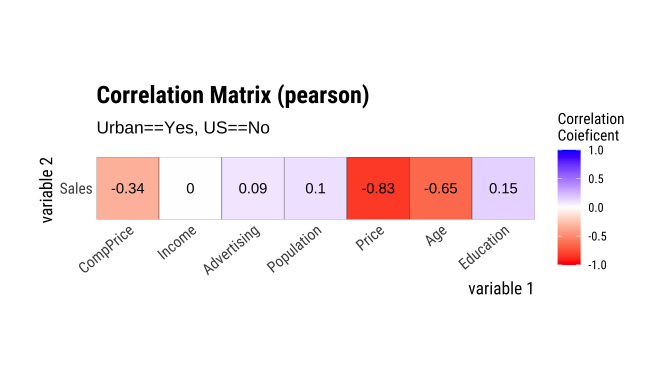

<!-- README.md is generated from README.Rmd. Please edit that file -->

# dlookr 

<!-- badges: start -->

[](https://cran.r-project.org/package=dlookr)
[](https://cran.r-project.org/package=dlookr)
<!-- badges: end -->

## Overview

Diagnose, explore and transform data with `dlookr`.

Features:

- Diagnose data quality.
- Find appropriate scenarios to pursuit the follow-up analysis through
  data exploration and understanding.
- Derive new variables or perform variable transformations.
- Automatically generate reports for the above three tasks.
- Supports quality diagnosis and EDA of table of DBMS.
  - version (≥ 0.3.2)

The name `dlookr` comes from `looking at the data` in the data analysis
process.

## Install dlookr

The released version is available on CRAN

``` r
install.packages("dlookr")
```

Or you can get the development version without vignettes from GitHub:

``` r
devtools::install_github("choonghyunryu/dlookr")
```

Or you can get the development version with vignettes from GitHub:

``` r
install.packages(c("DBI", "RSQLite"))
devtools::install_github("choonghyunryu/dlookr", build_vignettes = TRUE)
```

## Usage

dlookr includes several vignette files, which we use throughout the
documentation.

Provided vignettes is as follows.

- Data quality diagnosis for data.frame, tbl_df, and table of DBMS
- Exploratory Data Analysis for data.frame, tbl_df, and table of DBMS
- Data Transformation
- Data diagnosis and EDA for table of DBMS

``` r
browseVignettes(package = "dlookr")
```

### Data quality diagnosis

#### Data: flights

To illustrate basic use of the dlookr package, use the `flights` data in
dlookr from the `nycflights13` package. The `flights` data frame
contains departure and arrival information on all flights departing from
NYC(i.e. JFK, LGA or EWR) in 2013.

``` r
library(dlookr)
#> 
#> Attaching package: 'dlookr'
#> The following object is masked from 'package:base':
#> 
#>     transform
data(flights)
dim(flights)
#> [1] 3000   19
flights
#> # A tibble: 3,000 × 19
#>     year month   day dep_time sched_dep_time dep_delay arr_time sched_arr_time
#>    <int> <int> <int>    <int>          <int>     <dbl>    <int>          <int>
#>  1  2013     6    17     1033           1040        -7     1246           1309
#>  2  2013    12    26     1343           1329        14     1658           1624
#>  3  2013     8    26     1258           1218        40     1510           1516
#>  4  2013     8    17     1558           1600        -2     1835           1849
#>  5  2013     2    17       NA           1500        NA       NA           1653
#>  6  2013     6    30      905            900         5     1200           1206
#>  7  2013     9    15     1017           1025        -8     1245           1325
#>  8  2013     5     7     1623           1627        -4     1819           1818
#>  9  2013     3    14      703            645        18      854            846
#> 10  2013     9     4      739            740        -1     1030           1055
#> # ℹ 2,990 more rows
#> # ℹ 11 more variables: arr_delay <dbl>, carrier <chr>, flight <int>,
#> #   tailnum <chr>, origin <chr>, dest <chr>, air_time <dbl>, distance <dbl>,
#> #   hour <dbl>, minute <dbl>, time_hour <dttm>
```

#### General diagnosis of all variables with `diagnose()`

`diagnose()` allows you to diagnose variables on a data frame. Like any
other `dplyr` functions, the first argument is the tibble (or data
frame). The second and subsequent arguments refer to variables within
the data frame.

The variables of the `tbl_df` object returned by `diagnose ()` are as
follows.

- `variables` : variable names
- `types` : the data type of the variables
- `missing_count` : number of missing values
- `missing_percent` : percentage of missing values
- `unique_count` : number of unique values
- `unique_rate` : rate of unique value. unique_count / number of
  observation

For example, we can diagnose all variables in `flights`:

``` r
library(dlookr)
library(dplyr)

diagnose(flights)
#> # A tibble: 19 × 6
#>    variables      types   missing_count missing_percent unique_count unique_rate
#>    <chr>          <chr>           <int>           <dbl>        <int>       <dbl>
#>  1 year           integer             0           0                1    0.000333
#>  2 month          integer             0           0               12    0.004   
#>  3 day            integer             0           0               31    0.0103  
#>  4 dep_time       integer            82           2.73           982    0.327   
#>  5 sched_dep_time integer             0           0              588    0.196   
#>  6 dep_delay      numeric            82           2.73           204    0.068   
#>  7 arr_time       integer            87           2.9           1010    0.337   
#>  8 sched_arr_time integer             0           0              920    0.307   
#>  9 arr_delay      numeric            89           2.97           236    0.0787  
#> 10 carrier        charac…             0           0               15    0.005   
#> 11 flight         integer             0           0             1428    0.476   
#> 12 tailnum        charac…            23           0.767         1704    0.568   
#> 13 origin         charac…             0           0                3    0.001   
#> 14 dest           charac…             0           0               93    0.031   
#> 15 air_time       numeric            89           2.97           339    0.113   
#> 16 distance       numeric             0           0              184    0.0613  
#> 17 hour           numeric             0           0               19    0.00633 
#> 18 minute         numeric             0           0               60    0.02    
#> 19 time_hour      POSIXct             0           0             2391    0.797
```

- `Missing Value(NA)` : Variables with many missing values, i.e. those
  with a `missing_percent` close to 100, should be excluded from the
  analysis.
- `Unique value` : Variables with a unique value (`unique_count` = 1)
  are considered to be excluded from data analysis. And if the data type
  is not numeric (integer, numeric) and the number of unique values is
  equal to the number of observations (unique_rate = 1), then the
  variable is likely to be an identifier. Therefore, this variable is
  also not suitable for the analysis model.

`year` can be considered not to be used in the analysis model since
`unique_count` is 1. However, you do not have to remove it if you
configure `date` as a combination of `year`, `month`, and `day`.

For example, we can diagnose only a few selected variables:

``` r
# Select columns by name
diagnose(flights, year, month, day)
#> # A tibble: 3 × 6
#>   variables types   missing_count missing_percent unique_count unique_rate
#>   <chr>     <chr>           <int>           <dbl>        <int>       <dbl>
#> 1 year      integer             0               0            1    0.000333
#> 2 month     integer             0               0           12    0.004   
#> 3 day       integer             0               0           31    0.0103
# Select all columns between year and day (include)
diagnose(flights, year:day)
#> # A tibble: 3 × 6
#>   variables types   missing_count missing_percent unique_count unique_rate
#>   <chr>     <chr>           <int>           <dbl>        <int>       <dbl>
#> 1 year      integer             0               0            1    0.000333
#> 2 month     integer             0               0           12    0.004   
#> 3 day       integer             0               0           31    0.0103
# Select all columns except those from year to day (exclude)
diagnose(flights, -(year:day))
#> # A tibble: 16 × 6
#>    variables      types   missing_count missing_percent unique_count unique_rate
#>    <chr>          <chr>           <int>           <dbl>        <int>       <dbl>
#>  1 dep_time       integer            82           2.73           982     0.327  
#>  2 sched_dep_time integer             0           0              588     0.196  
#>  3 dep_delay      numeric            82           2.73           204     0.068  
#>  4 arr_time       integer            87           2.9           1010     0.337  
#>  5 sched_arr_time integer             0           0              920     0.307  
#>  6 arr_delay      numeric            89           2.97           236     0.0787 
#>  7 carrier        charac…             0           0               15     0.005  
#>  8 flight         integer             0           0             1428     0.476  
#>  9 tailnum        charac…            23           0.767         1704     0.568  
#> 10 origin         charac…             0           0                3     0.001  
#> 11 dest           charac…             0           0               93     0.031  
#> 12 air_time       numeric            89           2.97           339     0.113  
#> 13 distance       numeric             0           0              184     0.0613 
#> 14 hour           numeric             0           0               19     0.00633
#> 15 minute         numeric             0           0               60     0.02   
#> 16 time_hour      POSIXct             0           0             2391     0.797
```

By using with dplyr, variables including missing values can be sorted by
the weight of missing values.:

``` r
flights %>%
  diagnose() %>%
  select(-unique_count, -unique_rate) %>% 
  filter(missing_count > 0) %>% 
  arrange(desc(missing_count))
#> # A tibble: 6 × 4
#>   variables types     missing_count missing_percent
#>   <chr>     <chr>             <int>           <dbl>
#> 1 arr_delay numeric              89           2.97 
#> 2 air_time  numeric              89           2.97 
#> 3 arr_time  integer              87           2.9  
#> 4 dep_time  integer              82           2.73 
#> 5 dep_delay numeric              82           2.73 
#> 6 tailnum   character            23           0.767
```

#### Diagnosis of numeric variables with `diagnose_numeric()`

`diagnose_numeric()` diagnoses numeric(continuous and discrete)
variables in a data frame. Usage is the same as `diagnose()` but returns
more diagnostic information. However, if you specify a non-numeric
variable in the second and subsequent argument list, the variable is
automatically ignored.

The variables of the `tbl_df` object returned by `diagnose_numeric()`
are as follows.

- `min` : minimum value
- `Q1` : 1/4 quartile, 25th percentile
- `mean` : arithmetic mean
- `median` : median, 50th percentile
- `Q3` : 3/4 quartile, 75th percentile
- `max` : maximum value
- `zero` : number of observations with a value of 0
- `minus` : number of observations with negative numbers
- `outlier` : number of outliers

The summary() function summarizes the distribution of individual
variables in the data frame and outputs it to the console. The summary
values of numeric variables are `min`, `Q1`, `mean`, `median`, `Q3` and
`max`, which help to understand the distribution of data.

However, the result displayed on the console has the disadvantage that
the analyst has to look at it with the eyes. However, when the summary
information is returned in a data frame structure such as tbl_df, the
scope of utilization is expanded. `diagnose_numeric()` supports this.

`zero`, `minus`, and `outlier` are useful measures to diagnose data
integrity. For example, numerical data in some cases cannot have zero or
negative numbers. A numeric variable called `employee salary` cannot
have negative numbers or zeros. Therefore, this variable should be
checked for the inclusion of zero or negative numbers in the data
diagnosis process.

`diagnose_numeric()` can diagnose all numeric variables of `flights` as
follows.:

``` r
diagnose_numeric(flights)
#> # A tibble: 14 × 10
#>    variables        min      Q1    mean median      Q3   max  zero minus outlier
#>    <chr>          <dbl>   <dbl>   <dbl>  <dbl>   <dbl> <dbl> <int> <int>   <int>
#>  1 year            2013 2013    2013     2013  2013     2013     0     0       0
#>  2 month              1    4       6.54     7     9.25    12     0     0       0
#>  3 day                1    8      15.8     16    23       31     0     0       0
#>  4 dep_time           1  905.   1354.    1417  1755     2359     0     0       0
#>  5 sched_dep_time   500  910    1354.    1415  1740     2359     0     0       0
#>  6 dep_delay        -22   -5      13.6     -1    12     1126   143  1618     401
#>  7 arr_time           2 1106    1517.    1547  1956     2400     0     0       0
#>  8 sched_arr_time     1 1125    1548.    1604. 1957     2359     0     0       0
#>  9 arr_delay        -70  -17       7.13    -5    15     1109    43  1686     250
#> 10 flight             1  529    1952.    1460  3434.    6177     0     0       0
#> 11 air_time          24   79     149.     126   191      639     0     0      38
#> 12 distance          94  488    1029.     820  1389     4983     0     0       3
#> 13 hour               5    9      13.3     14    17       23     0     0       0
#> 14 minute             0    9.75   26.4     29    44       59   527     0       0
```

If a numeric variable can not logically have a negative or zero value,
it can be used with `filter()` to easily find a variable that does not
logically match:

``` r
diagnose_numeric(flights) %>% 
  filter(minus > 0 | zero > 0) 
#> # A tibble: 3 × 10
#>   variables   min     Q1  mean median    Q3   max  zero minus outlier
#>   <chr>     <dbl>  <dbl> <dbl>  <dbl> <dbl> <dbl> <int> <int>   <int>
#> 1 dep_delay   -22  -5    13.6      -1    12  1126   143  1618     401
#> 2 arr_delay   -70 -17     7.13     -5    15  1109    43  1686     250
#> 3 minute        0   9.75 26.4      29    44    59   527     0       0
```

#### Diagnosis of categorical variables with `diagnose_category()`

`diagnose_category()` diagnoses the categorical(factor, ordered,
character) variables of a data frame. The usage is similar to
`diagnose()` but returns more diagnostic information. If you specify a
non-categorical variable in the second and subsequent argument list, the
variable is automatically ignored.

The `top` argument specifies the number of levels to return for each
variable. The default is 10, which returns the top 10 level. Of course,
if the number of levels is less than 10, all levels are returned.

The variables of the `tbl_df` object returned by `diagnose_category()`
are as follows.

- `variables` : variable names
- `levels`: level names
- `N` : number of observation
- `freq` : number of observation at the levels
- `ratio` : percentage of observation at the levels
- `rank` : rank of occupancy ratio of levels

\``diagnose_category()` can diagnose all categorical variables of
`flights` as follows.:

``` r
diagnose_category(flights)
#> # A tibble: 43 × 6
#>    variables levels     N  freq ratio  rank
#>    <chr>     <chr>  <int> <int> <dbl> <int>
#>  1 carrier   UA      3000   551 18.4      1
#>  2 carrier   EV      3000   493 16.4      2
#>  3 carrier   B6      3000   490 16.3      3
#>  4 carrier   DL      3000   423 14.1      4
#>  5 carrier   AA      3000   280  9.33     5
#>  6 carrier   MQ      3000   214  7.13     6
#>  7 carrier   US      3000   182  6.07     7
#>  8 carrier   9E      3000   151  5.03     8
#>  9 carrier   WN      3000   105  3.5      9
#> 10 carrier   VX      3000    54  1.8     10
#> # ℹ 33 more rows
```

In collaboration with `filter()` in the `dplyr` package, we can see that
the `tailnum` variable is ranked in top 1 with 2,512 missing values in
the case where the missing value is included in the top 10:

``` r
diagnose_category(flights) %>% 
  filter(is.na(levels))
#> # A tibble: 1 × 6
#>   variables levels     N  freq ratio  rank
#>   <chr>     <chr>  <int> <int> <dbl> <int>
#> 1 tailnum   <NA>    3000    23 0.767     1
```

The following example returns a list where the level’s relative
percentage is 0.01% or less. Note that the value of the `top` argument
is set to a large value such as 500. If the default value of 10 was
used, values below 0.01% would not be included in the list:

``` r
flights %>%
  diagnose_category(top = 500)  %>%
  filter(ratio <= 0.01)
#> # A tibble: 0 × 6
#> # ℹ 6 variables: variables <chr>, levels <chr>, N <int>, freq <int>,
#> #   ratio <dbl>, rank <int>
```

In the analytics model, you can also consider removing levels where the
relative frequency is very small in the observations or, if possible,
combining them together.

#### Diagnosing outliers with `diagnose_outlier()`

`diagnose_outlier()` diagnoses the outliers of the numeric (continuous
and discrete) variables of the data frame. The usage is the same as
`diagnose()`.

The variables of the `tbl_df` object returned by `diagnose_outlier()`
are as follows.

- `outliers_cnt` : number of outliers
- `outliers_ratio` : percent of outliers
- `outliers_mean` : arithmetic average of outliers
- `with_mean` : arithmetic average of with outliers
- `without_mean` : arithmetic average of without outliers

`diagnose_outlier()` can diagnose outliers of all numerical variables on
`flights` as follows:

``` r
diagnose_outlier(flights)
#> # A tibble: 14 × 6
#>    variables    outliers_cnt outliers_ratio outliers_mean with_mean without_mean
#>    <chr>               <int>          <dbl>         <dbl>     <dbl>        <dbl>
#>  1 year                    0           0            NaN     2013        2013    
#>  2 month                   0           0            NaN        6.54        6.54 
#>  3 day                     0           0            NaN       15.8        15.8  
#>  4 dep_time                0           0            NaN     1354.       1354.   
#>  5 sched_dep_t…            0           0            NaN     1354.       1354.   
#>  6 dep_delay             401          13.4           94.4     13.6         0.722
#>  7 arr_time                0           0            NaN     1517.       1517.   
#>  8 sched_arr_t…            0           0            NaN     1548.       1548.   
#>  9 arr_delay             250           8.33         121.       7.13       -3.52 
#> 10 flight                  0           0            NaN     1952.       1952.   
#> 11 air_time               38           1.27         389.     149.        146.   
#> 12 distance                3           0.1         4970.    1029.       1025.   
#> 13 hour                    0           0            NaN       13.3        13.3  
#> 14 minute                  0           0            NaN       26.4        26.4
```

Numeric variables that contained outliers are easily found with
`filter()`.:

``` r
diagnose_outlier(flights) %>% 
  filter(outliers_cnt > 0) 
#> # A tibble: 4 × 6
#>   variables outliers_cnt outliers_ratio outliers_mean with_mean without_mean
#>   <chr>            <int>          <dbl>         <dbl>     <dbl>        <dbl>
#> 1 dep_delay          401          13.4           94.4     13.6         0.722
#> 2 arr_delay          250           8.33         121.       7.13       -3.52 
#> 3 air_time            38           1.27         389.     149.        146.   
#> 4 distance             3           0.1         4970.    1029.       1025.
```

The following example finds a numeric variable with an outlier ratio of
5% or more, and then returns the result of dividing mean of outliers by
total mean in descending order:

``` r
diagnose_outlier(flights) %>% 
  filter(outliers_ratio > 5) %>% 
  mutate(rate = outliers_mean / with_mean) %>% 
  arrange(desc(rate)) %>% 
  select(-outliers_cnt)
#> # A tibble: 2 × 6
#>   variables outliers_ratio outliers_mean with_mean without_mean  rate
#>   <chr>              <dbl>         <dbl>     <dbl>        <dbl> <dbl>
#> 1 arr_delay           8.33         121.       7.13       -3.52  16.9 
#> 2 dep_delay          13.4           94.4     13.6         0.722  6.94
```

In cases where the mean of the outliers is large relative to the overall
average, it may be desirable to impute or remove the outliers.

#### Visualization of outliers using `plot_outlier()`

`plot_outlier()` visualizes outliers of numerical variables(continuous
and discrete) of data.frame. Usage is the same `diagnose()`.

The plot derived from the numerical data diagnosis is as follows.

- With outliers box plot
- Without outliers box plot
- With outliers histogram
- Without outliers histogram

The following example uses `diagnose_outlier()`, `plot_outlier()`, and
`dplyr` packages to visualize all numerical variables with an outlier
ratio of 0.5% or higher.

``` r
flights %>%
  plot_outlier(diagnose_outlier(flights) %>% 
                 filter(outliers_ratio >= 0.5) %>% 
                 select(variables) %>% 
                 unlist())
```

<!-- --><!-- --><!-- -->

Analysts should look at the results of the visualization to decide
whether to remove or replace outliers. In some cases, you should
consider removing variables with outliers from the data analysis model.

Looking at the results of the visualization, `arr_delay` shows that the
observed values without outliers are similar to the normal distribution.
In the case of a linear model, we might consider removing or imputing
outliers. And `air_time` has a similar shape before and after removing
outliers.

### Exploratory Data Analysis

#### datasets

To illustrate the basic use of EDA in the dlookr package, I use a
`Carseats` dataset. `Carseats` in the `ISLR` package is a simulated data
set containing sales of child car seats at 400 different stores. This
data is a data.frame created for the purpose of predicting sales volume.

``` r
str(Carseats)
#> 'data.frame':    400 obs. of  11 variables:
#>  $ Sales      : num  9.5 11.22 10.06 7.4 4.15 ...
#>  $ CompPrice  : num  138 111 113 117 141 124 115 136 132 132 ...
#>  $ Income     : num  73 48 35 100 64 113 105 81 110 113 ...
#>  $ Advertising: num  11 16 10 4 3 13 0 15 0 0 ...
#>  $ Population : num  276 260 269 466 340 501 45 425 108 131 ...
#>  $ Price      : num  120 83 80 97 128 72 108 120 124 124 ...
#>  $ ShelveLoc  : Factor w/ 3 levels "Bad","Good","Medium": 1 2 3 3 1 1 3 2 3 3 ...
#>  $ Age        : num  42 65 59 55 38 78 71 67 76 76 ...
#>  $ Education  : num  17 10 12 14 13 16 15 10 10 17 ...
#>  $ Urban      : Factor w/ 2 levels "No","Yes": 2 2 2 2 2 1 2 2 1 1 ...
#>  $ US         : Factor w/ 2 levels "No","Yes": 2 2 2 2 1 2 1 2 1 2 ...
```

The contents of individual variables are as follows. (Refer to
ISLR::Carseats Man page)

- Sales
  - Unit sales (in thousands) at each location
- CompPrice
  - Price charged by competitor at each location
- Income
  - Community income level (in thousands of dollars)
- Advertising
  - Local advertising budget for company at each location (in thousands
    of dollars)
- Population
  - Population size in region (in thousands)
- Price
  - Price company charges for car seats at each site
- ShelveLoc
  - A factor with levels Bad, Good and Medium indicating the quality of
    the shelving location for the car seats at each site
- Age
  - Average age of the local population
- Education
  - Education level at each location
- Urban
  - A factor with levels No and Yes to indicate whether the store is in
    an urban or rural location
- US
  - A factor with levels No and Yes to indicate whether the store is in
    the US or not

When data analysis is performed, data containing missing values is
frequently encountered. However, ‘Carseats’ is complete data without
missing values. So the following script created the missing values and
saved them as `carseats`.

``` r
carseats <- Carseats

suppressWarnings(RNGversion("3.5.0"))
set.seed(123)
carseats[sample(seq(NROW(carseats)), 20), "Income"] <- NA

suppressWarnings(RNGversion("3.5.0"))
set.seed(456)
carseats[sample(seq(NROW(carseats)), 10), "Urban"] <- NA
```

#### Univariate data EDA

##### Calculating descriptive statistics using `describe()`

`describe()` computes descriptive statistics for numerical data. The
descriptive statistics help determine the distribution of numerical
variables. Like function of dplyr, the first argument is the tibble (or
data frame). The second and subsequent arguments refer to variables
within that data frame.

The variables of the `tbl_df` object returned by `describe()` are as
follows.

- `n` : number of observations excluding missing values
- `na` : number of missing values
- `mean` : arithmetic average
- `sd` : standard deviation
- `se_mean` : standard error mean. sd/sqrt(n)
- `IQR` : interquartile range (Q3-Q1)
- `skewness` : skewness
- `kurtosis` : kurtosis
- `p25` : Q1. 25% percentile
- `p50` : median. 50% percentile
- `p75` : Q3. 75% percentile
- `p01`, `p05`, `p10`, `p20`, `p30` : 1%, 5%, 20%, 30% percentiles
- `p40`, `p60`, `p70`, `p80` : 40%, 60%, 70%, 80% percentiles
- `p90`, `p95`, `p99`, `p100` : 90%, 95%, 99%, 100% percentiles

For example, we can computes the statistics of all numerical variables
in `carseats`:

``` r
describe(carseats)
#> # A tibble: 8 × 26
#>   described_variables     n    na   mean     sd se_mean    IQR skewness kurtosis
#>   <chr>               <int> <int>  <dbl>  <dbl>   <dbl>  <dbl>    <dbl>    <dbl>
#> 1 Sales                 400     0   7.50   2.82   0.141   3.93   0.186   -0.0809
#> 2 CompPrice             400     0 125.    15.3    0.767  20     -0.0428   0.0417
#> 3 Income                380    20  68.9   28.1    1.44   48.2    0.0449  -1.09  
#> 4 Advertising           400     0   6.64   6.65   0.333  12      0.640   -0.545 
#> 5 Population            400     0 265.   147.     7.37  260.    -0.0512  -1.20  
#> 6 Price                 400     0 116.    23.7    1.18   31     -0.125    0.452 
#> 7 Age                   400     0  53.3   16.2    0.810  26.2   -0.0772  -1.13  
#> 8 Education             400     0  13.9    2.62   0.131   4      0.0440  -1.30  
#> # ℹ 17 more variables: p00 <dbl>, p01 <dbl>, p05 <dbl>, p10 <dbl>, p20 <dbl>,
#> #   p25 <dbl>, p30 <dbl>, p40 <dbl>, p50 <dbl>, p60 <dbl>, p70 <dbl>,
#> #   p75 <dbl>, p80 <dbl>, p90 <dbl>, p95 <dbl>, p99 <dbl>, p100 <dbl>
```

- `skewness` : The left-skewed distribution data that is the variables
  with large positive skewness should consider the log or sqrt
  transformations to follow the normal distribution. The variables
  `Advertising` seem to need to consider variable transformation.
- `mean` and `sd`, `se_mean` : The`Population` with a large
  `standard error of the mean`(se_mean) has low representativeness of
  the `arithmetic mean`(mean). The `standard deviation`(sd) is much
  larger than the arithmetic average.

The `describe()` function can be sorted by
`left or right skewed size`(skewness) using `dplyr`.:

``` r
carseats %>%
  describe() %>%
  select(described_variables, skewness, mean, p25, p50, p75) %>% 
  filter(!is.na(skewness)) %>% 
  arrange(desc(abs(skewness)))
#> # A tibble: 8 × 6
#>   described_variables skewness   mean    p25    p50    p75
#>   <chr>                  <dbl>  <dbl>  <dbl>  <dbl>  <dbl>
#> 1 Advertising           0.640    6.64   0      5     12   
#> 2 Sales                 0.186    7.50   5.39   7.49   9.32
#> 3 Price                -0.125  116.   100    117    131   
#> 4 Age                  -0.0772  53.3   39.8   54.5   66   
#> 5 Population           -0.0512 265.   139    272    398.  
#> 6 Income                0.0449  68.9   42.8   69     91   
#> 7 Education             0.0440  13.9   12     14     16   
#> 8 CompPrice            -0.0428 125.   115    125    135
```

The `describe()` function supports the `group_by()` function syntax of
the `dplyr` package.

``` r
carseats %>%
  group_by(US) %>% 
  describe(Sales, Income) 
#> # A tibble: 4 × 27
#>   described_variables US        n    na  mean    sd se_mean   IQR skewness
#>   <chr>               <fct> <int> <int> <dbl> <dbl>   <dbl> <dbl>    <dbl>
#> 1 Income              No      130    12 65.8  28.2    2.48  50      0.100 
#> 2 Income              Yes     250     8 70.4  27.9    1.77  48      0.0199
#> 3 Sales               No      142     0  6.82  2.60   0.218  3.44   0.323 
#> 4 Sales               Yes     258     0  7.87  2.88   0.179  4.23   0.0760
#> # ℹ 18 more variables: kurtosis <dbl>, p00 <dbl>, p01 <dbl>, p05 <dbl>,
#> #   p10 <dbl>, p20 <dbl>, p25 <dbl>, p30 <dbl>, p40 <dbl>, p50 <dbl>,
#> #   p60 <dbl>, p70 <dbl>, p75 <dbl>, p80 <dbl>, p90 <dbl>, p95 <dbl>,
#> #   p99 <dbl>, p100 <dbl>
```

``` r
carseats %>%
  group_by(US, Urban) %>% 
  describe(Sales, Income) 
#> # A tibble: 12 × 28
#>    described_variables US    Urban     n    na  mean    sd se_mean    IQR
#>    <chr>               <fct> <fct> <int> <int> <dbl> <dbl>   <dbl>  <dbl>
#>  1 Income              No    No       42     4 60.2  29.1    4.49  45.2  
#>  2 Income              No    Yes      84     8 69.5  27.4    2.99  47    
#>  3 Income              No    <NA>      4     0 48.2  24.7   12.3   40.8  
#>  4 Income              Yes   No       65     4 70.5  29.9    3.70  48    
#>  5 Income              Yes   Yes     179     4 70.3  27.2    2.03  46.5  
#>  6 Income              Yes   <NA>      6     0 75.3  34.3   14.0   47.2  
#>  7 Sales               No    No       46     0  6.46  2.72   0.402  3.15 
#>  8 Sales               No    Yes      92     0  7.00  2.58   0.269  3.49 
#>  9 Sales               No    <NA>      4     0  6.99  1.28   0.639  0.827
#> 10 Sales               Yes   No       69     0  8.23  2.65   0.319  4.1  
#> 11 Sales               Yes   Yes     183     0  7.74  2.97   0.219  4.11 
#> 12 Sales               Yes   <NA>      6     0  7.61  2.61   1.06   3.25 
#> # ℹ 19 more variables: skewness <dbl>, kurtosis <dbl>, p00 <dbl>, p01 <dbl>,
#> #   p05 <dbl>, p10 <dbl>, p20 <dbl>, p25 <dbl>, p30 <dbl>, p40 <dbl>,
#> #   p50 <dbl>, p60 <dbl>, p70 <dbl>, p75 <dbl>, p80 <dbl>, p90 <dbl>,
#> #   p95 <dbl>, p99 <dbl>, p100 <dbl>
```

##### Test of normality on numeric variables using `normality()`

`normality()` performs a normality test on numerical data.
`Shapiro-Wilk normality test` is performed. When the number of
observations is greater than 5000, it is tested after extracting 5000
samples by random simple sampling.

The variables of `tbl_df` object returned by `normality()` are as
follows.

- `statistic` : Statistics of the Shapiro-Wilk test
- `p_value` : p-value of the Shapiro-Wilk test
- `sample` : Number of sample observations performed Shapiro-Wilk test

`normality()` performs the normality test for all numerical variables of
`carseats` as follows.:

``` r
normality(carseats)
#> # A tibble: 8 × 4
#>   vars        statistic  p_value sample
#>   <chr>           <dbl>    <dbl>  <dbl>
#> 1 Sales           0.995 2.54e- 1    400
#> 2 CompPrice       0.998 9.77e- 1    400
#> 3 Income          0.961 1.52e- 8    400
#> 4 Advertising     0.874 1.49e-17    400
#> 5 Population      0.952 4.08e-10    400
#> 6 Price           0.996 3.90e- 1    400
#> 7 Age             0.957 1.86e- 9    400
#> 8 Education       0.924 2.43e-13    400
```

You can use `dplyr` to sort variables that do not follow a normal
distribution in order of `p_value`:

``` r
carseats %>%
  normality() %>%
  filter(p_value <= 0.01) %>% 
  arrange(abs(p_value))
#> # A tibble: 5 × 4
#>   vars        statistic  p_value sample
#>   <chr>           <dbl>    <dbl>  <dbl>
#> 1 Advertising     0.874 1.49e-17    400
#> 2 Education       0.924 2.43e-13    400
#> 3 Population      0.952 4.08e-10    400
#> 4 Age             0.957 1.86e- 9    400
#> 5 Income          0.961 1.52e- 8    400
```

In particular, the `Advertising` variable is considered to be the most
out of the normal distribution.

The `normality()` function supports the `group_by()` function syntax in
the `dplyr` package.

``` r
carseats %>%
  group_by(ShelveLoc, US) %>%
  normality(Income) %>% 
  arrange(desc(p_value))
#> # A tibble: 6 × 6
#>   variable ShelveLoc US    statistic  p_value sample
#>   <chr>    <fct>     <fct>     <dbl>    <dbl>  <dbl>
#> 1 Income   Bad       No        0.969 0.470        34
#> 2 Income   Bad       Yes       0.958 0.0343       62
#> 3 Income   Good      No        0.902 0.0328       24
#> 4 Income   Good      Yes       0.955 0.0296       61
#> 5 Income   Medium    No        0.947 0.00319      84
#> 6 Income   Medium    Yes       0.961 0.000948    135
```

The `Income` variable does not follow the normal distribution. However,
the case where `US` is `No` and `ShelveLoc` is `Good` and `Bad` at the
significance level of 0.01, it follows the normal distribution.

The following example performs `normality test of log(Income)` for each
combination of `ShelveLoc` and `US` categorical variables to search for
variables that follow the normal distribution.

``` r
carseats %>%
  mutate(log_income = log(Income)) %>%
  group_by(ShelveLoc, US) %>%
  normality(log_income) %>%
  filter(p_value > 0.01)
#> # A tibble: 1 × 6
#>   variable   ShelveLoc US    statistic p_value sample
#>   <chr>      <fct>     <fct>     <dbl>   <dbl>  <dbl>
#> 1 log_income Bad       No        0.940  0.0737     34
```

#### Visualization of normality of numerical variables using `plot_normality()`

`plot_normality()` visualizes the normality of numeric data.

The information that `plot_normality()` visualizes is as follows.

- `Histogram of original data`
- `Q-Q plot of original data`
- `histogram of log transformed data`
- `Histogram of square root transformed data`

In the data analysis process, it often encounters numerical data that
follows the `power-law distribution`. Since the numerical data that
follows the `power-law distribution` is converted into a normal
distribution by performing the `log` or `sqrt` transformation, so draw a
histogram of the `log` and `sqrt` transformed data.

`plot_normality()` can also specify several variables like `normality()`
function.

``` r
# Select columns by name
plot_normality(carseats, Sales, CompPrice)
```

<!-- --><!-- -->

The `plot_normality()` function also supports the `group_by()` function
syntax in the `dplyr` package.

``` r
carseats %>%
  filter(ShelveLoc == "Good") %>%
  group_by(US) %>%
  plot_normality(Income)
```

<!-- --><!-- -->

#### EDA of bivariate data

##### Calculation of `correlation coefficient` using `correlate()`

`correlate()` calculates the correlation coefficient of all combinations
of `carseats` numerical variables as follows:

``` r
correlate(carseats)
#> # A tibble: 56 × 3
#>    var1        var2      coef_corr
#>    <fct>       <fct>         <dbl>
#>  1 CompPrice   Sales        0.0641
#>  2 Income      Sales        0.151 
#>  3 Advertising Sales        0.270 
#>  4 Population  Sales        0.0505
#>  5 Price       Sales       -0.445 
#>  6 Age         Sales       -0.232 
#>  7 Education   Sales       -0.0520
#>  8 Sales       CompPrice    0.0641
#>  9 Income      CompPrice   -0.0761
#> 10 Advertising CompPrice   -0.0242
#> # ℹ 46 more rows
```

The following example performs a normality test only on combinations
that include several selected variables.

``` r
# Select columns by name
correlate(carseats, Sales, CompPrice, Income)
#> # A tibble: 21 × 3
#>    var1      var2        coef_corr
#>    <fct>     <fct>           <dbl>
#>  1 CompPrice Sales          0.0641
#>  2 Income    Sales          0.151 
#>  3 Sales     CompPrice      0.0641
#>  4 Income    CompPrice     -0.0761
#>  5 Sales     Income         0.151 
#>  6 CompPrice Income        -0.0761
#>  7 Sales     Advertising    0.270 
#>  8 CompPrice Advertising   -0.0242
#>  9 Income    Advertising    0.0435
#> 10 Sales     Population     0.0505
#> # ℹ 11 more rows
```

`correlate()` produces `two pairs of variables`. So the following
example uses `filter()` to get the correlation coefficient for
`a pair of variable` combinations:

``` r
carseats %>%
  correlate(Sales:Income) %>%
  filter(as.integer(var1) > as.integer(var2))
#> # A tibble: 3 × 3
#>   var1      var2      coef_corr
#>   <fct>     <fct>         <dbl>
#> 1 CompPrice Sales        0.0641
#> 2 Income    Sales        0.151 
#> 3 Income    CompPrice   -0.0761
```

The `correlate()` also supports the `group_by()` function syntax in the
`dplyr` package.

``` r
carseats %>%
  filter(ShelveLoc == "Good") %>%
  group_by(Urban, US) %>%
  correlate(Sales) %>%
  filter(abs(coef_corr) > 0.5)
#> # A tibble: 10 × 5
#>    Urban US    var1  var2       coef_corr
#>    <fct> <fct> <fct> <fct>          <dbl>
#>  1 No    No    Sales Population    -0.530
#>  2 No    No    Sales Price         -0.838
#>  3 No    Yes   Sales Price         -0.630
#>  4 Yes   No    Sales Price         -0.833
#>  5 Yes   No    Sales Age           -0.649
#>  6 Yes   Yes   Sales Price         -0.619
#>  7 <NA>  Yes   Sales CompPrice      0.858
#>  8 <NA>  Yes   Sales Population    -0.806
#>  9 <NA>  Yes   Sales Price         -0.901
#> 10 <NA>  Yes   Sales Age           -0.984
```

##### Visualization of the correlation matrix using `plot.correlate()`

`plot.correlate()` visualizes the correlation matrix.

``` r
carseats %>% 
  correlate() %>%
  plot()
```


`plot.correlate()` can also specify multiple variables with
`correlate()` function. The following is a visualization of the
correlation matrix including several selected variables.

``` r
# Select columns by name
carseats %>% 
  correlate(Sales, Price) %>%
  plot()
```

<!-- -->

The `plot.correlate()` function also supports the `group_by()` function
syntax in the `dplyr` package.

``` r
carseats %>%
  filter(ShelveLoc == "Good") %>%
  group_by(Urban, US) %>%
  correlate(Sales) %>% 
  plot()
```

<!-- --><!-- --><!-- --><!-- --><!-- -->

#### EDA based on target variable

##### Definition of target variable

To perform EDA based on `target variable`, you need to create a
`target_by` class object. `target_by()` creates a `target_by` class with
an object inheriting data.frame or data.frame. `target_by()` is similar
to `group_by()` in `dplyr` which creates `grouped_df`. The difference is
that you specify only one variable.

The following is an example of specifying `US` as target variable in
`carseats` data.frame.:

``` r
categ <- target_by(carseats, US)
```

##### EDA when target variable is categorical variable

Let’s perform EDA when the target variable is a categorical variable.
When the categorical variable `US` is the target variable, we examine
the relationship between the target variable and the predictor.

Cases where predictors are numeric variable:

`relate()` shows the relationship between the target variable and the
predictor. The following example shows the relationship between `Sales`
and the target variable `US`. The predictor `Sales` is a numeric
variable. In this case, the descriptive statistics are shown for each
level of the target variable.

``` r
# If the variable of interest is a numerical variable
cat_num <- relate(categ, Sales)
cat_num
#> # A tibble: 3 × 27
#>   described_variables US        n    na  mean    sd se_mean   IQR skewness
#>   <chr>               <fct> <int> <int> <dbl> <dbl>   <dbl> <dbl>    <dbl>
#> 1 Sales               No      142     0  6.82  2.60   0.218  3.44   0.323 
#> 2 Sales               Yes     258     0  7.87  2.88   0.179  4.23   0.0760
#> 3 Sales               total   400     0  7.50  2.82   0.141  3.93   0.186 
#> # ℹ 18 more variables: kurtosis <dbl>, p00 <dbl>, p01 <dbl>, p05 <dbl>,
#> #   p10 <dbl>, p20 <dbl>, p25 <dbl>, p30 <dbl>, p40 <dbl>, p50 <dbl>,
#> #   p60 <dbl>, p70 <dbl>, p75 <dbl>, p80 <dbl>, p90 <dbl>, p95 <dbl>,
#> #   p99 <dbl>, p100 <dbl>
summary(cat_num)
#>  described_variables     US          n               na         mean      
#>  Length:3            No   :1   Min.   :142.0   Min.   :0   Min.   :6.823  
#>  Class :character    Yes  :1   1st Qu.:200.0   1st Qu.:0   1st Qu.:7.160  
#>  Mode  :character    total:1   Median :258.0   Median :0   Median :7.496  
#>                                Mean   :266.7   Mean   :0   Mean   :7.395  
#>                                3rd Qu.:329.0   3rd Qu.:0   3rd Qu.:7.682  
#>                                Max.   :400.0   Max.   :0   Max.   :7.867  
#>        sd           se_mean            IQR           skewness      
#>  Min.   :2.603   Min.   :0.1412   Min.   :3.442   Min.   :0.07603  
#>  1st Qu.:2.713   1st Qu.:0.1602   1st Qu.:3.686   1st Qu.:0.13080  
#>  Median :2.824   Median :0.1791   Median :3.930   Median :0.18556  
#>  Mean   :2.768   Mean   :0.1796   Mean   :3.866   Mean   :0.19489  
#>  3rd Qu.:2.851   3rd Qu.:0.1988   3rd Qu.:4.077   3rd Qu.:0.25432  
#>  Max.   :2.877   Max.   :0.2184   Max.   :4.225   Max.   :0.32308  
#>     kurtosis             p00              p01              p05       
#>  Min.   :-0.32638   Min.   :0.0000   Min.   :0.4675   Min.   :3.147  
#>  1st Qu.:-0.20363   1st Qu.:0.0000   1st Qu.:0.6868   1st Qu.:3.148  
#>  Median :-0.08088   Median :0.0000   Median :0.9062   Median :3.149  
#>  Mean   : 0.13350   Mean   :0.1233   Mean   :1.0072   Mean   :3.183  
#>  3rd Qu.: 0.36344   3rd Qu.:0.1850   3rd Qu.:1.2771   3rd Qu.:3.200  
#>  Max.   : 0.80776   Max.   :0.3700   Max.   :1.6480   Max.   :3.252  
#>       p10             p20             p25             p30       
#>  Min.   :3.917   Min.   :4.754   Min.   :5.080   Min.   :5.306  
#>  1st Qu.:4.018   1st Qu.:4.910   1st Qu.:5.235   1st Qu.:5.587  
#>  Median :4.119   Median :5.066   Median :5.390   Median :5.867  
#>  Mean   :4.073   Mean   :5.051   Mean   :5.411   Mean   :5.775  
#>  3rd Qu.:4.152   3rd Qu.:5.199   3rd Qu.:5.576   3rd Qu.:6.010  
#>  Max.   :4.184   Max.   :5.332   Max.   :5.763   Max.   :6.153  
#>       p40             p50             p60             p70       
#>  Min.   :5.994   Min.   :6.660   Min.   :7.496   Min.   :7.957  
#>  1st Qu.:6.301   1st Qu.:7.075   1st Qu.:7.787   1st Qu.:8.386  
#>  Median :6.608   Median :7.490   Median :8.078   Median :8.815  
#>  Mean   :6.506   Mean   :7.313   Mean   :8.076   Mean   :8.740  
#>  3rd Qu.:6.762   3rd Qu.:7.640   3rd Qu.:8.366   3rd Qu.:9.132  
#>  Max.   :6.916   Max.   :7.790   Max.   :8.654   Max.   :9.449  
#>       p75             p80              p90              p95       
#>  Min.   :8.523   Min.   : 8.772   Min.   : 9.349   Min.   :11.28  
#>  1st Qu.:8.921   1st Qu.: 9.265   1st Qu.:10.325   1st Qu.:11.86  
#>  Median :9.320   Median : 9.758   Median :11.300   Median :12.44  
#>  Mean   :9.277   Mean   : 9.665   Mean   :10.795   Mean   :12.08  
#>  3rd Qu.:9.654   3rd Qu.:10.111   3rd Qu.:11.518   3rd Qu.:12.49  
#>  Max.   :9.988   Max.   :10.464   Max.   :11.736   Max.   :12.54  
#>       p99             p100      
#>  Min.   :13.64   Min.   :14.90  
#>  1st Qu.:13.78   1st Qu.:15.59  
#>  Median :13.91   Median :16.27  
#>  Mean   :13.86   Mean   :15.81  
#>  3rd Qu.:13.97   3rd Qu.:16.27  
#>  Max.   :14.03   Max.   :16.27
```

`plot()` visualizes the `relate` class object created by `relate()` as
the relationship between the target variable and the predictor variable.
The relationship between `US` and `Sales` is visualized by density plot.

``` r
plot(cat_num)
```

<!-- -->

Cases where predictors are categorical variable:

The following example shows the relationship between `ShelveLoc` and the
target variable `US`. The predictor variable `ShelveLoc` is a
categorical variable. In this case, it shows the `contingency table` of
two variables. The `summary()` function performs `independence test` on
the contingency table.

``` r
# If the variable of interest is a categorical variable
cat_cat <- relate(categ, ShelveLoc)
cat_cat
#>      ShelveLoc
#> US    Bad Good Medium
#>   No   34   24     84
#>   Yes  62   61    135
summary(cat_cat)
#> Call: xtabs(formula = formula_str, data = data, addNA = TRUE)
#> Number of cases in table: 400 
#> Number of factors: 2 
#> Test for independence of all factors:
#>  Chisq = 2.7397, df = 2, p-value = 0.2541
```

`plot()` visualizes the relationship between the target variable and the
predictor. The relationship between `US` and `ShelveLoc` is represented
by a `mosaics plot`.

``` r
plot(cat_cat)
```

<!-- -->

##### EDA when target variable is numerical variable

Let’s perform EDA when the target variable is numeric. When the numeric
variable `Sales` is the target variable, we examine the relationship
between the target variable and the predictor.

``` r
# If the variable of interest is a numerical variable
num <- target_by(carseats, Sales)
```

Cases where predictors are numeric variable:

The following example shows the relationship between `Price` and the
target variable `Sales`. The predictor variable `Price` is a numeric
variable. In this case, it shows the result of a `simple linear model`
of the `target ~ predictor` formula. The `summary()` function expresses
the details of the model.

``` r
# If the variable of interest is a numerical variable
num_num <- relate(num, Price)
num_num
#> 
#> Call:
#> lm(formula = formula_str, data = data)
#> 
#> Coefficients:
#> (Intercept)        Price  
#>    13.64192     -0.05307
summary(num_num)
#> 
#> Call:
#> lm(formula = formula_str, data = data)
#> 
#> Residuals:
#>     Min      1Q  Median      3Q     Max 
#> -6.5224 -1.8442 -0.1459  1.6503  7.5108 
#> 
#> Coefficients:
#>              Estimate Std. Error t value Pr(>|t|)    
#> (Intercept) 13.641915   0.632812  21.558   <2e-16 ***
#> Price       -0.053073   0.005354  -9.912   <2e-16 ***
#> ---
#> Signif. codes:  0 '***' 0.001 '**' 0.01 '*' 0.05 '.' 0.1 ' ' 1
#> 
#> Residual standard error: 2.532 on 398 degrees of freedom
#> Multiple R-squared:  0.198,  Adjusted R-squared:  0.196 
#> F-statistic: 98.25 on 1 and 398 DF,  p-value: < 2.2e-16
```

`plot()` visualizes the relationship between the target and predictor
variables. The relationship between `Sales` and `Price` is visualized
with a scatter plot. The figure on the left shows the scatter plot of
`Sales` and `Price` and the confidence interval of the regression line
and regression line. The figure on the right shows the relationship
between the original data and the predicted values of the linear model
as a scatter plot. If there is a linear relationship between the two
variables, the scatter plot of the observations converges on the red
diagonal line.

``` r
plot(num_num)
```

<!-- -->

Cases where predictors are categorical variable:

The following example shows the relationship between `ShelveLoc` and the
target variable `Sales`. The predictor `ShelveLoc` is a categorical
variable and shows the result of `one-way ANOVA` of `target ~ predictor`
relationship. The results are expressed in terms of ANOVA. The
`summary()` function shows the `regression coefficients` for each level
of the predictor. In other words, it shows detailed information about
`simple regression analysis` of `target ~ predictor` relationship.

``` r
# If the variable of interest is a categorical variable
num_cat <- relate(num, ShelveLoc)
num_cat
#> Analysis of Variance Table
#> 
#> Response: Sales
#>            Df Sum Sq Mean Sq F value    Pr(>F)    
#> ShelveLoc   2 1009.5  504.77   92.23 < 2.2e-16 ***
#> Residuals 397 2172.7    5.47                      
#> ---
#> Signif. codes:  0 '***' 0.001 '**' 0.01 '*' 0.05 '.' 0.1 ' ' 1
summary(num_cat)
#> 
#> Call:
#> lm(formula = formula(formula_str), data = data)
#> 
#> Residuals:
#>     Min      1Q  Median      3Q     Max 
#> -7.3066 -1.6282 -0.0416  1.5666  6.1471 
#> 
#> Coefficients:
#>                 Estimate Std. Error t value Pr(>|t|)    
#> (Intercept)       5.5229     0.2388  23.131  < 2e-16 ***
#> ShelveLocGood     4.6911     0.3484  13.464  < 2e-16 ***
#> ShelveLocMedium   1.7837     0.2864   6.229  1.2e-09 ***
#> ---
#> Signif. codes:  0 '***' 0.001 '**' 0.01 '*' 0.05 '.' 0.1 ' ' 1
#> 
#> Residual standard error: 2.339 on 397 degrees of freedom
#> Multiple R-squared:  0.3172, Adjusted R-squared:  0.3138 
#> F-statistic: 92.23 on 2 and 397 DF,  p-value: < 2.2e-16
```

`plot()` visualizes the relationship between the target variable and the
predictor. The relationship between `Sales` and `ShelveLoc` is
represented by a `box plot`.

``` r
plot(num_cat)
```

<!-- -->

### Data Transformation

dlookr imputes missing values and outliers and resolves skewed data. It
also provides the ability to bin continuous variables as categorical
variables.

Here is a list of the data conversion functions and functions provided
by dlookr:

- `find_na()` finds a variable that contains the missing values
  variable, and `imputate_na()` imputes the missing values.
- `find_outliers()` finds a variable that contains the outliers, and
  `imputate_outlier()` imputes the outlier.
- `summary.imputation()` and `plot.imputation()` provide information and
  visualization of the imputed variables.
- `find_skewness()` finds the variables of the skewed data, and
  `transform()` performs the resolving of the skewed data.
- `transform()` also performs standardization of numeric variables.
- `summary.transform()` and `plot.transform()` provide information and
  visualization of transformed variables.
- `binning()` and `binning_by()` convert binational data into
  categorical data.
- `print.bins()` and `summary.bins()` show and summarize the binning
  results.
- `plot.bins()` and `plot.optimal_bins()` provide visualization of the
  binning result.
- `transformation_report()` performs the data transform and reports the
  result.

#### Imputation of missing values

##### imputes the missing value with `imputate_na()`

`imputate_na()` imputes the missing value contained in the variable. The
predictor with missing values support both numeric and categorical
variables, and supports the following `method`.

- predictor is numerical variable
  - “mean” : arithmetic mean
  - “median” : median
  - “mode” : mode
  - “knn” : K-nearest neighbors
    - target variable must be specified
  - “rpart” : Recursive Partitioning and Regression Trees
    - target variable must be specified  
  - “mice” : Multivariate Imputation by Chained Equations
    - target variable must be specified  
    - random seed must be set
- predictor is categorical variable
  - “mode” : mode
  - “rpart” : Recursive Partitioning and Regression Trees
    - target variable must be specified  
  - “mice” : Multivariate Imputation by Chained Equations
    - target variable must be specified  
    - random seed must be set

In the following example, `imputate_na()` imputes the missing value of
`Income`, a numeric variable of carseats, using the “rpart” method.
`summary()` summarizes missing value imputation information, and
`plot()` visualizes missing information.

``` r
income <- imputate_na(carseats, Income, US, method = "rpart")

# result of imputation
income
#>   [1]  73.00000  48.00000  35.00000 100.00000  64.00000 113.00000 105.00000
#>   [8]  81.00000 110.00000 113.00000  78.00000  94.00000  35.00000  28.00000
#>  [15] 117.00000  95.00000  76.75000  68.70968 110.00000  76.00000  90.00000
#>  [22]  29.00000  46.00000  31.00000 119.00000  32.00000 115.00000 118.00000
#>  [29]  74.00000  99.00000  94.00000  58.00000  32.00000  38.00000  54.00000
#>  [36]  84.00000  76.00000  41.00000  73.00000  69.27778  98.00000  53.00000
#>  [43]  69.00000  42.00000  79.00000  63.00000  90.00000  98.00000  52.00000
#>  [50]  93.00000  32.00000  90.00000  40.00000  64.00000 103.00000  81.00000
#>  [57]  82.00000  91.00000  93.00000  71.00000 102.00000  32.00000  45.00000
#>  [64]  88.00000  67.00000  26.00000  92.00000  61.00000  69.00000  59.00000
#>  [71]  81.00000  51.00000  45.00000  90.00000  68.00000 111.00000  87.00000
#>  [78]  71.00000  48.00000  67.00000 100.00000  72.00000  83.00000  36.00000
#>  [85]  25.00000 103.00000  84.00000  67.00000  42.00000  66.00000  22.00000
#>  [92]  46.00000 113.00000  30.00000  88.93750  25.00000  42.00000  82.00000
#>  [99]  77.00000  47.00000  69.00000  93.00000  22.00000  91.00000  96.00000
#> [106] 100.00000  33.00000 107.00000  79.00000  65.00000  62.00000 118.00000
#> [113]  99.00000  29.00000  87.00000  68.70968  75.00000  53.00000  88.00000
#> [120]  94.00000 105.00000  89.00000 100.00000 103.00000 113.00000  98.33333
#> [127]  68.00000  48.00000 100.00000 120.00000  84.00000  69.00000  87.00000
#> [134]  98.00000  31.00000  94.00000  75.00000  42.00000 103.00000  62.00000
#> [141]  60.00000  42.00000  84.00000  88.00000  68.00000  63.00000  83.00000
#> [148]  54.00000 119.00000 120.00000  84.00000  58.00000  78.00000  36.00000
#> [155]  69.00000  72.00000  34.00000  58.00000  90.00000  60.00000  28.00000
#> [162]  21.00000  83.53846  64.00000  64.00000  58.00000  67.00000  73.00000
#> [169]  89.00000  41.00000  39.00000 106.00000 102.00000  91.00000  24.00000
#> [176]  89.00000  69.27778  72.00000  85.00000  25.00000 112.00000  83.00000
#> [183]  60.00000  74.00000  33.00000 100.00000  51.00000  32.00000  37.00000
#> [190] 117.00000  37.00000  42.00000  26.00000  70.00000  98.00000  93.00000
#> [197]  28.00000  61.00000  80.00000  88.00000  92.00000  83.00000  78.00000
#> [204]  82.00000  80.00000  22.00000  67.00000 105.00000  98.33333  21.00000
#> [211]  41.00000 118.00000  69.00000  84.00000 115.00000  83.00000  43.75000
#> [218]  44.00000  61.00000  79.00000 120.00000  73.47368 119.00000  45.00000
#> [225]  82.00000  25.00000  33.00000  64.00000  73.00000 104.00000  60.00000
#> [232]  69.00000  80.00000  76.00000  62.00000  32.00000  34.00000  28.00000
#> [239]  24.00000 105.00000  80.00000  63.00000  46.00000  25.00000  30.00000
#> [246]  43.00000  56.00000 114.00000  52.00000  67.00000 105.00000 111.00000
#> [253]  97.00000  24.00000 104.00000  81.00000  40.00000  62.00000  38.00000
#> [260]  36.00000 117.00000  42.00000  73.47368  26.00000  29.00000  35.00000
#> [267]  93.00000  82.00000  57.00000  69.00000  26.00000  56.00000  33.00000
#> [274] 106.00000  93.00000 119.00000  69.00000  48.00000 113.00000  57.00000
#> [281]  86.00000  69.00000  96.00000 110.00000  46.00000  26.00000 118.00000
#> [288]  44.00000  40.00000  77.00000 111.00000  70.00000  66.00000  84.00000
#> [295]  76.00000  35.00000  44.00000  83.00000  63.00000  40.00000  78.00000
#> [302]  93.00000  77.00000  52.00000  98.00000  29.00000  32.00000  92.00000
#> [309]  80.00000 111.00000  65.00000  68.00000 117.00000  81.00000  56.57895
#> [316]  21.00000  36.00000  30.00000  72.00000  45.00000  70.00000  39.00000
#> [323]  50.00000 105.00000  65.00000  69.00000  30.00000  38.00000  66.00000
#> [330]  54.00000  59.00000  63.00000  33.00000  60.00000 117.00000  70.00000
#> [337]  35.00000  38.00000  24.00000  44.00000  29.00000 120.00000 102.00000
#> [344]  42.00000  80.00000  68.00000  76.75000  39.00000 102.00000  27.00000
#> [351]  51.83333 115.00000 103.00000  67.00000  31.00000 100.00000 109.00000
#> [358]  73.00000  96.00000  62.00000  86.00000  25.00000  55.00000  51.83333
#> [365]  21.00000  30.00000  56.00000 106.00000  22.00000 100.00000  41.00000
#> [372]  81.00000  68.66667  68.88889  47.00000  46.00000  60.00000  61.00000
#> [379]  88.00000 111.00000  64.00000  65.00000  28.00000 117.00000  37.00000
#> [386]  73.00000 116.00000  73.00000  89.00000  42.00000  75.00000  63.00000
#> [393]  42.00000  51.00000  58.00000 108.00000  81.17647  26.00000  79.00000
#> [400]  37.00000
#> attr(,"var_type")
#> [1] "numerical"
#> attr(,"method")
#> [1] "rpart"
#> attr(,"na_pos")
#>  [1]  17  18  40  95 116 126 163 177 179 209 217 222 263 315 347 351 364 373 374
#> [20] 397
#> attr(,"type")
#> [1] "missing values"
#> attr(,"message")
#> [1] "complete imputation"
#> attr(,"success")
#> [1] TRUE
#> attr(,"class")
#> [1] "imputation" "numeric"

# summary of imputation
summary(income)
#> * Impute missing values based on Recursive Partitioning and Regression Trees
#>  - method : rpart
#> 
#> * Information of Imputation (before vs after)
#>                     Original     Imputation  
#> described_variables "value"      "value"     
#> n                   "380"        "400"       
#> na                  "20"         " 0"        
#> mean                "68.86053"   "69.05073"  
#> sd                  "28.09161"   "27.57382"  
#> se_mean             "1.441069"   "1.378691"  
#> IQR                 "48.25"      "46.00"     
#> skewness            "0.04490600" "0.02935732"
#> kurtosis            "-1.089201"  "-1.035086" 
#> p00                 "21"         "21"        
#> p01                 "21.79"      "21.99"     
#> p05                 "26"         "26"        
#> p10                 "30.0"       "30.9"      
#> p20                 "39"         "40"        
#> p25                 "42.75"      "44.00"     
#> p30                 "48.00000"   "51.58333"  
#> p40                 "62"         "63"        
#> p50                 "69"         "69"        
#> p60                 "78.0"       "77.4"      
#> p70                 "86.3"       "84.3"      
#> p75                 "91"         "90"        
#> p80                 "96.2"       "96.0"      
#> p90                 "108.1"      "106.1"     
#> p95                 "115.05"     "115.00"    
#> p99                 "119.21"     "119.01"    
#> p100                "120"        "120"

# viz of imputation
plot(income)
```

<!-- -->

The following imputes the categorical variable `urban` by the “mice”
method.

``` r
library(mice)
#> 
#> Attaching package: 'mice'
#> The following object is masked from 'package:stats':
#> 
#>     filter
#> The following objects are masked from 'package:base':
#> 
#>     cbind, rbind

urban <- imputate_na(carseats, Urban, US, method = "mice", print_flag = FALSE)

# result of imputation
urban
#>   [1] Yes Yes Yes Yes Yes No  Yes Yes No  No  No  Yes Yes Yes Yes No  Yes Yes
#>  [19] No  Yes Yes No  Yes Yes Yes No  No  Yes Yes Yes Yes Yes Yes Yes Yes Yes
#>  [37] No  Yes Yes No  No  Yes Yes Yes Yes Yes No  Yes Yes Yes Yes Yes Yes Yes
#>  [55] No  Yes Yes Yes Yes Yes Yes No  Yes Yes No  No  Yes Yes Yes Yes Yes No 
#>  [73] Yes No  No  No  Yes No  Yes Yes Yes Yes Yes Yes No  No  Yes No  Yes No 
#>  [91] No  Yes Yes Yes Yes Yes No  Yes No  No  No  Yes No  Yes Yes Yes No  Yes
#> [109] Yes No  Yes Yes Yes Yes Yes Yes No  Yes Yes Yes Yes Yes Yes No  Yes No 
#> [127] Yes Yes Yes No  Yes Yes Yes Yes Yes No  No  Yes Yes No  Yes Yes Yes Yes
#> [145] No  Yes Yes No  No  Yes Yes No  No  No  No  Yes Yes No  No  No  No  No 
#> [163] Yes No  No  Yes Yes Yes Yes Yes Yes Yes Yes Yes No  Yes No  Yes No  Yes
#> [181] Yes Yes Yes Yes No  Yes No  Yes Yes No  No  Yes No  Yes Yes Yes Yes Yes
#> [199] Yes Yes No  Yes No  Yes Yes Yes Yes No  Yes No  No  Yes Yes Yes Yes Yes
#> [217] Yes No  Yes Yes Yes Yes Yes Yes No  Yes Yes Yes No  No  No  No  Yes No 
#> [235] No  Yes Yes Yes Yes Yes Yes Yes No  Yes Yes No  Yes Yes Yes Yes Yes Yes
#> [253] Yes No  Yes Yes Yes Yes No  No  Yes Yes Yes Yes Yes Yes No  No  Yes Yes
#> [271] Yes Yes Yes Yes Yes Yes Yes Yes No  Yes Yes No  Yes No  No  Yes No  Yes
#> [289] No  Yes No  No  Yes Yes Yes No  Yes Yes Yes No  Yes Yes Yes Yes Yes Yes
#> [307] Yes Yes Yes Yes Yes Yes Yes Yes Yes Yes Yes No  No  No  Yes Yes Yes Yes
#> [325] Yes Yes Yes Yes Yes Yes No  Yes Yes Yes Yes Yes Yes Yes No  Yes Yes No 
#> [343] No  Yes No  Yes No  No  Yes No  No  No  Yes No  Yes Yes Yes Yes Yes Yes
#> [361] No  No  Yes Yes Yes No  No  Yes No  Yes Yes Yes No  Yes Yes Yes Yes No 
#> [379] Yes Yes Yes Yes Yes Yes Yes Yes Yes No  Yes Yes Yes Yes Yes No  Yes Yes
#> [397] No  Yes Yes Yes
#> attr(,"var_type")
#> [1] categorical
#> attr(,"method")
#> [1] mice
#> attr(,"na_pos")
#>  [1]  33  36  84  94 113 132 151 292 313 339
#> attr(,"seed")
#> [1] 67257
#> attr(,"type")
#> [1] missing values
#> attr(,"message")
#> [1] complete imputation
#> attr(,"success")
#> [1] TRUE
#> Levels: No Yes

# summary of imputation
summary(urban)
#> * Impute missing values based on Multivariate Imputation by Chained Equations
#>  - method : mice
#>  - random seed : 67257
#> 
#> * Information of Imputation (before vs after)
#>      original imputation original_percent imputation_percent
#> No        115        117            28.75              29.25
#> Yes       275        283            68.75              70.75
#> <NA>       10          0             2.50               0.00

# viz of imputation
plot(urban)
```

<!-- -->

##### Collaboration with dplyr

The following example imputes the missing value of the `Income`
variable, and then calculates the arithmetic mean for each level of
`US`. In this case, `dplyr` is used, and it is easily interpreted
logically using pipes.

``` r
# The mean before and after the imputation of the Income variable
carseats %>%
  mutate(Income_imp = imputate_na(carseats, Income, US, method = "knn")) %>%
  group_by(US) %>%
  summarise(orig = mean(Income, na.rm = TRUE),
    imputation = mean(Income_imp))
#> # A tibble: 2 × 3
#>   US     orig imputation
#>   <fct> <dbl>      <dbl>
#> 1 No     65.8       66.1
#> 2 Yes    70.4       70.5
```

#### Imputation of outliers

##### imputes thr outliers with `imputate_outlier()`

`imputate_outlier()` imputes the outliers value. The predictor with
outliers supports only numeric variables and supports the following
methods.

- predictor is numerical variable
  - “mean” : arithmetic mean
  - “median” : median
  - “mode” : mode
  - “capping” : Imputate the upper outliers with 95 percentile, and
    Imputate the bottom outliers with 5 percentile.

`imputate_outlier()` imputes the outliers with the numeric variable
`Price` as the “capping” method, as follows. `summary()` summarizes
outliers imputation information, and `plot()` visualizes imputation
information.

``` r
price <- imputate_outlier(carseats, Price, method = "capping")

# result of imputation
price
#>   [1] 120.00  83.00  80.00  97.00 128.00  72.00 108.00 120.00 124.00 124.00
#>  [11] 100.00  94.00 136.00  86.00 118.00 144.00 110.00 131.00  68.00 121.00
#>  [21] 131.00 109.00 138.00 109.00 113.00  82.00 131.00 107.00  97.00 102.00
#>  [31]  89.00 131.00 137.00 128.00 128.00  96.00 100.00 110.00 102.00 138.00
#>  [41] 126.00 124.00  77.00 134.00  95.00 135.00  70.00 108.00  98.00 149.00
#>  [51] 108.00 108.00 129.00 119.00 144.00 154.00  84.00 117.00 103.00 114.00
#>  [61] 123.00 107.00 133.00 101.00 104.00 128.00  91.00 115.00 134.00  99.00
#>  [71]  99.00 150.00 116.00 104.00 136.00  92.00  70.00  89.00 145.00  90.00
#>  [81]  79.00 128.00 139.00  94.00 121.00 112.00 134.00 126.00 111.00 119.00
#>  [91] 103.00 107.00 125.00 104.00  84.00 148.00 132.00 129.00 127.00 107.00
#> [101] 106.00 118.00  97.00  96.00 138.00  97.00 139.00 108.00 103.00  90.00
#> [111] 116.00 151.00 125.00 127.00 106.00 129.00 128.00 119.00  99.00 128.00
#> [121] 131.00  87.00 108.00 155.00 120.00  77.00 133.00 116.00 126.00 147.00
#> [131]  77.00  94.00 136.00  97.00 131.00 120.00 120.00 118.00 109.00  94.00
#> [141] 129.00 131.00 104.00 159.00 123.00 117.00 131.00 119.00  97.00  87.00
#> [151] 114.00 103.00 128.00 150.00 110.00  69.00 157.00  90.00 112.00  70.00
#> [161] 111.00 160.00 149.00 106.00 141.00 155.05 137.00  93.00 117.00  77.00
#> [171] 118.00  55.00 110.00 128.00 155.05 122.00 154.00  94.00  81.00 116.00
#> [181] 149.00  91.00 140.00 102.00  97.00 107.00  86.00  96.00  90.00 104.00
#> [191] 101.00 173.00  93.00  96.00 128.00 112.00 133.00 138.00 128.00 126.00
#> [201] 146.00 134.00 130.00 157.00 124.00 132.00 160.00  97.00  64.00  90.00
#> [211] 123.00 120.00 105.00 139.00 107.00 144.00 144.00 111.00 120.00 116.00
#> [221] 124.00 107.00 145.00 125.00 141.00  82.00 122.00 101.00 163.00  72.00
#> [231] 114.00 122.00 105.00 120.00 129.00 132.00 108.00 135.00 133.00 118.00
#> [241] 121.00  94.00 135.00 110.00 100.00  88.00  90.00 151.00 101.00 117.00
#> [251] 156.00 132.00 117.00 122.00 129.00  81.00 144.00 112.00  81.00 100.00
#> [261] 101.00 118.00 132.00 115.00 159.00 129.00 112.00 112.00 105.00 166.00
#> [271]  89.00 110.00  63.00  86.00 119.00 132.00 130.00 125.00 151.00 158.00
#> [281] 145.00 105.00 154.00 117.00  96.00 131.00 113.00  72.00  97.00 156.00
#> [291] 103.00  89.00  74.00  89.00  99.00 137.00 123.00 104.00 130.00  96.00
#> [301]  99.00  87.00 110.00  99.00 134.00 132.00 133.00 120.00 126.00  80.00
#> [311] 166.00 132.00 135.00  54.00 129.00 171.00  72.00 136.00 130.00 129.00
#> [321] 152.00  98.00 139.00 103.00 150.00 104.00 122.00 104.00 111.00  89.00
#> [331] 112.00 134.00 104.00 147.00  83.00 110.00 143.00 102.00 101.00 126.00
#> [341]  91.00  93.00 118.00 121.00 126.00 149.00 125.00 112.00 107.00  96.00
#> [351]  91.00 105.00 122.00  92.00 145.00 146.00 164.00  72.00 118.00 130.00
#> [361] 114.00 104.00 110.00 108.00 131.00 162.00 134.00  77.00  79.00 122.00
#> [371] 119.00 126.00  98.00 116.00 118.00 124.00  92.00 125.00 119.00 107.00
#> [381]  89.00 151.00 121.00  68.00 112.00 132.00 160.00 115.00  78.00 107.00
#> [391] 111.00 124.00 130.00 120.00 139.00 128.00 120.00 159.00  95.00 120.00
#> attr(,"method")
#> [1] "capping"
#> attr(,"var_type")
#> [1] "numerical"
#> attr(,"outlier_pos")
#> [1]  43 126 166 175 368
#> attr(,"outliers")
#> [1]  24  49 191 185  53
#> attr(,"type")
#> [1] "outliers"
#> attr(,"message")
#> [1] "complete imputation"
#> attr(,"success")
#> [1] TRUE
#> attr(,"class")
#> [1] "imputation" "numeric"

# summary of imputation
summary(price)
#> Impute outliers with capping
#> 
#> * Information of Imputation (before vs after)
#>                     Original     Imputation  
#> described_variables "value"      "value"     
#> n                   "400"        "400"       
#> na                  "0"          "0"         
#> mean                "115.7950"   "115.8927"  
#> sd                  "23.67666"   "22.61092"  
#> se_mean             "1.183833"   "1.130546"  
#> IQR                 "31"         "31"        
#> skewness            "-0.1252862" "-0.0461621"
#> kurtosis            " 0.4518850" "-0.3030578"
#> p00                 "24"         "54"        
#> p01                 "54.99"      "67.96"     
#> p05                 "77"         "77"        
#> p10                 "87"         "87"        
#> p20                 "96.8"       "96.8"      
#> p25                 "100"        "100"       
#> p30                 "104"        "104"       
#> p40                 "110"        "110"       
#> p50                 "117"        "117"       
#> p60                 "122"        "122"       
#> p70                 "128.3"      "128.3"     
#> p75                 "131"        "131"       
#> p80                 "134"        "134"       
#> p90                 "146"        "146"       
#> p95                 "155.0500"   "155.0025"  
#> p99                 "166.05"     "164.02"    
#> p100                "191"        "173"

# viz of imputation
plot(price)
```

<!-- -->

##### Collaboration with dplyr

The following example imputes the outliers of the `Price` variable, and
then calculates the arithmetic mean for each level of `US`. In this
case, `dplyr` is used, and it is easily interpreted logically using
pipes.

``` r
# The mean before and after the imputation of the Price variable
carseats %>%
  mutate(Price_imp = imputate_outlier(carseats, Price, method = "capping")) %>%
  group_by(US) %>%
  summarise(orig = mean(Price, na.rm = TRUE),
    imputation = mean(Price_imp, na.rm = TRUE))
#> # A tibble: 2 × 3
#>   US     orig imputation
#>   <fct> <dbl>      <dbl>
#> 1 No     114.       114.
#> 2 Yes    117.       117.
```

#### Standardization and Resolving Skewness

##### Introduction to the use of `transform()`

`transform()` performs data transformation. Only numeric variables are
supported, and the following methods are provided.

- Standardization
  - “zscore” : z-score transformation. (x - mu) / sigma
  - “minmax” : minmax transformation. (x - min) / (max - min)
- Resolving Skewness
  - “log” : log transformation. log(x)
  - “log+1” : log transformation. log(x + 1). Used for values that
    contain 0.
  - “sqrt” : square root transformation.
  - “1/x” : 1 / x transformation
  - “x^2” : x square transformation
  - “x^3” : x^3 square transformation

###### Standardization with `transform()`

Use the methods “zscore” and “minmax” to perform standardization.

``` r
carseats %>% 
  mutate(Income_minmax = transform(carseats$Income, method = "minmax"),
    Sales_minmax = transform(carseats$Sales, method = "minmax")) %>% 
  select(Income_minmax, Sales_minmax) %>% 
  boxplot()
```

<!-- -->

##### Resolving Skewness data with `transform()`

`find_skewness()` searches for variables with skewed data. This function
finds data skewed by search conditions and calculates skewness.

``` r
# find index of skewed variables
find_skewness(carseats)
#> [1] 4

# find names of skewed variables
find_skewness(carseats, index = FALSE)
#> [1] "Advertising"

# compute the skewness
find_skewness(carseats, value = TRUE)
#>       Sales   CompPrice      Income Advertising  Population       Price 
#>       0.185      -0.043       0.045       0.637      -0.051      -0.125 
#>         Age   Education 
#>      -0.077       0.044

# compute the skewness & filtering with threshold
find_skewness(carseats, value = TRUE, thres = 0.1)
#>       Sales Advertising       Price 
#>       0.185       0.637      -0.125
```

The skewness of `Advertising` is 0.637. This means that the distribution
of data is somewhat inclined to the left. So, for normal distribution,
use `transform()` to convert to “log” method as follows. `summary()`
summarizes transformation information, and `plot()` visualizes
transformation information.

``` r
Advertising_log = transform(carseats$Advertising, method = "log")

# result of transformation
head(Advertising_log)
#> [1] 2.397895 2.772589 2.302585 1.386294 1.098612 2.564949
# summary of transformation
summary(Advertising_log)
#> * Resolving Skewness with log
#> 
#> * Information of Transformation (before vs after)
#>             Original Transformation
#> n        400.0000000    400.0000000
#> na         0.0000000      0.0000000
#> mean       6.6350000           -Inf
#> sd         6.6503642            NaN
#> se_mean    0.3325182            NaN
#> IQR       12.0000000            Inf
#> skewness   0.6395858            NaN
#> kurtosis  -0.5451178            NaN
#> p00        0.0000000           -Inf
#> p01        0.0000000           -Inf
#> p05        0.0000000           -Inf
#> p10        0.0000000           -Inf
#> p20        0.0000000           -Inf
#> p25        0.0000000           -Inf
#> p30        0.0000000           -Inf
#> p40        2.0000000      0.6931472
#> p50        5.0000000      1.6094379
#> p60        8.4000000      2.1265548
#> p70       11.0000000      2.3978953
#> p75       12.0000000      2.4849066
#> p80       13.0000000      2.5649494
#> p90       16.0000000      2.7725887
#> p95       19.0000000      2.9444390
#> p99       23.0100000      3.1359198
#> p100      29.0000000      3.3672958
# viz of transformation
plot(Advertising_log)
```

<!-- -->

It seems that the raw data contains 0, as there is a -Inf in the log
converted value. So this time, convert it to “log+1”.

``` r
Advertising_log <- transform(carseats$Advertising, method = "log+1")

# result of transformation
head(Advertising_log)
#> [1] 2.484907 2.833213 2.397895 1.609438 1.386294 2.639057
# summary of transformation
summary(Advertising_log)
#> * Resolving Skewness with log+1
#> 
#> * Information of Transformation (before vs after)
#>             Original Transformation
#> n        400.0000000   400.00000000
#> na         0.0000000     0.00000000
#> mean       6.6350000     1.46247709
#> sd         6.6503642     1.19436323
#> se_mean    0.3325182     0.05971816
#> IQR       12.0000000     2.56494936
#> skewness   0.6395858    -0.19852549
#> kurtosis  -0.5451178    -1.66342876
#> p00        0.0000000     0.00000000
#> p01        0.0000000     0.00000000
#> p05        0.0000000     0.00000000
#> p10        0.0000000     0.00000000
#> p20        0.0000000     0.00000000
#> p25        0.0000000     0.00000000
#> p30        0.0000000     0.00000000
#> p40        2.0000000     1.09861229
#> p50        5.0000000     1.79175947
#> p60        8.4000000     2.23936878
#> p70       11.0000000     2.48490665
#> p75       12.0000000     2.56494936
#> p80       13.0000000     2.63905733
#> p90       16.0000000     2.83321334
#> p95       19.0000000     2.99573227
#> p99       23.0100000     3.17846205
#> p100      29.0000000     3.40119738
# viz of transformation
plot(Advertising_log)
```

<!-- -->

#### Binning

##### Binning of individual variables using `binning()`

`binning()` transforms a numeric variable into a categorical variable by
binning it. The following types of binning are supported.

- “quantile” : categorize using quantile to include the same frequencies
- “equal” : categorize to have equal length segments
- “pretty” : categorized into moderately good segments
- “kmeans” : categorization using K-means clustering
- “bclust” : categorization using bagged clustering technique

Here are some examples of how to bin `Income` using `binning()`.:

``` r
# Binning the carat variable. default type argument is "quantile"
bin <- binning(carseats$Income)
# Print bins class object
bin
#> binned type: quantile
#> number of bins: 10
#> x
#>         [21,30]         (30,39]         (39,48]         (48,62]         (62,69] 
#>              40              37              38              40              42 
#>         (69,78]   (78,86.56667] (86.56667,96.6] (96.6,108.6333]  (108.6333,120] 
#>              33              36              38              38              38 
#>            <NA> 
#>              20
# Summarize bins class object
summary(bin)
#>             levels freq   rate
#> 1          [21,30]   40 0.1000
#> 2          (30,39]   37 0.0925
#> 3          (39,48]   38 0.0950
#> 4          (48,62]   40 0.1000
#> 5          (62,69]   42 0.1050
#> 6          (69,78]   33 0.0825
#> 7    (78,86.56667]   36 0.0900
#> 8  (86.56667,96.6]   38 0.0950
#> 9  (96.6,108.6333]   38 0.0950
#> 10  (108.6333,120]   38 0.0950
#> 11            <NA>   20 0.0500
# Plot bins class object
plot(bin)
```

<!-- -->

``` r
# Using labels argument
bin <- binning(carseats$Income, nbins = 4,
              labels = c("LQ1", "UQ1", "LQ3", "UQ3"))
bin
#> binned type: quantile
#> number of bins: 4
#> x
#>  LQ1  UQ1  LQ3  UQ3 <NA> 
#>   95  102   89   94   20
# Using another type argument
binning(carseats$Income, nbins = 5, type = "equal")
#> binned type: equal
#> number of bins: 5
#> x
#>    [21,40.8]  (40.8,60.6]  (60.6,80.4] (80.4,100.2]  (100.2,120]         <NA> 
#>           81           65           94           80           60           20
binning(carseats$Income, nbins = 5, type = "pretty")
#> binned type: pretty
#> number of bins: 5
#> x
#>   [20,40]   (40,60]   (60,80]  (80,100] (100,120]      <NA> 
#>        81        65        94        80        60        20
binning(carseats$Income, nbins = 5, type = "kmeans")
#> binned type: kmeans
#> number of bins: 5
#> x
#>   [21,46.5] (46.5,67.5]   (67.5,85]  (85,102.5] (102.5,120]        <NA> 
#>         109          72          83          60          56          20
binning(carseats$Income, nbins = 5, type = "bclust")
#> binned type: bclust
#> number of bins: 5
#> x
#>      [21,49]    (49,77.5]  (77.5,95.5] (95.5,108.5]  (108.5,120]         <NA> 
#>          115          111           75           41           38           20

# Extract the binned results
extract(bin)
#>   [1] LQ3  UQ1  LQ1  UQ3  UQ1  UQ3  UQ3  LQ3  UQ3  UQ3  LQ3  UQ3  LQ1  LQ1  UQ3 
#>  [16] UQ3  <NA> <NA> UQ3  LQ3  LQ3  LQ1  UQ1  LQ1  UQ3  LQ1  UQ3  UQ3  LQ3  UQ3 
#>  [31] UQ3  UQ1  LQ1  LQ1  UQ1  LQ3  LQ3  LQ1  LQ3  <NA> UQ3  UQ1  UQ1  LQ1  LQ3 
#>  [46] UQ1  LQ3  UQ3  UQ1  UQ3  LQ1  LQ3  LQ1  UQ1  UQ3  LQ3  LQ3  LQ3  UQ3  LQ3 
#>  [61] UQ3  LQ1  UQ1  LQ3  UQ1  LQ1  UQ3  UQ1  UQ1  UQ1  LQ3  UQ1  UQ1  LQ3  UQ1 
#>  [76] UQ3  LQ3  LQ3  UQ1  UQ1  UQ3  LQ3  LQ3  LQ1  LQ1  UQ3  LQ3  UQ1  LQ1  UQ1 
#>  [91] LQ1  UQ1  UQ3  LQ1  <NA> LQ1  LQ1  LQ3  LQ3  UQ1  UQ1  UQ3  LQ1  LQ3  UQ3 
#> [106] UQ3  LQ1  UQ3  LQ3  UQ1  UQ1  UQ3  UQ3  LQ1  LQ3  <NA> LQ3  UQ1  LQ3  UQ3 
#> [121] UQ3  LQ3  UQ3  UQ3  UQ3  <NA> UQ1  UQ1  UQ3  UQ3  LQ3  UQ1  LQ3  UQ3  LQ1 
#> [136] UQ3  LQ3  LQ1  UQ3  UQ1  UQ1  LQ1  LQ3  LQ3  UQ1  UQ1  LQ3  UQ1  UQ3  UQ3 
#> [151] LQ3  UQ1  LQ3  LQ1  UQ1  LQ3  LQ1  UQ1  LQ3  UQ1  LQ1  LQ1  <NA> UQ1  UQ1 
#> [166] UQ1  UQ1  LQ3  LQ3  LQ1  LQ1  UQ3  UQ3  LQ3  LQ1  LQ3  <NA> LQ3  <NA> LQ1 
#> [181] UQ3  LQ3  UQ1  LQ3  LQ1  UQ3  UQ1  LQ1  LQ1  UQ3  LQ1  LQ1  LQ1  LQ3  UQ3 
#> [196] UQ3  LQ1  UQ1  LQ3  LQ3  UQ3  LQ3  LQ3  LQ3  LQ3  LQ1  UQ1  UQ3  <NA> LQ1 
#> [211] LQ1  UQ3  UQ1  LQ3  UQ3  LQ3  <NA> UQ1  UQ1  LQ3  UQ3  <NA> UQ3  UQ1  LQ3 
#> [226] LQ1  LQ1  UQ1  LQ3  UQ3  UQ1  UQ1  LQ3  LQ3  UQ1  LQ1  LQ1  LQ1  LQ1  UQ3 
#> [241] LQ3  UQ1  UQ1  LQ1  LQ1  UQ1  UQ1  UQ3  UQ1  UQ1  UQ3  UQ3  UQ3  LQ1  UQ3 
#> [256] LQ3  LQ1  UQ1  LQ1  LQ1  UQ3  LQ1  <NA> LQ1  LQ1  LQ1  UQ3  LQ3  UQ1  UQ1 
#> [271] LQ1  UQ1  LQ1  UQ3  UQ3  UQ3  UQ1  UQ1  UQ3  UQ1  LQ3  UQ1  UQ3  UQ3  UQ1 
#> [286] LQ1  UQ3  UQ1  LQ1  LQ3  UQ3  LQ3  UQ1  LQ3  LQ3  LQ1  UQ1  LQ3  UQ1  LQ1 
#> [301] LQ3  UQ3  LQ3  UQ1  UQ3  LQ1  LQ1  UQ3  LQ3  UQ3  UQ1  UQ1  UQ3  LQ3  <NA>
#> [316] LQ1  LQ1  LQ1  LQ3  UQ1  LQ3  LQ1  UQ1  UQ3  UQ1  UQ1  LQ1  LQ1  UQ1  UQ1 
#> [331] UQ1  UQ1  LQ1  UQ1  UQ3  LQ3  LQ1  LQ1  LQ1  UQ1  LQ1  UQ3  UQ3  LQ1  LQ3 
#> [346] UQ1  <NA> LQ1  UQ3  LQ1  <NA> UQ3  UQ3  UQ1  LQ1  UQ3  UQ3  LQ3  UQ3  UQ1 
#> [361] LQ3  LQ1  UQ1  <NA> LQ1  LQ1  UQ1  UQ3  LQ1  UQ3  LQ1  LQ3  <NA> <NA> UQ1 
#> [376] UQ1  UQ1  UQ1  LQ3  UQ3  UQ1  UQ1  LQ1  UQ3  LQ1  LQ3  UQ3  LQ3  LQ3  LQ1 
#> [391] LQ3  UQ1  LQ1  UQ1  UQ1  UQ3  <NA> LQ1  LQ3  LQ1 
#> Levels: LQ1 < UQ1 < LQ3 < UQ3

# -------------------------
# Using pipes & dplyr
# -------------------------
library(dplyr)

carseats %>%
 mutate(Income_bin = binning(carseats$Income) %>% 
                     extract()) %>%
 group_by(ShelveLoc, Income_bin) %>%
 summarise(freq = n()) %>%
 arrange(desc(freq)) %>%
 head(10)
#> `summarise()` has grouped output by 'ShelveLoc'. You can override using the
#> `.groups` argument.
#> # A tibble: 10 × 3
#> # Groups:   ShelveLoc [1]
#>    ShelveLoc Income_bin       freq
#>    <fct>     <ord>           <int>
#>  1 Medium    [21,30]            25
#>  2 Medium    (62,69]            24
#>  3 Medium    (48,62]            23
#>  4 Medium    (39,48]            21
#>  5 Medium    (30,39]            20
#>  6 Medium    (86.56667,96.6]    20
#>  7 Medium    (108.6333,120]     20
#>  8 Medium    (69,78]            18
#>  9 Medium    (96.6,108.6333]    18
#> 10 Medium    (78,86.56667]      17
```

##### Optimal Binning with `binning_by()`

`binning_by()` transforms a numeric variable into a categorical variable
by optimal binning. This method is often used when developing a
`scorecard model`.

The following `binning_by()` example optimally binning `Advertising`
considering the target variable `US` with a binary class.

``` r
# optimal binning using character
bin <- binning_by(carseats, "US", "Advertising")
#> Warning in binning_by(carseats, "US", "Advertising"): The factor y has been changed to a numeric vector consisting of 0 and 1.
#> 'Yes' changed to 1 (positive) and 'No' changed to 0 (negative).

# optimal binning using name
bin <- binning_by(carseats, US, Advertising)
#> Warning in binning_by(carseats, US, Advertising): The factor y has been changed to a numeric vector consisting of 0 and 1.
#> 'Yes' changed to 1 (positive) and 'No' changed to 0 (negative).
bin
#> binned type: optimal
#> number of bins: 3
#> x
#> [-1,0]  (0,6] (6,29] 
#>    144     69    187

# summary optimal_bins class
summary(bin)
#> ── Binning Table ──────────────────────── Several Metrics ── 
#>      Bin CntRec CntPos CntNeg RatePos RateNeg    Odds      WoE      IV     JSD
#> 1 [-1,0]    144     19    125 0.07364 0.88028  0.1520 -2.48101 2.00128 0.20093
#> 2  (0,6]     69     54     15 0.20930 0.10563  3.6000  0.68380 0.07089 0.00869
#> 3 (6,29]    187    185      2 0.71705 0.01408 92.5000  3.93008 2.76272 0.21861
#> 4  Total    400    258    142 1.00000 1.00000  1.8169       NA 4.83489 0.42823
#>       AUC
#> 1 0.03241
#> 2 0.01883
#> 3 0.00903
#> 4 0.06028
#> 
#> ── General Metrics ───────────────────────────────────────── 
#> • Gini index                       :  -0.87944
#> • IV (Jeffrey)                     :  4.83489
#> • JS (Jensen-Shannon) Divergence   :  0.42823
#> • Kolmogorov-Smirnov Statistics    :  0.80664
#> • HHI (Herfindahl-Hirschman Index) :  0.37791
#> • HHI (normalized)                 :  0.06687
#> • Cramer's V                       :  0.81863 
#> 
#> ── Significance Tests ──────────────────── Chisquare Test ── 
#>    Bin A  Bin B statistics      p_value
#> 1 [-1,0]  (0,6]   87.67064 7.731349e-21
#> 2  (0,6] (6,29]   34.73349 3.780706e-09

# performance table
attr(bin, "performance")
#>      Bin CntRec CntPos CntNeg CntCumPos CntCumNeg RatePos RateNeg RateCumPos
#> 1 [-1,0]    144     19    125        19       125 0.07364 0.88028    0.07364
#> 2  (0,6]     69     54     15        73       140 0.20930 0.10563    0.28295
#> 3 (6,29]    187    185      2       258       142 0.71705 0.01408    1.00000
#> 4  Total    400    258    142        NA        NA 1.00000 1.00000         NA
#>   RateCumNeg    Odds   LnOdds      WoE      IV     JSD     AUC
#> 1    0.88028  0.1520 -1.88387 -2.48101 2.00128 0.20093 0.03241
#> 2    0.98592  3.6000  1.28093  0.68380 0.07089 0.00869 0.01883
#> 3    1.00000 92.5000  4.52721  3.93008 2.76272 0.21861 0.00903
#> 4         NA  1.8169  0.59713       NA 4.83489 0.42823 0.06028

# visualize optimal_bins class
plot(bin)
```


``` r

# extract binned results
extract(bin)
#>   [1] (6,29] (6,29] (6,29] (0,6]  (0,6]  (6,29] [-1,0] (6,29] [-1,0] [-1,0]
#>  [11] (6,29] (0,6]  (0,6]  (6,29] (6,29] (0,6]  [-1,0] (6,29] [-1,0] (6,29]
#>  [21] (0,6]  (6,29] (0,6]  [-1,0] (6,29] [-1,0] (6,29] [-1,0] [-1,0] (6,29]
#>  [31] [-1,0] (6,29] (6,29] (6,29] [-1,0] (6,29] [-1,0] (0,6]  [-1,0] [-1,0]
#>  [41] [-1,0] [-1,0] [-1,0] (6,29] (0,6]  [-1,0] (6,29] [-1,0] [-1,0] [-1,0]
#>  [51] (6,29] [-1,0] (0,6]  (6,29] (6,29] (0,6]  [-1,0] [-1,0] (6,29] (0,6] 
#>  [61] (6,29] [-1,0] [-1,0] (6,29] (6,29] [-1,0] [-1,0] (6,29] (6,29] [-1,0]
#>  [71] (6,29] (6,29] [-1,0] (6,29] (0,6]  (6,29] (6,29] (6,29] (0,6]  [-1,0]
#>  [81] (6,29] [-1,0] (0,6]  (6,29] [-1,0] [-1,0] (6,29] (6,29] (6,29] (0,6] 
#>  [91] [-1,0] (6,29] [-1,0] [-1,0] (0,6]  (6,29] (6,29] (0,6]  (6,29] (0,6] 
#> [101] (6,29] [-1,0] [-1,0] [-1,0] [-1,0] (6,29] [-1,0] [-1,0] (0,6]  [-1,0]
#> [111] (6,29] (6,29] (0,6]  (6,29] (6,29] [-1,0] [-1,0] [-1,0] (0,6]  (6,29]
#> [121] (6,29] (6,29] (0,6]  [-1,0] [-1,0] [-1,0] (0,6]  (0,6]  (0,6]  (6,29]
#> [131] (6,29] (0,6]  (6,29] (0,6]  [-1,0] (6,29] [-1,0] [-1,0] (6,29] (6,29]
#> [141] (6,29] [-1,0] [-1,0] (6,29] [-1,0] (6,29] [-1,0] (6,29] [-1,0] (6,29]
#> [151] (6,29] (6,29] [-1,0] (6,29] (6,29] [-1,0] [-1,0] (6,29] (0,6]  [-1,0]
#> [161] [-1,0] (0,6]  [-1,0] [-1,0] [-1,0] (6,29] (6,29] [-1,0] [-1,0] (6,29]
#> [171] (6,29] (6,29] (6,29] (0,6]  [-1,0] [-1,0] (6,29] [-1,0] (6,29] (0,6] 
#> [181] (6,29] [-1,0] (0,6]  (0,6]  (6,29] (6,29] [-1,0] [-1,0] [-1,0] (6,29]
#> [191] (6,29] (6,29] [-1,0] (6,29] (6,29] (0,6]  (0,6]  [-1,0] (0,6]  (0,6] 
#> [201] [-1,0] [-1,0] (0,6]  [-1,0] [-1,0] (0,6]  [-1,0] [-1,0] [-1,0] (6,29]
#> [211] (0,6]  (6,29] (6,29] (0,6]  (0,6]  (6,29] [-1,0] [-1,0] (6,29] (6,29]
#> [221] (6,29] [-1,0] (0,6]  (6,29] [-1,0] [-1,0] [-1,0] (6,29] (6,29] [-1,0]
#> [231] [-1,0] [-1,0] (6,29] (6,29] (6,29] (6,29] (6,29] (6,29] [-1,0] [-1,0]
#> [241] [-1,0] [-1,0] [-1,0] (6,29] [-1,0] [-1,0] (6,29] [-1,0] [-1,0] [-1,0]
#> [251] (6,29] (0,6]  [-1,0] (0,6]  (6,29] (6,29] [-1,0] (6,29] [-1,0] (6,29]
#> [261] (6,29] (0,6]  (6,29] (0,6]  (0,6]  (6,29] (6,29] (6,29] [-1,0] [-1,0]
#> [271] [-1,0] [-1,0] [-1,0] (6,29] (0,6]  (6,29] (6,29] (6,29] (0,6]  (6,29]
#> [281] (6,29] (6,29] [-1,0] [-1,0] (6,29] (6,29] (6,29] (0,6]  [-1,0] (6,29]
#> [291] (6,29] [-1,0] (6,29] [-1,0] (0,6]  (6,29] (6,29] (6,29] [-1,0] (6,29]
#> [301] (0,6]  [-1,0] (6,29] (6,29] (6,29] (6,29] (0,6]  [-1,0] (6,29] (6,29]
#> [311] (6,29] (6,29] (0,6]  (0,6]  (6,29] (6,29] (0,6]  [-1,0] (6,29] (6,29]
#> [321] (6,29] (0,6]  (6,29] (6,29] (0,6]  (6,29] [-1,0] (6,29] (0,6]  (6,29]
#> [331] [-1,0] (6,29] (6,29] (6,29] (6,29] (6,29] (0,6]  [-1,0] [-1,0] (0,6] 
#> [341] [-1,0] [-1,0] (6,29] (6,29] [-1,0] [-1,0] [-1,0] [-1,0] (6,29] (6,29]
#> [351] (6,29] (6,29] (6,29] (6,29] (0,6]  [-1,0] [-1,0] (0,6]  (6,29] (6,29]
#> [361] (6,29] (6,29] [-1,0] (0,6]  (6,29] [-1,0] (6,29] [-1,0] (6,29] (6,29]
#> [371] (6,29] [-1,0] [-1,0] [-1,0] (6,29] (0,6]  (6,29] [-1,0] (0,6]  [-1,0]
#> [381] (6,29] (6,29] (6,29] [-1,0] (6,29] (6,29] [-1,0] (6,29] (6,29] (6,29]
#> [391] (6,29] [-1,0] (6,29] (6,29] (6,29] (6,29] (0,6]  (6,29] (6,29] [-1,0]
#> Levels: [-1,0] < (0,6] < (6,29]
```

## Reporting

### Diagnostic Report

dlookr provides two automated data diagnostic reports:

- Web page-based dynamic reports can perform in-depth analysis through
  visualization and statistical tables.
- Static reports generated as pdf files or html files can be archived as
  output of data analysis.

#### Create a diagnostic report using `diagnose_web_report()`

`diagnose_web_report()` create dynamic report for object inherited from
data.frame(`tbl_df`, `tbl`, etc) or data.frame.

##### Contents of dynamic web report

The contents of the report are as follows.:

- Overview
  - Data Structures
    - Data Structures
    - Data Types
    - Job Informations
  - Warnings
  - Variables
- Missing Values
  - List of Missing Values
  - Visualization
- Unique Values
  - Categorical Variables
  - Numerical Variables
- Outliers
- Samples
  - Duplicated
  - Heads
  - Tails

##### Some arguments for dynamic web report

diagnose_web_report() generates various reports with the following
arguments.

- output_file
  - name of generated file.
- output_dir
  - name of directory to generate report file.
- title
  - title of report.
- subtitle
  - subtitle of report.
- author
  - author of report.
- title_color
  - color of title.
- thres_uniq_cat
  - threshold to use for “Unique Values - Categorical Variables”.
- thres_uniq_num
  - threshold to use for “Unique Values - Numerical Variables”.
- logo_img
  - name of logo image file on top left.
- create_date
  - The date on which the report is generated.
- theme
  - name of theme for report. support “orange” and “blue”.
- sample_percent
  - Sample percent of data for performing Diagnosis.

The following script creates a quality diagnosis report for the `tbl_df`
class object, `flights`.

``` r
flights %>%
  diagnose_web_report(subtitle = "flights", output_dir = "./", 
                      output_file = "Diagn.html", theme = "blue")
```

##### Screenshot of dynamic report

- The part of the report is shown in the following figure.:

<div class="figure" style="text-align: center">


<p class="caption">
The part of the report
</p>

</div>

- The dynamic contents of the report is shown in the following figure.:

<div class="figure" style="text-align: center">


<p class="caption">
The dynamic contents of the report
</p>

</div>

#### Create a diagnostic report using `diagnose_paged_report()`

`diagnose_paged_report()` create static report for object inherited from
data.frame(`tbl_df`, `tbl`, etc) or data.frame.

#### Contents of static paged report

The contents of the report are as follows.:

- Overview
  - Data Structures
  - Job Informations
  - Warnings
  - Variables
- Missing Values
  - List of Missing Values
  - Visualization
- Unique Values
  - Categorical Variables
  - Numerical Variables  
- Categorical Variable Diagnosis
  - Top Ranks
- Numerical Variable Diagnosis
  - Distribution
    - Zero Values
    - Minus Values
  - Outliers
    - List of Outliers
    - Individual Outliers

##### Some arguments for static paged report

diagnose_paged_report() generates various reports with the following
arguments.

- output_format
  - report output type. Choose either “pdf” and “html”.
- output_file
  - name of generated file.
- output_dir
  - name of directory to generate report file.
- title
  - title of report.
- subtitle
  - subtitle of report.
- abstract_title
  - abstract of report
- author
  - author of report.
- title_color
  - color of title.
- subtitle_color
  - color of subtitle.
- thres_uniq_cat
  - threshold to use for “Unique Values - Categorical Variables”.
- thres_uniq_num
  - threshold to use for “Unique Values - Numerical Variables”.
- flag_content_zero
  - whether to output “Zero Values” information.
- flag_content_minus
  - whether to output “Minus Values” information.
- flag_content_missing
  - whether to output “Missing Value” information.  
- logo_img
  - name of logo image file on top left.
- cover_img
  - name of cover image file on center.
- create_date
  - The date on which the report is generated.
- theme
  - name of theme for report. support “orange” and “blue”.
- sample_percent
  - Sample percent of data for performing Diagnosis.

The following script creates a quality diagnosis report for the `tbl_df`
class object, `flights`.

``` r
flights %>%
  diagnose_paged_report(subtitle = "flights", output_dir = "./",
                        output_file = "Diagn.pdf", theme = "blue")
```

##### Screenshot of static report

- The cover of the report is shown in the following figure.:

<div class="figure" style="text-align: center">


<p class="caption">
The part of the report
</p>

</div>

- The contents of the report is shown in the following figure.:

<div class="figure" style="text-align: center">


<p class="caption">
The dynamic contents of the report
</p>

</div>

### EDA Report

dlookr provides two automated EDA reports:

- Web page-based dynamic reports can perform in-depth analysis through
  visualization and statistical tables.
- Static reports generated as pdf files or html files can be archived as
  output of data analysis.

#### Create a dynamic report using `eda_web_report()`

`eda_web_report()` create dynamic report for object inherited from
data.frame(`tbl_df`, `tbl`, etc) or data.frame.

##### Contents of dynamic web report

The contents of the report are as follows.:

- Overview
  - Data Structures
  - Data Types
  - Job Informations
- Univariate Analysis
  - Descriptive Statistics
  - Normality Test
- Bivariate Analysis
  - Compare Numerical Variables
  - Compare Categorical Variables
- Multivariate Analysis
  - Correlation Analysis
    - Correlation Matrix
    - Correlation Plot
- Target based Analysis
  - Grouped Numerical Variables
  - Grouped Categorical Variables
  - Grouped Correlation

##### Some arguments for dynamic web report

eda_web_report() generates various reports with the following arguments.

- target
  - target variable
- output_file
  - name of generated file.
- output_dir
  - name of directory to generate report file.
- title
  - title of report.
- subtitle
  - subtitle of report.
- author
  - author of report.
- title_color
  - color of title.
- logo_img
  - name of logo image file on top left.
- create_date
  - The date on which the report is generated.
- theme
  - name of theme for report. support “orange” and “blue”.
- sample_percent
  - Sample percent of data for performing EDA.

The following script creates a EDA report for the `data.frame` class
object, `heartfailure`.

``` r
heartfailure %>%
  eda_web_report(target = "death_event", subtitle = "heartfailure", 
                 output_dir = "./", output_file = "EDA.html", theme = "blue")
```

##### Screenshot of dynamic report

- The dynamic contents of the report is shown in the following figure.:

<div class="figure" style="text-align: center">


<p class="caption">
The part of the report
</p>

</div>

#### Create a EDA report using `eda_paged_report()`

`eda_paged_report()` create static report for object inherited from
data.frame(`tbl_df`, `tbl`, etc) or data.frame.

##### Contents of static paged report

The contents of the report are as follows.:

- Overview
  - Data Structures
  - Job Informations
- Univariate Analysis
  - Descriptive Statistics
    - Numerical Variables
    - Categorical Variables
  - Normality Test  
- Bivariate Analysis
  - Compare Numerical Variables
  - Compare Categorical Variables
- Multivariate Analysis
  - Correlation Analysis
    - Correlation Coefficient Matrix
    - Correlation Plot
- Target based Analysis
  - Grouped Numerical Variables
  - Grouped Categorical Variables
  - Grouped Correlation

##### Some arguments for static paged report

eda_paged_report() generates various reports with the following
arguments.

- target
  - target variable
- output_format
  - report output type. Choose either “pdf” and “html”.
- output_file
  - name of generated file.
- output_dir
  - name of directory to generate report file.
- title
  - title of report.
- subtitle
  - subtitle of report.
- abstract_title
  - abstract of report
- author
  - author of report.
- title_color
  - color of title.
- subtitle_color
  - color of subtitle.
- logo_img
  - name of logo image file on top left.
- cover_img
  - name of cover image file on center.
- create_date
  - The date on which the report is generated.
- theme
  - name of theme for report. support “orange” and “blue”.
- sample_percent
  - Sample percent of data for performing EDA.

The following script creates a EDA report for the `data.frame` class
object, `heartfailure`.

``` r
heartfailure %>%
  eda_paged_report(target = "death_event", subtitle = "heartfailure", 
                   output_dir = "./", output_file = "EDA.pdf", theme = "blue")
```

##### Screenshot of static report

- The cover of the report is shown in the following figure.:

<div class="figure" style="text-align: center">


<p class="caption">
The part of the report
</p>

</div>

- The contents of the report is shown in the following figure.:

<div class="figure" style="text-align: center">


<p class="caption">
The dynamic contents of the report
</p>

</div>

### Data Transformation Report

dlookr provides two automated data transformation reports:

- Web page-based dynamic reports can perform in-depth analysis through
  visualization and statistical tables.
- Static reports generated as pdf files or html files can be archived as
  output of data analysis.

#### Create a dynamic report using `transformation_web_report()`

`transformation_web_report()` create dynamic report for object inherited
from data.frame(`tbl_df`, `tbl`, etc) or data.frame.

##### Contents of dynamic web report

The contents of the report are as follows.:

- Overview
  - Data Structures
  - Data Types
  - Job Informations
- Imputation
  - Missing Values
  - Outliers
- Resolving Skewness
- Binning
- Optimal Binning

##### Some arguments for dynamic web report

transformation_web_report() generates various reports with the following
arguments.

- target
  - target variable
- output_file
  - name of generated file.
- output_dir
  - name of directory to generate report file.
- title
  - title of report.
- subtitle
  - subtitle of report.
- author
  - author of report.
- title_color
  - color of title.
- logo_img
  - name of logo image file on top left.
- create_date
  - The date on which the report is generated.
- theme
  - name of theme for report. support “orange” and “blue”.
- sample_percent
  - Sample percent of data for performing data transformation.

The following script creates a data transformation report for the
`tbl_df` class object, `heartfailure`.

``` r
heartfailure %>%
  transformation_web_report(target = "death_event", subtitle = "heartfailure",
                            output_dir = "./", output_file = "transformation.html", 
                            theme = "blue")
```

##### Screenshot of dynamic report

- The dynamic contents of the report is shown in the following figure.:

<div class="figure" style="text-align: center">


<p class="caption">
The part of the report
</p>

</div>

#### Create a static report using `transformation_paged_report()`

`transformation_paged_report()` create static report for object
inherited from data.frame(`tbl_df`, `tbl`, etc) or data.frame.

##### Contents of static paged report

The contents of the report are as follows.:

- Overview
  - Data Structures
  - Job Informations
- Imputation
  - Missing Values
  - Outliers
- Resolving Skewness
- Binning
- Optimal Binning

##### Some arguments for static paged report

transformation_paged_report() generates various reports with the
following arguments.

- target
  - target variable
- output_format
  - report output type. Choose either “pdf” and “html”.
- output_file
  - name of generated file.
- output_dir
  - name of directory to generate report file.
- title
  - title of report.
- subtitle
  - subtitle of report.
- abstract_title
  - abstract of report
- author
  - author of report.
- title_color
  - color of title.
- subtitle_color
  - color of subtitle.
- logo_img
  - name of logo image file on top left.
- cover_img
  - name of cover image file on center.
- create_date
  - The date on which the report is generated.
- theme
  - name of theme for report. support “orange” and “blue”.
- sample_percent
  - Sample percent of data for performing data tansformation.

The following script creates a data transformation report for the
`data.frame` class object, `heartfailure`.

``` r
heartfailure %>%
  transformation_paged_report(target = "death_event", subtitle = "heartfailure",
                              output_dir = "./", output_file = "transformation.pdf", 
                              theme = "blue")
```

##### Screenshot of static report

- The cover of the report is shown in the following figure.:

<div class="figure" style="text-align: center">


<p class="caption">
The part of the report
</p>

</div>

- The contents of the report is shown in the following figure.:

<div class="figure" style="text-align: center">


<p class="caption">
The dynamic contents of the report
</p>

</div>

## Supports table of DBMS

### Functions that supports tables of DBMS

The DBMS table diagnostic/EDA function supports In-database mode that
performs SQL operations on the DBMS side. If the size of the data is
large, using In-database mode is faster.

It is difficult to obtain anomaly or to implement the sampling-based
algorithm in SQL of DBMS. So some functions do not yet support
In-database mode. In this case, it is performed in In-memory mode in
which table data is brought to R side and calculated. In this case, if
the data size is large, the execution speed may be slow. It supports the
collect_size argument, which allows you to import the specified number
of samples of data into R.

- In-database support functions
  - `diagonse()`
  - `diagnose_category()`
- In-database not support functions
  - `diagnose_numeric()`
  - `diagnose_outlier()`  
  - `plot_outlier()`  
  - `diagnose_web_report()`
  - `diagnose_paged_report()`  
  - `normality()`
  - `plot_normality()`  
  - `correlate()`  
  - `plot.correlate()`
  - `describe()`
  - `eda_web_report()`
  - `eda_paged_report()`

#### How to use functions

- Function calls using the In-database mode
  - in_database = TRUE
- Function calls using the In-memory mode
  - in_database = FALSE
- Diagnosis and EDA using sample data from DBMS
  - collect_size = <sample size>
  - only In-memory mode

### Preparing table data

Copy the `carseats` data frame to the SQLite DBMS and create it as a
table named `TB_CARSEATS`. Mysql/MariaDB, PostgreSQL, Oracle DBMS, etc.
are also available for your environment.

``` r
if (!require(DBI)) install.packages('DBI')
if (!require(RSQLite)) install.packages('RSQLite')
if (!require(dplyr)) install.packages('dplyr')
if (!require(dbplyr)) install.packages('dbplyr')

library(dbplyr)
library(dplyr)

carseats <- Carseats
carseats[sample(seq(NROW(carseats)), 20), "Income"] <- NA
carseats[sample(seq(NROW(carseats)), 5), "Urban"] <- NA

# connect DBMS
con_sqlite <- DBI::dbConnect(RSQLite::SQLite(), ":memory:")

# copy carseats to the DBMS with a table named TB_CARSEATS
copy_to(con_sqlite, carseats, name = "TB_CARSEATS", overwrite = TRUE)
```

### Diagonose table of the DBMS

#### Diagnose data quality of variables in the DBMS

Use `dplyr::tbl()` to create a tbl_dbi object, then use it as a data
frame object. That is, the data argument of all diagnose function is
specified as tbl_dbi object instead of data frame object.

``` r
# Diagnosis of all columns
con_sqlite %>% 
  tbl("TB_CARSEATS") %>% 
  diagnose()
#> # A tibble: 11 × 6
#>    variables   types     missing_count missing_percent unique_count unique_rate
#>    <chr>       <chr>             <dbl>           <dbl>        <int>       <dbl>
#>  1 Sales       double                0            0             336      0.84  
#>  2 CompPrice   double                0            0              73      0.182 
#>  3 Income      double               20            5              98      0.245 
#>  4 Advertising double                0            0              28      0.07  
#>  5 Population  double                0            0             275      0.688 
#>  6 Price       double                0            0             101      0.252 
#>  7 ShelveLoc   character             0            0               3      0.0075
#>  8 Age         double                0            0              56      0.14  
#>  9 Education   double                0            0               9      0.0225
#> 10 Urban       character             5            1.25            2      0.005 
#> 11 US          character             0            0               2      0.005

# Positions values select columns, and In-memory mode
con_sqlite %>% 
  tbl("TB_CARSEATS") %>% 
  diagnose(1, 3, 8, in_database = FALSE)
#> # A tibble: 3 × 6
#>   variables types   missing_count missing_percent unique_count unique_rate
#>   <chr>     <chr>           <int>           <dbl>        <int>       <dbl>
#> 1 Sales     numeric             0               0          336       0.84 
#> 2 Income    numeric            20               5           99       0.248
#> 3 Age       numeric             0               0           56       0.14
```

#### Diagnose data quality of categorical variables in the DBMS

``` r
# Positions values select variables, and In-memory mode and collect size is 200
con_sqlite %>% 
  tbl("TB_CARSEATS") %>% 
  diagnose_category(7, in_database = FALSE, collect_size = 200) 
#> # A tibble: 3 × 6
#>   variables levels     N  freq ratio  rank
#>   <chr>     <chr>  <int> <int> <dbl> <int>
#> 1 ShelveLoc Medium   200   113  56.5     1
#> 2 ShelveLoc Bad      200    47  23.5     2
#> 3 ShelveLoc Good     200    40  20       3
```

#### Diagnose data quality of numerical variables in the DBMS

``` r
# Diagnosis of all numerical variables
con_sqlite %>% 
  tbl("TB_CARSEATS") %>% 
  diagnose_numeric()
#> # A tibble: 8 × 10
#>   variables     min     Q1   mean median     Q3   max  zero minus outlier
#>   <chr>       <dbl>  <dbl>  <dbl>  <dbl>  <dbl> <dbl> <int> <int>   <int>
#> 1 Sales           0   5.39   7.50   7.49   9.32  16.3     1     0       2
#> 2 CompPrice      77 115    125.   125    135    175       0     0       2
#> 3 Income         21  43.8   68.7   69     91    120       0     0       0
#> 4 Advertising     0   0      6.64   5     12     29     144     0       0
#> 5 Population     10 139    265.   272    398.   509       0     0       0
#> 6 Price          24 100    116.   117    131    191       0     0       5
#> 7 Age            25  39.8   53.3   54.5   66     80       0     0       0
#> 8 Education      10  12     13.9   14     16     18       0     0       0
```

#### Diagnose outlier of numerical variables in the DBMS

``` r
con_sqlite %>% 
  tbl("TB_CARSEATS") %>% 
  diagnose_outlier()  %>%
  filter(outliers_ratio > 1)
#> # A tibble: 1 × 6
#>   variables outliers_cnt outliers_ratio outliers_mean with_mean without_mean
#>   <chr>            <int>          <dbl>         <dbl>     <dbl>        <dbl>
#> 1 Price                5           1.25          100.      116.         116.
```

#### Plot outlier information of numerical data diagnosis in the DBMS

``` r
# Visualization of numerical variables with a ratio of
# outliers greater than 1%
con_sqlite %>% 
  tbl("TB_CARSEATS") %>% 
  plot_outlier(con_sqlite %>% 
                 tbl("TB_CARSEATS") %>% 
                 diagnose_outlier() %>%
                 filter(outliers_ratio > 1) %>%
                 select(variables) %>%
                 pull())
```

<!-- -->

#### Reporting the information of data diagnosis for table of thr DBMS

The following shows several examples of creating an data diagnosis
report for a DBMS table.

Using the `collect_size` argument, you can perform data diagnosis with
the corresponding number of sample data. If the number of data is very
large, use `collect_size`.

``` r
# create html file. 
con_sqlite %>% 
  tbl("TB_CARSEATS") %>% 
  diagnose_web_report()

# create pdf file. file name is Diagn.pdf
con_sqlite %>% 
  tbl("TB_CARSEATS") %>% 
  diagnose_paged_report(output_format = "pdf", output_file = "Diagn.pdf")
```

### EDA table of the DBMS

#### Calculating descriptive statistics of numerical column of table in the DBMS

Use `dplyr::tbl()` to create a tbl_dbi object, then use it as a data
frame object. That is, the data argument of all EDA function is
specified as tbl_dbi object instead of data frame object.

``` r
# extract only those with 'Urban' variable level is "Yes",
# and find 'Sales' statistics by 'ShelveLoc' and 'US'
con_sqlite %>% 
  tbl("TB_CARSEATS") %>% 
  filter(Urban == "Yes") %>%
  group_by(ShelveLoc, US) %>%
  describe(Sales)
#> # A tibble: 6 × 28
#>   described_variables ShelveLoc US        n    na  mean    sd se_mean   IQR
#>   <chr>               <chr>     <chr> <int> <int> <dbl> <dbl>   <dbl> <dbl>
#> 1 Sales               Bad       No       23     0  5.36  1.91   0.398  2.32
#> 2 Sales               Bad       Yes      49     0  5.62  2.60   0.372  3.77
#> 3 Sales               Good      No       18     0  9.21  2.97   0.700  3.71
#> 4 Sales               Good      Yes      38     0 10.9   2.35   0.382  3.27
#> 5 Sales               Medium    No       53     0  6.99  2.10   0.289  3.29
#> 6 Sales               Medium    Yes      96     0  7.55  2.19   0.224  3.39
#> # ℹ 19 more variables: skewness <dbl>, kurtosis <dbl>, p00 <dbl>, p01 <dbl>,
#> #   p05 <dbl>, p10 <dbl>, p20 <dbl>, p25 <dbl>, p30 <dbl>, p40 <dbl>,
#> #   p50 <dbl>, p60 <dbl>, p70 <dbl>, p75 <dbl>, p80 <dbl>, p90 <dbl>,
#> #   p95 <dbl>, p99 <dbl>, p100 <dbl>
```

#### Test of normality on numeric columns using in the DBMS

``` r
# Test log(Income) variables by 'ShelveLoc' and 'US',
# and extract only p.value greater than 0.01.

# SQLite extension functions for log transformation
RSQLite::initExtension(con_sqlite)

con_sqlite %>% 
  tbl("TB_CARSEATS") %>% 
 mutate(log_income = log(Income)) %>%
 group_by(ShelveLoc, US) %>%
 normality(log_income) %>%
 filter(p_value > 0.01)
#> # A tibble: 1 × 6
#>   variable   ShelveLoc US    statistic p_value sample
#>   <chr>      <chr>     <chr>     <dbl>   <dbl>  <dbl>
#> 1 log_income Bad       No        0.946  0.0992     34
```

#### Normalization visualization of numerical column in the DBMS

``` r
# extract only those with 'ShelveLoc' variable level is "Good",
# and plot 'Income' by 'US'
con_sqlite %>% 
  tbl("TB_CARSEATS") %>% 
  filter(ShelveLoc == "Good") %>%
  group_by(US) %>%
  plot_normality(Income)
```

<!-- --><!-- -->

#### Compute the correlation coefficient between two columns of table in DBMS

``` r
# extract only those with 'ShelveLoc' variable level is "Good",
# and compute the correlation coefficient of 'Sales' variable
# by 'Urban' and 'US' variables.
# And the correlation coefficient is negative and smaller than 0.5
con_sqlite %>% 
  tbl("TB_CARSEATS") %>% 
  filter(ShelveLoc == "Good") %>%
  group_by(Urban, US) %>%
  correlate(Sales) %>%
  filter(coef_corr < 0) %>%
  filter(abs(coef_corr) > 0.5)
#> # A tibble: 6 × 5
#>   Urban US    var1  var2       coef_corr
#>   <chr> <chr> <fct> <fct>          <dbl>
#> 1 No    No    Sales Population    -0.530
#> 2 No    No    Sales Price         -0.838
#> 3 No    Yes   Sales Price         -0.644
#> 4 Yes   No    Sales Price         -0.833
#> 5 Yes   No    Sales Age           -0.649
#> 6 Yes   Yes   Sales Price         -0.604
```

#### Visualize correlation plot of numerical columns in the DBMS

``` r
# Extract only those with 'ShelveLoc' variable level is "Good",
# and visualize correlation plot of 'Sales' variable by 'Urban'
# and 'US' variables.
con_sqlite %>% 
  tbl("TB_CARSEATS") %>% 
  filter(ShelveLoc == "Good") %>%
  group_by(Urban, US) %>%
  correlate(Sales) %>% 
  plot()
```

<!-- --><!-- --><!-- --><!-- --><!-- -->

#### EDA based on target variable

The following is an EDA where the target column is character and the
predictor column is a numeric type.

``` r
# If the target variable is a categorical variable
categ <- target_by(con_sqlite %>% tbl("TB_CARSEATS") , US)

# If the variable of interest is a numarical variable
cat_num <- relate(categ, Sales)
cat_num
#> # A tibble: 3 × 27
#>   described_variables US        n    na  mean    sd se_mean   IQR skewness
#>   <chr>               <fct> <int> <int> <dbl> <dbl>   <dbl> <dbl>    <dbl>
#> 1 Sales               No      142     0  6.82  2.60   0.218  3.44   0.323 
#> 2 Sales               Yes     258     0  7.87  2.88   0.179  4.23   0.0760
#> 3 Sales               total   400     0  7.50  2.82   0.141  3.93   0.186 
#> # ℹ 18 more variables: kurtosis <dbl>, p00 <dbl>, p01 <dbl>, p05 <dbl>,
#> #   p10 <dbl>, p20 <dbl>, p25 <dbl>, p30 <dbl>, p40 <dbl>, p50 <dbl>,
#> #   p60 <dbl>, p70 <dbl>, p75 <dbl>, p80 <dbl>, p90 <dbl>, p95 <dbl>,
#> #   p99 <dbl>, p100 <dbl>
summary(cat_num)
#>  described_variables     US          n               na         mean      
#>  Length:3            No   :1   Min.   :142.0   Min.   :0   Min.   :6.823  
#>  Class :character    Yes  :1   1st Qu.:200.0   1st Qu.:0   1st Qu.:7.160  
#>  Mode  :character    total:1   Median :258.0   Median :0   Median :7.496  
#>                                Mean   :266.7   Mean   :0   Mean   :7.395  
#>                                3rd Qu.:329.0   3rd Qu.:0   3rd Qu.:7.682  
#>                                Max.   :400.0   Max.   :0   Max.   :7.867  
#>        sd           se_mean            IQR           skewness      
#>  Min.   :2.603   Min.   :0.1412   Min.   :3.442   Min.   :0.07603  
#>  1st Qu.:2.713   1st Qu.:0.1602   1st Qu.:3.686   1st Qu.:0.13080  
#>  Median :2.824   Median :0.1791   Median :3.930   Median :0.18556  
#>  Mean   :2.768   Mean   :0.1796   Mean   :3.866   Mean   :0.19489  
#>  3rd Qu.:2.851   3rd Qu.:0.1988   3rd Qu.:4.077   3rd Qu.:0.25432  
#>  Max.   :2.877   Max.   :0.2184   Max.   :4.225   Max.   :0.32308  
#>     kurtosis             p00              p01              p05       
#>  Min.   :-0.32638   Min.   :0.0000   Min.   :0.4675   Min.   :3.147  
#>  1st Qu.:-0.20363   1st Qu.:0.0000   1st Qu.:0.6868   1st Qu.:3.148  
#>  Median :-0.08088   Median :0.0000   Median :0.9062   Median :3.149  
#>  Mean   : 0.13350   Mean   :0.1233   Mean   :1.0072   Mean   :3.183  
#>  3rd Qu.: 0.36344   3rd Qu.:0.1850   3rd Qu.:1.2771   3rd Qu.:3.200  
#>  Max.   : 0.80776   Max.   :0.3700   Max.   :1.6480   Max.   :3.252  
#>       p10             p20             p25             p30       
#>  Min.   :3.917   Min.   :4.754   Min.   :5.080   Min.   :5.306  
#>  1st Qu.:4.018   1st Qu.:4.910   1st Qu.:5.235   1st Qu.:5.587  
#>  Median :4.119   Median :5.066   Median :5.390   Median :5.867  
#>  Mean   :4.073   Mean   :5.051   Mean   :5.411   Mean   :5.775  
#>  3rd Qu.:4.152   3rd Qu.:5.199   3rd Qu.:5.576   3rd Qu.:6.010  
#>  Max.   :4.184   Max.   :5.332   Max.   :5.763   Max.   :6.153  
#>       p40             p50             p60             p70       
#>  Min.   :5.994   Min.   :6.660   Min.   :7.496   Min.   :7.957  
#>  1st Qu.:6.301   1st Qu.:7.075   1st Qu.:7.787   1st Qu.:8.386  
#>  Median :6.608   Median :7.490   Median :8.078   Median :8.815  
#>  Mean   :6.506   Mean   :7.313   Mean   :8.076   Mean   :8.740  
#>  3rd Qu.:6.762   3rd Qu.:7.640   3rd Qu.:8.366   3rd Qu.:9.132  
#>  Max.   :6.916   Max.   :7.790   Max.   :8.654   Max.   :9.449  
#>       p75             p80              p90              p95       
#>  Min.   :8.523   Min.   : 8.772   Min.   : 9.349   Min.   :11.28  
#>  1st Qu.:8.921   1st Qu.: 9.265   1st Qu.:10.325   1st Qu.:11.86  
#>  Median :9.320   Median : 9.758   Median :11.300   Median :12.44  
#>  Mean   :9.277   Mean   : 9.665   Mean   :10.795   Mean   :12.08  
#>  3rd Qu.:9.654   3rd Qu.:10.111   3rd Qu.:11.518   3rd Qu.:12.49  
#>  Max.   :9.988   Max.   :10.464   Max.   :11.736   Max.   :12.54  
#>       p99             p100      
#>  Min.   :13.64   Min.   :14.90  
#>  1st Qu.:13.78   1st Qu.:15.59  
#>  Median :13.91   Median :16.27  
#>  Mean   :13.86   Mean   :15.81  
#>  3rd Qu.:13.97   3rd Qu.:16.27  
#>  Max.   :14.03   Max.   :16.27
```

``` r
plot(cat_num)
```

<!-- -->

#### Reporting the information of EDA for table of the DBMS

The following shows several examples of creating an EDA report for a
DBMS table.

Using the `collect_size` argument, you can perform EDA with the
corresponding number of sample data. If the number of data is very
large, use `collect_size`.

``` r
# create html file. file name is EDA_TB_CARSEATS.html
con_sqlite %>% 
  tbl("TB_CARSEATS") %>% 
  eda_web_report(US, output_file = "EDA_TB_CARSEATS.html")

## target variable is numerical variable
# reporting the EDA information, and collect size is 350
con_sqlite %>% 
  tbl("TB_CARSEATS") %>% 
  eda_web_report(Sales, collect_size = 350)

# create pdf file. file name is EDA2.pdf
con_sqlite %>% 
  tbl("TB_CARSEATS") %>% 
  eda_paged_report("Sales", output_file = "EDA2.pdf")
```
