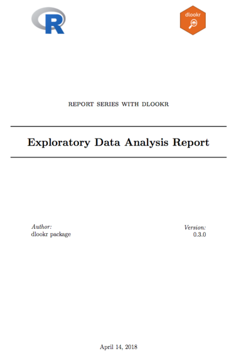
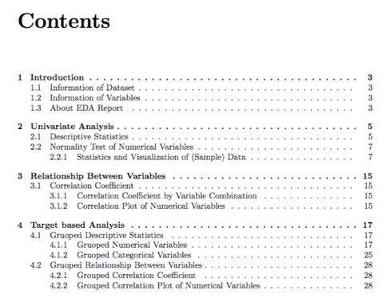
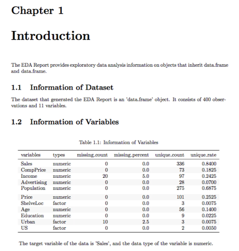
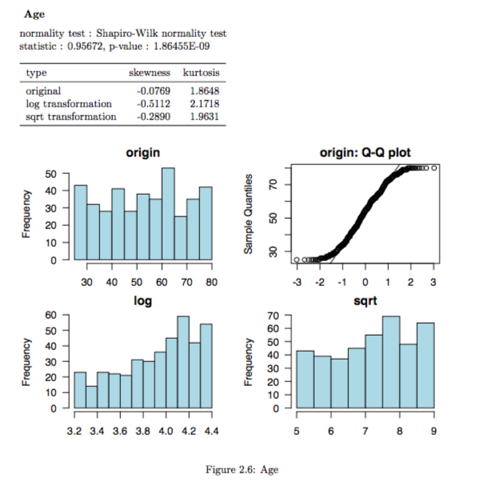
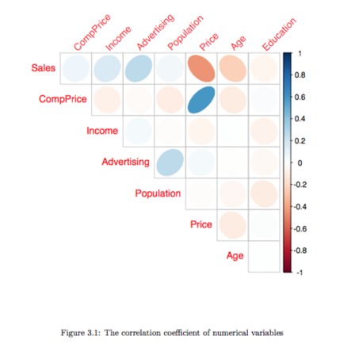
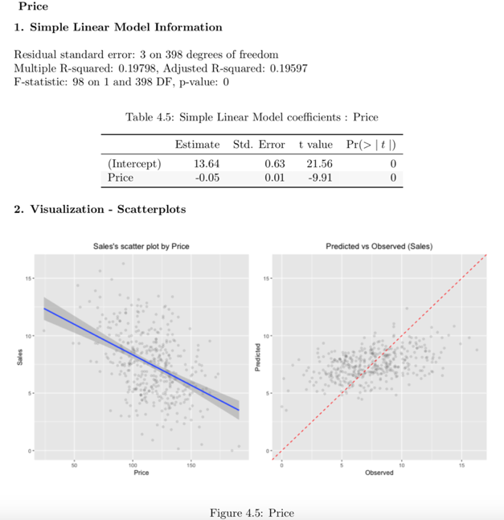
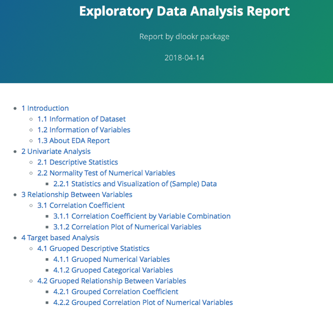
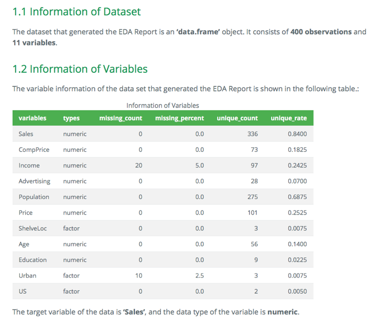
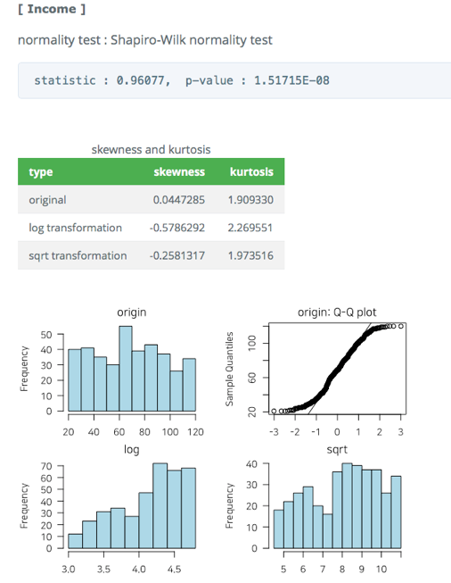

```{r environment, echo = FALSE, message = FALSE}
knitr::opts_chunk$set(collapse = TRUE, comment = "")
options(tibble.print_min = 4L, tibble.print_max = 4L)

library(dlookr)
library(dplyr)
library(ggplot2)
```

## Preface
After you have acquired the data, you should do the following:

* Diagnose data quality.
    + If there is a problem with data quality,
    + The data must be corrected or re-acquired.
* **Explore data to understand the data and find scenarios for performing the analysis.**
* Derive new variables or perform variable transformations.

The dlookr package makes these steps fast and easy:

* Performs an data diagnosis or automatically generates a data diagnosis report.
* **Discover data in a variety of ways, and automatically generate EDA(exploratory data analysis) report.**
* Imputate missing values and outliers, resolve skewed data, and binarize continuous variables into categorical variables. And generates an automated report to support it.

This document introduces **EDA(Exploratory Data Analysis)** methods provided by the dlookr package. You will learn how to EDA of `tbl_df` data that inherits from data.frame and `data.frame` with functions provided by dlookr.

dlookr synergy with `dplyr` increases. Particularly in data exploration and data wrangle, it increases the efficiency of the `tidyverse` package group.

## datasets
To illustrate the basic use of EDA in the dlookr package, I use a `Carseats` datasets.
`Carseats` in the `ISLR` package is simulation dataset that sells children's car seats at 400 stores. This data is a data.frame created for the purpose of predicting sales volume.

```{r import_data}
library(ISLR)
str(Carseats)
```

The contents of individual variables are as follows. (Refer to ISLR::Carseats Man page)

* Sales
    + Unit sales (in thousands) at each location
* CompPrice
    + Price charged by competitor at each location
* Income
    + Community income level (in thousands of dollars)
* Advertising
    + Local advertising budget for company at each location (in thousands of dollars)
* Population
    + Population size in region (in thousands)
* Price
    + Price company charges for car seats at each site
* ShelveLoc
    + A factor with levels Bad, Good and Medium indicating the quality of the shelving location for the car seats at each site
* Age
    + Average age of the local population
* Education
    + Education level at each location
* Urban
    + A factor with levels No and Yes to indicate whether the store is in an urban or rural location
* US
    + A factor with levels No and Yes to indicate whether the store is in the US or not

When data analysis is performed, data containing missing values is often encountered. However, Carseats is complete data without missing. Therefore, the missing values are generated as follows. And I created a data.frame object named carseats.

```{r missing}
carseats <- ISLR::Carseats

set.seed(123)
carseats[sample(seq(NROW(carseats)), 20), "Income"] <- NA

set.seed(456)
carseats[sample(seq(NROW(carseats)), 10), "Urban"] <- NA
```

## Exploratory Data Analysis
dlookr can help to understand the distribution of data by calculating descriptive statistics of numerical data. In addition, correlation between variables is identified and normality test is performed. It also identifies the relationship between target variables and independent variables.:

The following is a list of the EDA functions included in the dlookr package.:

* `describe()` provides descriptive statistics for numerical data.
* `normality()` and `plot_normality()` perform normalization and visualization of numerical data.
* `correlate()` and `plot_correlate()` calculate the correlation coefficient between two numerical data and provide visualization.
* `target_by()` defines the target variable and `relate()` describes the relationship with the variables of interest corresponding to the target variable.
* `plot.relate()` visualizes the relationship to the variable of interest corresponding to the destination variable.
* `eda_report()` performs an exploratory data analysis and reports the results.

## Univariate data EDA
### Calculating descriptive statistics using `describe()`

`describe()` computes descriptive statistics for numerical data. The descriptive statistics help determine the distribution of numerical variables. Like function of dplyr, the first argument is the tibble (or data frame). The second and subsequent arguments refer to variables within that data frame.

The variables of the `tbl_df` object returned by `describe()` are as follows.

* `n` : number of observations excluding missing values
* `na` : number of missing values
* `mean` : arithmetic average
* `sd` : standard devation
* `se_mean` : standrd error mean. sd/sqrt(n)
* `IQR` : interquartile range (Q3-Q1)
* `skewness` : skewness
* `kurtosis` : kurtosis
* `p25` : Q1. 25% percentile
* `p50` : median. 50% percentile
* `p75` : Q3. 75% percentile
* `p01`, `p05`, `p10`, `p20`, `p30` : 1%, 5%, 20%, 30% percentiles
* `p40`, `p60`, `p70`, `p80` : 40%, 60%, 70%, 80% percentiles
* `p90`, `p95`, `p99`, `p100` : 90%, 95%, 99%, 100% percentiles

For example, we can computes the statistics of all numerical variables in `carseats`:

```{r describe}
describe(carseats)
```

* `skewness` : The left-skewed distribution data, that is, the variables with large positive skewness should consider the log or sqrt transformations to follow the normal distribution. The variables `Advertising` seem to need to consider variable transformations.
* `mean` and `sd`, `se_mean` : The` Population` with a large `standard error of the mean`(se_mean) has low representativeness of the `arithmetic mean`(mean). The `standard deviation`(sd) is much larger than the arithmetic average.

The following explains the descriptive statistics only for a few selected variables.:

```{r describes2}
# Select columns by name
describe(carseats, Sales, CompPrice, Income)
# Select all columns between year and day (inclusive)
describe(carseats, Sales:Income)
# Select all columns except those from year to day (inclusive)
describe(carseats, -(Sales:Income))
```

By using dplyr, You can sort by `left or right skewed size`(skewness).:

```{r describe_pipe}
carseats %>%
  describe() %>%
  select(variable, skewness, mean, p25, p50, p75) %>% 
  filter(!is.na(skewness)) %>% 
  arrange(desc(abs(skewness)))
```

The `describe()` function supports the `group_by()` function syntax of `dplyr`.

```{r diagnose_pipe2}
carseats %>%
  group_by(US) %>% 
  describe(Sales, Income) 
```

```{r diagnose_pipe3}
carseats %>%
  group_by(US, Urban) %>% 
  describe(Sales, Income) 
```

### Test of normality on numeric variables using `normality()`
`normality()` performs a normality test on numerical data. `Shapiro-Wilk normality test` is performed. If the number of observations is larger than 5000, 5000 observations are extracted by random simple sampling and then tested.

The variables of `tbl_df` object returned by `normality()` are as follows.

* `statistic` : Statistics of the Shapiro-Wilk test
* `p_value` : p-value of the Shapiro-Wilk test
* `sample` : Number of sample observations performed Shapiro-Wilk test

`normality()` performs the normality test for all numerical variables of `carseats` as follows.:

```{r normality}
normality(carseats)
```

The following example performs a normality test on only a few selected variables.

```{r normality2}
# Select columns by name
normality(carseats, Sales, CompPrice, Income)

# Select all columns between year and day (inclusive)
normality(carseats, Sales:Income)

# Select all columns except those from year to day (inclusive)
normality(carseats, -(Sales:Income))
```

You can use dplyr to sort non-normal distribution variables by p_value.:

```{r normality_pipe}
library(dplyr)

carseats %>%
  normality() %>%
  filter(p_value <= 0.01) %>% 
  arrange(abs(p_value))
```

In particular, the `Advertising` variable is considered to be the most out of the normal distribution.

The `normality()` function supports the `group_by()` function syntax in the `dplyr` package.

```{r normality_pipe2}
carseats %>%
  group_by(ShelveLoc, US) %>%
  normality(Income) %>% 
  arrange(desc(p_value))
```

The `Income` variable does not follow the normal distribution. However, if the `US` is `No` and the `ShelveLoc` is `Good` or `Bad` at the significance level of 0.01, it follows the normal distribution.

In the following, we perform `normality test of log(Income)` for each combination of `ShelveLoc` and `US` variables to inquire about normal distribution cases.

```{r normality_pipe3}
carseats %>%
  mutate(log_income = log(Income)) %>%
  group_by(ShelveLoc, US) %>%
  normality(log_income) %>%
  filter(p_value > 0.01)
```


### Normalization visualization of numerical variables using `plot_normality()`
`plot_normality()` visualizes the normality of numeric data.

The information that `plot_normality()` visualizes is as follows.

* `Histogram of original data`
* `Q-Q plot of original data`
* `histogram of log transformed data`
* `Histogram of square root transformed data`

Numerical data following a `power-law distribution` are often encountered in data analysis. Since the numerical data following the power distribution is transformed into the normal distribution by performing the log and sqrt transform, the histogram of the data for the log and sqrt transform is drawn.

`plot_normality()` can also specify several variables like `normality()` function.

```{r plot_normality, fig.width = 7, fig.height = 4}
# Select columns by name
plot_normality(carseats, Sales, CompPrice)
```

The `plot_normality()` function also supports the `group_by()` function syntax in the `dplyr` package.

```{r plot_normality2, fig.width = 7, fig.height = 4}
carseats %>%
  filter(ShelveLoc == "Good") %>%
  group_by(US) %>%
  plot_normality(Income)
```


## Bivariate data EDA
### Calculation of `correlation coefficient` using `correlate()`

`Correlate()` finds the correlation coefficient of all combinations of `carseats` numerical variables as follows:

```{r correlate}
correlate(carseats)
```

The following example performs a normality test only on combinations that include several selected variables.

```{r correlate2}
# Select columns by name
correlate(carseats, Sales, CompPrice, Income)

# Select all columns between year and day (inclusive)
correlate(carseats, Sales:Income)

# Select all columns except those from year to day (inclusive)
correlate(carseats, -(Sales:Income))
```

`correlate()` produces `two pairs of variable` combinations. So you can use the following `filter()` function to get the correlation coefficient for `a pair of variable` combinations:

```{r correlate3}
carseats %>%
  correlate(Sales:Income) %>%
  filter(as.integer(var1) > as.integer(var2))
```

The `correlate()` function also supports the `group_by()` function syntax in the `dplyr` package.

```{r correlate4}
carseats %>%
  filter(ShelveLoc == "Good") %>%
  group_by(Urban, US) %>%
  correlate(Sales) %>%
  filter(abs(coef_corr) > 0.5)
```


### Visualization of the correlation matrix using `plot_correlate()`
`plot_correlate()` visualizes the correlation matrix.

```{r plot_correlate, fig.width = 7, fig.height = 4}
plot_correlate(carseats)
```

`plot_correlate()` can also specify multiple variables, like the `correlate()` function.
The following is a visualization of the correlation matrix including several selected variables.

```{r plot_correlate2, fig.width = 7, fig.height = 4}
# Select columns by name
plot_correlate(carseats, Sales, Price)
```

The `plot_correlate()` function also supports the `group_by()` function syntax in the `dplyr` package.

```{r plot_correlate3, fig.width = 7, fig.height = 4, warning=FALSE}
carseats %>%
  filter(ShelveLoc == "Good") %>%
  group_by(Urban, US) %>%
  plot_correlate(Sales)
```


## EDA based on target variable

### Definition of target variable
To perform EDA based on `target variable`, you need to create a` target_by class` object.
`target_by()` creates a target_by class with an object inheriting data.frame or data.frame. `target_by()` is similar to `group_by()` in `dplyr` which creates` grouped_df`. The difference is that you specify only one variable.

The following is an example of specifying US as target variable in carseats data.frame.:

```{r target_by}
categ <- target_by(carseats, US)
```

### EDA when target variable is categorical variable
Let's do the EDA when the target variable is categorical. When the categorical variable US is the target variable, the relationship between the target variable and the predictor is examined.

#### Cases where predictors are numeric variable
`relate()` shows the relationship between the target variable and the predictor. The following example shows the relationship between Sales and the target variable US. The predictor Sales is a numeric variable. In this case, the descriptive statistics are shown for each level of the target variable.

```{r target_by2}
# If the variable of interest is a numarical variable
cat_num <- relate(categ, Sales)
cat_num
summary(cat_num)
```

The `relate class` object created with` relate()` visualizes the relationship between the target variable and the predictor with `plot()`. The relationship between US and Sales is represented by a density plot.

```{r target_by3, fig.width = 7, fig.height = 4, warning=FALSE}
plot(cat_num)
```

#### Cases where predictors are categorical variable
The following example shows the relationship between `ShelveLoc` and the target variable `US`.
The predictor, ShelveLoc, is a categorical variable. In this case, we show the `contigency table` of two variables. The `summary()` function also performs an `independence test` on the contigency table.

```{r target_by4}
# If the variable of interest is a categorical variable
cat_cat <- relate(categ, ShelveLoc)
cat_cat
summary(cat_cat)
```

`plot()` visualizes the relationship between the target variable and the predictor. The relationship between `US` and `ShelveLoc` is represented by a `mosaics plot`.

```{r target_by5, fig.width = 7, fig.height = 4, warning=FALSE}
plot(cat_cat)
```

### EDA when target variable is numerical variable
Let's do the EDA when the target variable is numeric. When the numeric variable Sales is the target variable, the relationship between the target variable and the predictor is examined.

```{r target_by6}
# If the variable of interest is a numarical variable
num <- target_by(carseats, Sales)
```

#### Cases where predictors are numeric variable
The following example shows the relationship between `Price` and the target variable `Sales`. Price, a predictor, is a numeric variable. In this case, we show the result of `simple regression model` of `target ~ predictor` relation. The `summary()` function represents the details of the model.

```{r target_by7}
# If the variable of interest is a numarical variable
num_num <- relate(num, Price)
num_num
summary(num_num)
```

`plot()` visualizes the relationship between the target variable and the predictor. The relationship between Sales and Price is repersented as a scatter plot.
The plot on the left represents the scatter plot of Sales and Price and the confidence interval of the regression line and the regression line.
The plot on the right represents the relationship between the original data and the predicted value of the linear model as a scatter plot.
If there is a linear relationship between the two variables, the observations will converge on the red diagonal in the scatter plot.

```{r target_by8, fig.width = 7, fig.height = 4, warning=FALSE}
plot(num_num)
```

#### Cases where predictors are categorical variable
The following example shows the relationship between `ShelveLoc` and the target variable `Sales`. The predictor, ShelveLoc, is a categorical variable. It shows the result of performing `one-way ANOVA` of `target ~ predictor` relation. The results are represented in terms of an analysis of variance.
The `summary()` function also shows the `regression coefficients` for each level of the predictor. In other words, it shows detailed information of `simple regression analysis` of `target ~ predictor` relation.

```{r target_by9}
# If the variable of interest is a categorical variable
num_cat <- relate(num, ShelveLoc)
num_cat
summary(num_cat)
```

`plot()` visualizes the relationship between the target variable and the predictor. The relationship between `Sales` and `ShelveLoc` is represented by a `box plot`.

```{r target_by10, fig.width = 7, fig.height = 4, warning=FALSE}
plot(num_cat)
```


## Creating an EDA report using `eda_report()`
`eda_report()` performs EDA on all variables of the data frame or object (`tbl_df`,` tbl`, etc.) that inherits the data frame.

`eda_report()` creates an EDA report in two forms:

* pdf file based on Latex
* html file

The contents of the report are as follows.:

* introduction
    + Information of Dataset
    + Information of Variables
    + Numerical Variables
* Univariate Analysis
    + Descriptive Statistics
    + Normality Test of Numerical Variables
        + Statistics and Visualization of (Sample) Data
* Relationship Between Variables
    + Correlation Coefficient
        + Correlation Coefficient by Variable Combination
        + Correlation Plot of Numerical Variables
* Target based Analysis
    + Gruoped Descriptive Statistics
        + Gruoped Numerical Variables
        + Gruoped Categorical Variables
    + Gruoped Relationship Between Variables
        + Grouped Correlation Coefficient
        + Grouped Correlation Plot of Numerical Variables

The following will create an EDA report for `carseats`. The file format is pdf, and the file name is `EDA_Report.pdf`.

```{r eda_report, eval=FALSE}
carseats %>%
  eda_report(target = Sales)
```

The following generates an HTML-formatted report named `EDA.html`.

```{r, eval=FALSE}
carseats %>%
  eda_report(target = Sales, output_format = "html", output_file = "EDA.html")
```

The EDA report is an automated report to assist in the EDA process. Design the data analysis scenario with reference to the report results.

### EDA report contents
#### Contents of pdf file

* The cover of the report is shown in the following figure.

```{r eda_title_pdf, echo=FALSE, out.width='70%', fig.align='center', fig.pos="!h", fig.cap="EDA report cover"}

```

* The report's argenda is shown in the following figure.

```{r eda_agenda_pdf, echo=FALSE, out.width='70%', fig.align='center', fig.pos="!h", fig.cap="EDA Report Contents"}

```

* Much information is represented in tables in the report. An example of the table is shown in the following figure.

```{r eda_intro_pdf, echo=FALSE, out.width='70%', fig.align='center', fig.pos="!h", fig.cap="Example EDA report table"}

```

* In the EDA report, the normality test content includes visualization results. The result is shown in the following figure.

```{r eda_normality_pdf, echo=FALSE, out.width='70%', fig.align='center', fig.pos="!h", fig.cap="Normality test information in EDA reports"}

```

* Correlation information in EDA reports includes visualization results. The result is shown in the following figure.

```{r eda_correlation_pdf, echo=FALSE, out.width='70%', fig.align='center', fig.pos="!h", fig.cap="Correlation information in EDA reports"}

```

* In EDA reports, information on linear relationships includes tables and visualization results. The result is shown in the following figure.

```{r eda_lm_pdf, echo=FALSE, out.width='70%', fig.align='center', fig.pos="!h", fig.cap="Linear relationship information in EDA reports"}

```

* In EDA reports, ANOVA information includes tables and visualization results. The result is shown in the following figure.

```{r eda_anova_pdf, echo=FALSE, out.width='70%', fig.align='center', fig.pos="!h", fig.cap="Information about ANOVA in EDA reports"}
knitr::include_graphics('img/eda_anova_pdf.png')
```

#### Contents of html file
* The title and contents of the report are shown in the following figure.

```{r eda_egenda_html, echo=FALSE, out.width='70%', fig.align='center', fig.pos="!h", fig.cap="EDA report titles and table of contents"}

```

* Much information is represented in tables in the report. An example of a table in an html file is shown in the following figure.

```{r eda_table_html, echo=FALSE, out.width='70%', fig.align='center', fig.pos="!h", fig.cap="EDA report table example (Web)"}

```

*  In EDA reports, normality test information includes visualization results. The result of the html file is shown in the following figure.

```{r eda_normality_html, echo=FALSE, out.width='70%', fig.align='center', fig.pos="!h", fig.cap="EDA Report Normality Test Information (Web)"}

```

