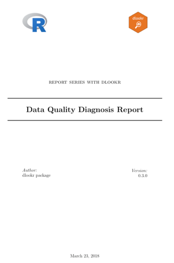
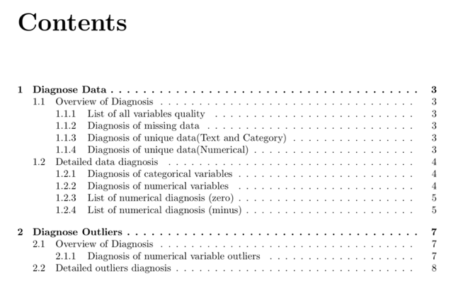
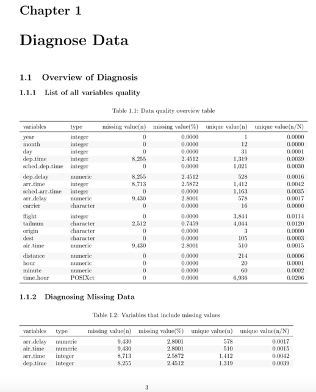
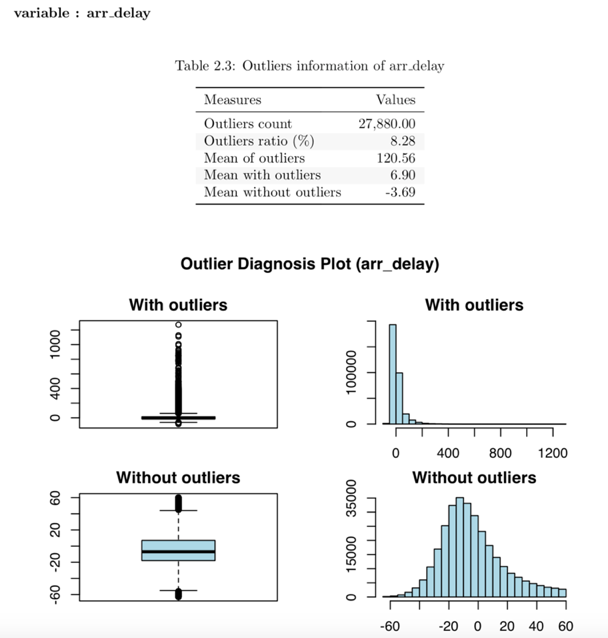
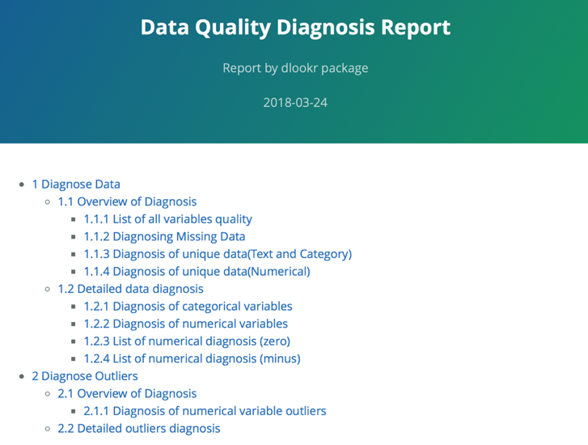
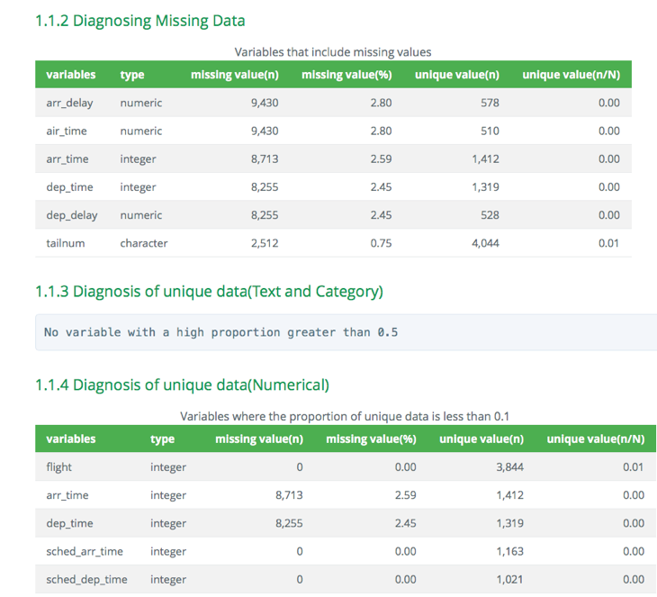
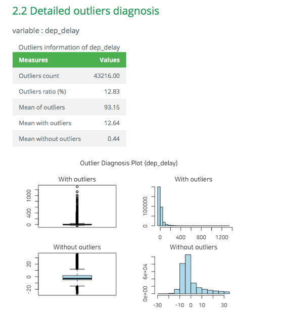

```{r environment, echo = FALSE, message = FALSE}
knitr::opts_chunk$set(collapse = TRUE, comment = "")
options(tibble.print_min = 4L, tibble.print_max = 4L)
library(dlookr)
library(dplyr)
library(ggplot2)
```

## 일러두기

**"본 vignett는 dplyr 패키지와의 상호 운용성을 강조하기 위해서 dplyr 패키지의 vignett인 'Introduction to dplyr'을 참고하였다."**

분석을 위한 데이터를 획득한 후에는 다음을 수행해야 한다.:

* **데이터의 품질을 진단한다.**
    + **만약 데이터 품질의 문제를 발견한다면,**
    + **문제의 데이터를 보완하거나 경우에 따라서는 재획득을 수행햐야 한다.**
* 데이터를 이해하기 위한 탐색을 수행하여, 분석의 전개 방향에 대한 시나리오를 수립한다.
* 분석에 효과적인 변수를 파생하거나 변수의 변환을 수행한다.

dlookr 패키지는 다음의 과정을 빠르고 쉽게 수행하도록 도움을 준다.

* **데이터의 진단을 수행하거나 데이터 품질 진단 리포트를 자동으로 생성한다.**
* 다양한 방법으로 데이터를 탐색하고 EDA(탐색적 데이터 분석) 보고서를 생성한다.
* 연속형 변수를 비닝(binning)하여 범주형 변수로 만들고, 비닝의 의사결정에 도움을 주는 리포트를 생성한다.

이 문서는 dlookr 기능 중에서 **데이터 품질 진단** 기능을 소개한다. 여러분은 dlookr에서 제공하는 함수로 데이터 프레임과 데이터 프레임을 상속한 tbl_df 데이터의 품질을 진단하는 방법을 일힐 수 있을 것이다.

dlookr 패키지는 `dplyr` 패키지와 함께 사용하면 시너지가 증가된다. 특히 데이터 탐색 및 데이터 조작에서 `tidyverse` 패키지 그룹의 효율성을 높여준다.

## Data: nycflights13

dlookr 패키지의 기초적인 사용 방법을 설명하기 위해서 `nycflights13` 패키지의 `flights` 데이터를 사용한다. `flights` 데이터 프레임은 2013년 NYC를 출발한 모든 항공편에 출발과 도착에 대한 정보를 담은 데이터다.

```{r import_data}
library(nycflights13)
dim(flights)
flights
```

## 데이터 진단
dlookr은 데이터를 진단하여 데이터 분석에 사용할 수 없는 변수를 선별하거나, 보정이 필요한 변수를 찾아낸는 것을 목표로 한다.:

* `diagnose()`는 변수들의 기본적인 진단 정보를 제공한다.
* `diagnose_category()`는 범주형 변수들의 상세 진단 정보를 제공한다.
* `diagnose_numeric()`는 수치형 변수들의 상세 진단 정보를 제공한다.
* `diagnose_outlier()`와 `plot_outlier()`는 이상치에 대한 정보와 시각화를 제공한다.
* `diagnose_report()`는 데이터 품질 진단을 수행한 후 그 결과를 보고서로 만들어 준다.

### `diagnose()`을 이용한 변수의 개괄적 진단

`diagnose()`은 데이터 프레임의 변수를 진단한다. dplyr의 함수처럼 첫 번째 인수는 tibble(또는 데이터 프레임)이다. 두 번째 및 후속 인수는 해당 데이터 프레임 내의 변수를 나타낸다.

`diagnose()`가 반환하는 `tbl_df` 객체의 변수는 다음과 같다.

* `variables` : 변수명
* `types` : 변수의 데이터 유형
* `missing_count` : 결측치 수
* `missing_percent` : 결측치의 백분율
* `unique_count` : 유일값의 수
* `unique_rate` : 유일값의 비율. unique_count / 관측치의 수

다음처럼 `diagnose()`는 `flights`의 모든 변수를 진단할 수 있다.:

```{r diagnose}
diagnose(flights)
```

* `결측치` : 결측치가 아주 많은 변수, 즉 missing_percent가 100에 가까운 변수는 분석에서 제외하는 것을 고려해야 한다.
* `유일값` : 유일값이 하나인(unique_count = 1) 변수는 데이터 분석에서 제외하는 것을 고려한다. 그리고 데이터 유형이 수치형(integer, numeric)이 아니면서 유일값의 개수가 관측치의 개수와 같은(unique_rate = 1) 변수는 식별자일 확률이 크다. 그러므로 이 변수도 분석 모델에 적합치 않은 변수다.

`year`는 unique_count가 1이므로 분석 모델에 사용하지 않는 것을 고려할 수 있다. 다만 `year`, `month`, `day`의 조합으로 `년월일`을 구성하는 경우에는 굳이 제거하지 않아도 될 것이다.

다음은 선택된 몇 개의 변수에 대해서만 진단을 수행한다.

```{r diagnoses}
# Select columns by name
diagnose(flights, year, month, day)
# Select all columns between year and day (inclusive)
diagnose(flights, year:day)
# Select all columns except those from year to day (inclusive)
diagnose(flights, -(year:day))
```

dplyr을 이용해서 결측치를 포함한 변수를 결측치의 비중별로 정렬할 수 있다.:

```{r diagnose_pipe}
flights %>%
  diagnose() %>%
  select(-unique_count, -unique_rate) %>% 
  filter(missing_count > 0) %>% 
  arrange(desc(missing_count))
```

### `diagnose_numeric()`을 이용한 수치형 변수의 상세 진단

`diagnose_numeric()`은 데이터 프레임의 수치형(연속형과 이산형) 변수를 진단한다. 사용 방법은 `diagnose()`와 동일하나 더 많은 진단 정보를 반환한다. 그런데 두 번째 및 후속 인수 목록에 수치형이 아닌 변수를 지정하면 해당 변수는 자동적으로 무시한다. 

`diagnose_numeric()`이 반환하는 `tbl_df` 객체의 변수는 다음과 같다.

* `min` : 최소값
* `Q1` : 1/4분위수, 25백분위수
* `mean` : 산술평균
* `median` : 중위수, 50백분위수
* `Q3` : 3/4분위수, 75백분위수
* `max` : 최대값
* `zero` : 0의 값을 갖는 관측치의 개수
* `minus` : 음수를 갖는 관측치의 개수
* `outlier` : 이상치의 개수

데이터 프레임에 summary() 함수를 적용하면 수치형 변수의 `min`,  `Q1`, `mean`, `median`, `Q3` , `max`를 콘솔에 출력하여 데이터의 분포를 파악할 수 있도록 도와준다. 그러나 그 결과는 분석가가 눈으로만 살펴볼 수 밖에 없는 단점이 있다. 그런데 이런 정보들을 `tbl_df`와 같은 데이터 프레임 구조로 반환하면 활용의 범위가 넓어진다. 

`zero`, `minus`, `outlier`는 데이터의 무결성을 진단하는데 유용한 측도다. 예를 들어 어떤 경우의 수치 데이터는 0이나 음수를 가질 수 없는 경우가 있기 때문이다. '직원의 급여'라는 가상의 수치형 변수는 음수나 0을 가질 수 없기 때문에 데이터 진단 과정에서 0이나 음수의 포함 여부를 살펴보아야 한다.

다음처럼 `diagnose_numeric()`는 `flights`의 모든 수치형 변수를 진단할 수 있다.:

```{r diagnose_pipe_numeric}
diagnose_numeric(flights)
```

수치형 변수가 논리적으로 음수나 0의 값을 가질 수 없을 경우에, `filter()`로 논리적으로 부합하지 않은 변수를 쉽게 찾아낸다.:

```{r diagnose_pipe_numeric_pipe}
diagnose_numeric(flights) %>% 
  filter(minus > 0 | zero > 0) 
```


### `diagnose_category()`을 이용한 범주형 변수의 상세 진단

`diagnose_category()`은 데이터 프레임의 범주형(factor, ordered, character) 변수를 진단한다. 사용 방법은 `diagnose()`와 유사하나 더 많은 진단 정보를 반환한다. 그런데 두 번째 및 후속 인수 목록에 범주형이 아닌 변수를 지정하면 해당 변수는 자동적으로 무시한다. top 인수는 변수별로 반환할 수준(levels)의 개수를 지정한다. 기본값은 10으로 상위 top 10의 수준을 반환한다. 물론 수준의 개수가 10개 미만일 경우에는 모든 수준을 반환한다.

`diagnose_category()`이 반환하는 `tbl_df` 객체의 변수는 다음과 같다.

* `variables` : 변수의 이름
* `levels`: 수준의 이름
* `N` : 관측치의 수
* `freq` : 수준별 도수(frequency)
* `ratio` : 수준별 상대도수(백분율 표현)
* `rank` : 레벨별 도수 크기의 순위

다음처럼 `diagnose_category()`는 `flights`의 모든 범주형 변수를 진단할 수 있다.:

```{r diagnose_category}
diagnose_category(flights)
```

`dplyr` 패키지의 `filter()`와 협업하여 결측치가 top 10에 포함된 사례를 조회한 결과에서 `tailnum` 변수가 2,512건의 결측치로 top 1에 랭크된 것을 알 수 있다.:  

```{r diagnose_category_pipe}
diagnose_category(flights) %>% 
  filter(is.na(levels))
```

다음은 수준이 차지하는 비중이 0.01% 이하인 목록을 반환한다. top 인수값을 500으로 넉넉하게 지정한 것에 주목해야 한다. 만약 기본값인 10을 사용하였다면 0.01% 이하의 값은 목록에 포함되지 못했을 것이다.:

```{r diagnose_category_pipe2}
flights %>%
  diagnose_category(top = 500)  %>%
  filter(ratio <= 0.01)
```

분석 모델에서 관측치에서 차지하는 비중이 미미한 수준들은 제거하거나 하나로 합치는 것도 고려해볼 수 있다.

### `diagnose_outlier()`를 이용한 이상치 진단
`diagnose_outlier()`은 데이터 프레임의 수치형(연속형과 이산형) 변수의 이상치(outliers)를 진단한다. 사용 방법은 `diagnose()`와 동일하다.  

`diagnose_outlier()`이 반환하는 `tbl_df` 객체의 변수는 다음과 같다.

* `outliers_cnt` : 이상치의 개수
* `outliers_ratio` : 이상치의 비율(백분율)
* `outliers_mean` : 이상치들의 산술평균
* `with_mean` : 이상치를 포함한 전체 관측치의 평균
* `without_mean` : 이상치를 제거한 관측치의 산술평균

다음처럼 `diagnose_outlier()`는 `flights`의 모든 수치형 변수의 이상치를 진단할 수 있다.:

```{r diagnose_outlier}
diagnose_outlier(flights)
```

이상치를 포함하는 수치형 변수는 `filter()`로 쉽게 찾아낸다.:

```{r diagnose_outlier_pipe}
diagnose_outlier(flights) %>% 
  filter(outliers_cnt > 0) 
```

다음은 이상치를 5% 이상 포함한 수치형 변수중에서 이상치의 평균이 전체 평균대비 규모가 큰 순으로 정렬하여 반환한다.:

```{r diagnose_outlier_pipe2}
diagnose_outlier(flights) %>% 
  filter(outliers_ratio > 5) %>% 
  mutate(rate = outliers_mean / with_mean) %>% 
  arrange(desc(rate)) %>% 
  select(-outliers_cnt)
```

데이터 분석 과정에서 이상치의 평균이 전체 평균대비 규모가 클 경우에는 이상치를 대체하거나 제거하는 것이 바람직할 수 있다.

### `plot_outlier()`를 이용한 이상치의 시각화
`plot_outlier()`은 데이터 프레임의 수치형(연속형과 이산형) 변수의 이상치(outliers)를 시각화한다. 사용 방법은 `diagnose()`와 동일하다.  

`plot_outlier()`이 시각화하는 플롯은 다음을 포함한다.

* 이상치를 포함한 박스플롯
* 이상치를 제거한 박스플롯
* 이상치를 포함한 히스토그램
* 이상치를 제거한 히스토그램

다음처럼 `plot_outlier()`는 `flights`의 `arr_delay` 변수의 이상치를 시각화할 수 있다.:

```{r plot_outlier, fig.width = 7, fig.height = 4}
flights %>%
  plot_outlier(arr_delay) 
```

다음은 `diagnose_outlier()`와 `plot_outlier()`, dplyr 패키지의 함수를 사용하여 이상치의 비율이 0.5% 이상인 모든 수치형 변수의 이상치를 시각화 한다. 

```{r plot_outlier_pipe, fig.width = 7, fig.height = 4}
flights %>%
  plot_outlier(diagnose_outlier(flights) %>% 
                 filter(outliers_ratio >= 0.5) %>% 
                 select(variables) %>% 
                 pull())
```

시각화 결과를 보고 이상치의 제거 및 대체 여부를 결정해야 한다. 경우에 따라서는 이상치가 포함된 변수를 데이터 분석 모델에서 제거하는 것도 고려해야 한다.

시각화 결과를 보면 `arr_delay`는 이상치를 제거한 관측치들은 정규분포와 유사한 분포를 보이고 있다. 선형 모형의 경우에는 이상치를 제거하거나 대체하는 것도 검토해볼 수 있겠다. 그리고 `air_time`은 이상치를 제거하기 전후의 분포가 대략 비슷한 모양을 보인다.

### `diagnose_report()`를 이용한 진단 보고서 작성
`diagnose_report()`는 데이터 프레임이나 데이터 프레임을 상속받은 객체(`tbl_df`, `tbl` 등)의 모든 변수들에 대해서 데이터 진단을 수행한다.

`diagnose_report()`는 진단 보고서를 다음과 같은 두 개의 형태로 작성한다.

* Latex에 기반한 pdf 파일
* html 파일

보고서의 목차는 다음과 같다.

* 데이터 진단
    + 데이터 품질 총괄
        + 전체변수 품질현황 목록
        + 결측치 진단
        + 유일값 진단(문자형과 범주형)
        + 유일값 진단(수치형)
    + 데이터 품질 상세
        + 범주형 변수 품질 현황
        + 수치형 변수 품질 현황
        + 수치변수 품질현황 (zero)
        + 수치변수 품질현황 (minus)
* 이상치 진단
    + 데이터 품질 총괄
        + 수치변수의 이상치 진단
        + 이상치 상세 진단

다음은 `tbl_df` 클래스 객체인 `flights`의 품질진단 리포트를 작성한다. 파일 형식은 pdf이며, 파일이름은 `DataDiagnosis_Report.pdf`다.

```{r diagnose_report, eval=FALSE}
flights %>%
  diagnose_report()
```

다음은 `Diagn.html`라는 이름의 html 형식의 보고서를 생성한다.

```{r, eval=FALSE}
flights %>%
  diagnose_report(output_format = "html", output_file = "Diagn.html")
```

데이터 진단 보고서는 데이터 진단 과정에 도움을 주기 위한 자동화 보고서다. 보고서 결과를 참고하여 데이터 보완이나 재획득을 판단한다.

### 진단 리포트 내용
#### pdf 파일의 내용
* 보고서의 표지는 다음 그림과 같다.

```{r diag_title_pdf, echo=FALSE, out.width='70%', fig.align='center', fig.pos="!h", fig.cap="데이터진단 보고서 표지"}

```

* 보고서의 차례는 다음 그림과 같다.

```{r diag_agenda_pdf, echo=FALSE, out.width='70%', fig.align='center', fig.pos="!h", fig.cap="데이터진단 보고서 차례"}

```

* 대부분의 정보는 보고서에서 표로 표현된다. 표의 예시는 다음 그림과 같다.

```{r diag_intro_pdf, echo=FALSE, out.width='70%', fig.align='center', fig.pos="!h", fig.cap="데이터진단 보고서 도표 예시"}

```

* 데이터진단 보고서에서 이상치 진단 내용은 시각화 결과를 포함한다. 그 결과는 다음 그림과 같다.

```{r diag_outlier_pdf, echo=FALSE, out.width='70%', fig.align='center', fig.pos="!h", fig.cap="데이터진단 보고서 이상치 진단 내용"}

```

#### html 파일의 내용
* 보고서의 타이틀과 목차는 다음 그림과 같다.

```{r diag_egenda_html, echo=FALSE, out.width='70%', fig.align='center', fig.pos="!h", fig.cap="데이터진단 보고서 타이틀과 목차"}

```

* 대부분의 정보는 보고서에서 표로 표현된다. html 파일에서 표의 예시는 다음 그림과 같다.

```{r diag_table_html, echo=FALSE, out.width='70%', fig.align='center', fig.pos="!h", fig.cap="데이터진단 보고서 도표 예시 (웹)"}

```

* 데이터진단 보고서에서 이상치 진단 내용은 시각화 결과를 포함한다. html 파일의 결과는 다음 그림과 같다.

```{r diag_outlier_html, echo=FALSE, out.width='70%', fig.align='center', fig.pos="!h", fig.cap="데이터진단 보고서 이상치 진단 내용 (웹)"}

```
