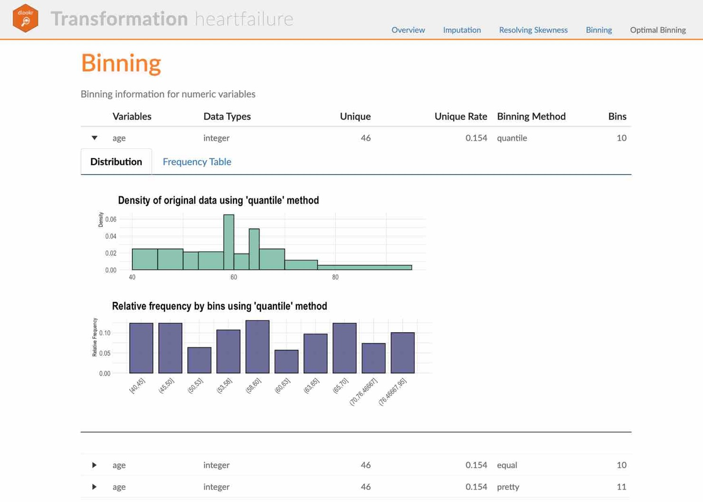
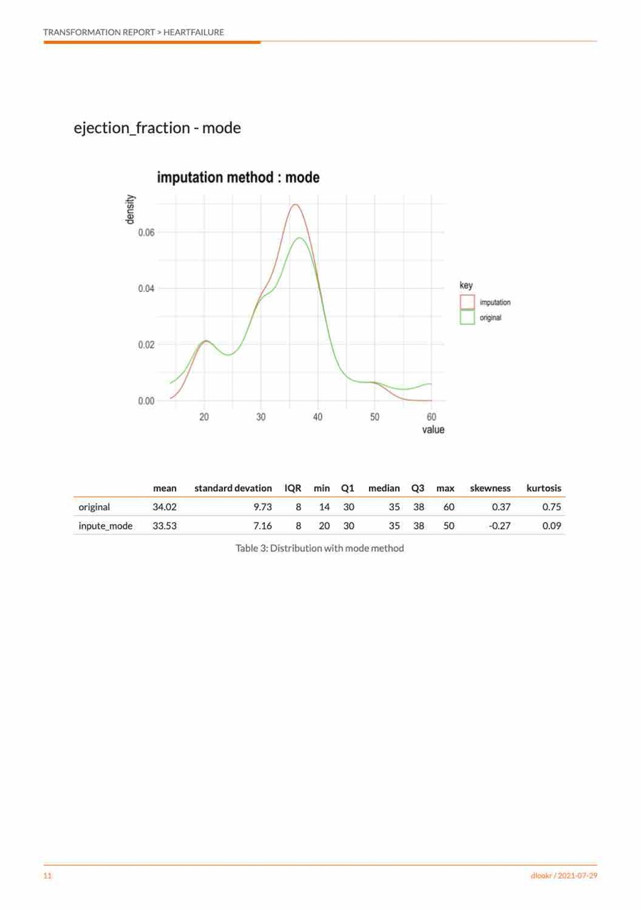

```{r environment, echo = FALSE, message = FALSE, warning=FALSE}
knitr::opts_chunk$set(collapse = TRUE, comment = "", out.width = "600px", dpi = 70)
options(tibble.print_min = 4L, tibble.print_max = 4L)

library(dlookr)
library(dplyr)
library(ggplot2)
```

## Preface
After you have acquired the data, you should do the following:

* Diagnose data quality.
    + If there is a problem with data quality,
    + The data must be corrected or re-acquired.
* Explore data to understand the data and find scenarios for performing the analysis.
* **Derive new variables or perform variable transformations.**

The dlookr package makes these steps fast and easy:

* Performs an data diagnosis or automatically generates a data diagnosis report.
* Discover data in a variety of ways, and automatically generate EDA(exploratory data analysis) report.
* **Impute missing values and outliers, resolve skewed data, and categorize continuous variables into categorical variables. And generates an automated report to support it.**

This document introduces **data transformation** methods provided by the dlookr package. You will learn how to transform of `tbl_df` data that inherits from data.frame and `data.frame` with functions provided by dlookr.

dlookr increases synergy with `dplyr`. Particularly in data transformation and data wrangle, it increases the efficiency of the `tidyverse` package group.

## datasets
To illustrate the basic use of data transformation in the dlookr package, I use a `Carseats` dataset.
`Carseats` in the `ISLR` package is simulation dataset that sells children's car seats at 400 stores. This data is a data.frame created for the purpose of predicting sales volume.

```{r import_data}
library(ISLR)
str(Carseats)
```

The contents of individual variables are as follows. (Refer to ISLR::Carseats Man page)

* Sales
    + Unit sales (in thousands) at each location
* CompPrice
    + Price charged by competitor at each location
* Income
    + Community income level (in thousands of dollars)
* Advertising
    + Local advertising budget for company at each location (in thousands of dollars)
* Population
    + Population size in region (in thousands)
* Price
    + Price company charges for car seats at each site
* ShelveLoc
    + A factor with levels Bad, Good and Medium indicating the quality of the shelving location for the car seats at each site
* Age
    + Average age of the local population
* Education
    + Education level at each location
* Urban
    + A factor with levels No and Yes to indicate whether the store is in an urban or rural location
* US
    + A factor with levels No and Yes to indicate whether the store is in the US or not

When data analysis is performed, data containing missing values is often encountered. However, `Carseats` is complete data without missing. Therefore, the missing values are generated as follows. And I created a data.frame object named carseats.

```{r missing}
carseats <- ISLR::Carseats

suppressWarnings(RNGversion("3.5.0"))
set.seed(123)
carseats[sample(seq(NROW(carseats)), 20), "Income"] <- NA

suppressWarnings(RNGversion("3.5.0"))
set.seed(456)
carseats[sample(seq(NROW(carseats)), 10), "Urban"] <- NA
```

## Data Transformation
dlookr imputes missing values and outliers and resolves skewed data. It also provides the ability to bin continuous variables as categorical variables.

Here is a list of the data conversion functions and functions provided by dlookr:

* `find_na()` finds a variable that contains the missing values variable, and `imputate_na()` imputes the missing values.
* `find_outliers()` finds a variable that contains the outliers, and `imputate_outlier()` imputes the outlier.
* `summary.imputation()` and `plot.imputation()` provide information and visualization of the imputed variables.
* `find_skewness()` finds the variables of the skewed data, and `transform()` performs the resolving of the skewed data.
* `transform()` also performs standardization of numeric variables.
* `summary.transform()` and `plot.transform()` provide information and visualization of transformed variables.
* `binning()` and `binning_by()` convert binational data into categorical data.
* `print.bins()` and `summary.bins()` show and summarize the binning results.
* `plot.bins()` and `plot.optimal_bins()` provide visualization of the binning result.
* `transformation_report()` performs the data transform and reports the result.


## Imputation of missing values
### imputes the missing value with `imputate_na()`

`imputate_na()` imputes the missing value contained in the variable. The predictor with missing values support both numeric and categorical variables, and supports the following `method`.

* predictor is numerical variable
    + "mean" : arithmetic mean
    + "median" : median
    + "mode" : mode
    + "knn" : K-nearest neighbors
        + target variable must be specified
    + "rpart" : Recursive Partitioning and Regression Trees
        + target variable must be specified    
    + "mice" : Multivariate Imputation by Chained Equations
        + target variable must be specified  
        + random seed must be set
* predictor is categorical variable
    + "mode" : mode
    + "rpart" : Recursive Partitioning and Regression Trees
        + target variable must be specified    
    + "mice" : Multivariate Imputation by Chained Equations
        + target variable must be specified  
        + random seed must be set
    
In the following example, `imputate_na()` imputes the missing value of `Income`, a numeric variable of carseats, using the "rpart" method. `summary()` summarizes missing value imputation information, and `plot()` visualizes missing information.

```{r imputate_na, fig.align='center', fig.width = 7, fig.height = 5}
if (requireNamespace("rpart", quietly = TRUE)) {
  income <- imputate_na(carseats, Income, US, method = "rpart")

  # result of imputation
  income

  # summary of imputation
  summary(income)

  # viz of imputation
  plot(income)
} else {
  cat("If you want to use this feature, you need to install the rpart package.\n")
}
```

The following imputes the categorical variable `urban` by the "mice" method.

```{r imputate_na2, fig.align='center', fig.width = 7, fig.height = 5}
library(mice)

urban <- imputate_na(carseats, Urban, US, method = "mice")

# result of imputation
urban

# summary of imputation
summary(urban)

# viz of imputation
plot(urban)
```
    
### Collaboration with dplyr
The following example imputes the missing value of the `Income` variable, and then calculates the arithmetic mean for each level of `US`. In this case, `dplyr` is used, and it is easily interpreted logically using pipes.

```{r imputate_na3}
# The mean before and after the imputation of the Income variable
carseats %>%
  mutate(Income_imp = imputate_na(carseats, Income, US, method = "knn")) %>%
  group_by(US) %>%
  summarise(orig = mean(Income, na.rm = TRUE),
            imputation = mean(Income_imp))
```


## Imputation of outliers
### imputes thr outliers with `imputate_outlier()`

`imputate_outlier()` imputes the outliers value. The predictor with outliers supports only numeric variables and supports the following methods.

* predictor is numerical variable
    + "mean" : arithmetic mean
    + "median" : median
    + "mode" : mode
    + "capping" : Impute the upper outliers with 95 percentile, and Impute the bottom outliers with 5 percentile.

`imputate_outlier()` imputes the outliers with the numeric variable `Price` as the "capping" method, as follows. `summary()` summarizes outliers imputation information, and `plot()` visualizes imputation information.

```{r imputate_outlier, fig.align='center', fig.width = 7, fig.height = 5}
price <- imputate_outlier(carseats, Price, method = "capping")

# result of imputation
price

# summary of imputation
summary(price)

# viz of imputation
plot(price)
```

### Collaboration with dplyr
The following example imputes the outliers of the `Price` variable, and then calculates the arithmetic mean for each level of `US`. In this case, `dplyr` is used, and it is easily interpreted logically using pipes.

```{r imputate_outlier2}
# The mean before and after the imputation of the Price variable
carseats %>%
  mutate(Price_imp = imputate_outlier(carseats, Price, method = "capping")) %>%
  group_by(US) %>%
  summarise(orig = mean(Price, na.rm = TRUE),
    imputation = mean(Price_imp, na.rm = TRUE))
```
    

## Standardization and Resolving Skewness
### Introduction to the use of `transform()`
`transform()` performs data transformation. Only numeric variables are supported, and the following methods are provided.

* Standardization
    + "zscore" : z-score transformation. (x - mu) / sigma
    + "minmax" : minmax transformation. (x - min) / (max - min)
* Resolving Skewness
    + "log" : log transformation. log(x)
    + "log+1" : log transformation. log(x + 1). Used for values that contain 0.
    + "sqrt" : square root transformation.
    + "1/x" : 1 / x transformation
    + "x^2" : x square transformation
    + "x^3" : x^3 square transformation

### Standardization with `transform()`
Use the methods "zscore" and "minmax" to perform standardization.

```{r standardization, fig.align='center', fig.width = 7, fig.height = 5}
carseats %>% 
  mutate(Income_minmax = transform(carseats$Income, method = "minmax"),
    Sales_minmax = transform(carseats$Sales, method = "minmax")) %>% 
  select(Income_minmax, Sales_minmax) %>% 
  boxplot()
```

### Resolving Skewness data with `transform()`
`find_skewness()` searches for variables with skewed data. This function finds data skewed by search conditions and calculates skewness.

```{r resolving1}
# find index of skewed variables
find_skewness(carseats)

# find names of skewed variables
find_skewness(carseats, index = FALSE)

# compute the skewness
find_skewness(carseats, value = TRUE)

# compute the skewness & filtering with threshold
find_skewness(carseats, value = TRUE, thres = 0.1)
```

The skewness of `Advertising` is 0.637. This means that the distribution of data is somewhat inclined to the left. So, for normal distribution, use `transform()` to convert to "log" method as follows.
`summary()` summarizes transformation information, and `plot()` visualizes transformation information.

```{r resolving2, fig.align='center', fig.width = 7, fig.height = 5}
Advertising_log <- transform(carseats$Advertising, method = "log")

# result of transformation
head(Advertising_log)
# summary of transformation
summary(Advertising_log)
# viz of transformation
plot(Advertising_log)
```

It seems that the raw data contains 0, as there is a -Inf in the log converted value. So this time, convert it to "log+1".

```{r resolving3, fig.align='center', fig.width = 7, fig.height = 5}
Advertising_log <- transform(carseats$Advertising, method = "log+1")

# result of transformation
head(Advertising_log)
# summary of transformation
summary(Advertising_log)
# viz of transformation
# plot(Advertising_log)
```

## Binning
### Binning of individual variables using `binning()`

`binning()` transforms a numeric variable into a categorical variable by binning it. The following types of binning are supported.

* "quantile" : categorize using quantile to include the same frequencies
* "equal" : categorize to have equal length segments
* "pretty" : categorized into moderately good segments
* "kmeans" : categorization using K-means clustering
* "bclust" : categorization using bagged clustering technique

Here are some examples of how to bin `Income` using `binning()`.:

```{r binning, fig.width = 7, fig.height = 5}
# Binning the carat variable. default type argument is "quantile"
bin <- binning(carseats$Income)
# Print bins class object
bin
# Summarize bins class object
summary(bin)
# Plot bins class object
plot(bin)
# Using labels argument
bin <- binning(carseats$Income, nbins = 4,
              labels = c("LQ1", "UQ1", "LQ3", "UQ3"))
bin
# Using another type argument
binning(carseats$Income, nbins = 5, type = "equal")
binning(carseats$Income, nbins = 5, type = "pretty")

if (requireNamespace("classInt", quietly = TRUE)) {
  binning(carseats$Income, nbins = 5, type = "kmeans")
  binning(carseats$Income, nbins = 5, type = "bclust")
} else {
  cat("If you want to use this feature, you need to install the classInt package.\n")
}

# Extract the binned results
extract(bin)

# -------------------------
# Using pipes & dplyr
# -------------------------
library(dplyr)

carseats %>%
 mutate(Income_bin = binning(carseats$Income) %>% 
                     extract()) %>%
 group_by(ShelveLoc, Income_bin) %>%
 summarise(freq = n()) %>%
 arrange(desc(freq)) %>%
 head(10)
```
    
### Optimal Binning with `binning_by()`

`binning_by()` transforms a numeric variable into a categorical variable by optimal binning. This method is often used when developing a `scorecard model`.

The following `binning_by()` example optimally binning `Advertising` considering the target variable `US` with a binary class.

```{r binning_by, fig.width = 7, fig.height = 5}
library(dplyr)

# optimal binning using character
bin <- binning_by(carseats, "US", "Advertising")

# optimal binning using name
bin <- binning_by(carseats, US, Advertising)
bin

# summary optimal_bins class
summary(bin)

# performance table
attr(bin, "performance")

# visualize optimal_bins class
plot(bin)

# extract binned results
extract(bin) %>% 
  head(20)
```


## Automated report

dlookr provides two automated data transformation reports:

* Web page-based dynamic reports can perform in-depth analysis through visualization and statistical tables.
* Static reports generated as pdf files or html files can be archived as output of data analysis.

### Create a dynamic report using `transformation_web_report()`
`transformation_web_report()` create dynamic report for object inherited from data.frame(`tbl_df`, `tbl`, etc) or data.frame.

#### Contents of dynamic web report
The contents of the report are as follows.:

* Overview
    + Data Structures
    + Data Types
    + Job Informations
* Imputation
    + Missing Values
    + Outliers
* Resolving Skewness
* Binning
* Optimal Binning

#### Some arguments for dynamic web report
transformation_web_report() generates various reports with the following arguments.

* target
    + target variable
* output_file
    + name of generated file.
* output_dir
    + name of directory to generate report file.
* title
    + title of report. 
* subtitle
    + subtitle of report. 
* author
    + author of report. 
* title_color
    + color of title.
* logo_img
    + name of logo image file on top left.
* create_date
    + The date on which the report is generated.
* theme
    + name of theme for report. support "orange" and "blue". 
* sample_percent
    + Sample percent of data for performing data transformation.


The following script creates a data transformation report for the `tbl_df` class object, `heartfailure`.

```{r trans_web_report, eval=FALSE}
heartfailure %>%
  transformation_web_report(target = "death_event", subtitle = "heartfailure",
                            output_dir = "./", output_file = "transformation.html", 
                            theme = "blue")
```

#### Screenshot of dynamic report

* The dynamic contents of the report is shown in the following figure.:

```{r trans_web_title, echo=FALSE, out.width='80%', fig.align='center', fig.pos="!h", fig.cap="The part of the report"}

```

### Create a static report using `transformation_paged_report()`
`transformation_paged_report()` create static report for object inherited from data.frame(`tbl_df`, `tbl`, etc) or data.frame.

#### Contents of static paged report
The contents of the report are as follows.:

* Overview
    + Data Structures
    + Job Informations
* Imputation
    + Missing Values
    + Outliers
* Resolving Skewness
* Binning
* Optimal Binning

#### Some arguments for static paged report
transformation_paged_report() generates various reports with the following arguments.

* target
    + target variable
* output_format
    + report output type. Choose either "pdf" and "html".
* output_file
    + name of generated file.
* output_dir
    + name of directory to generate report file.
* title
    + title of report. 
* subtitle
    + subtitle of report. 
* abstract_title
    + abstract of report
* author
    + author of report. 
* title_color
    + color of title.
* subtitle_color
    + color of subtitle.
* logo_img
    + name of logo image file on top left.
* cover_img
    + name of cover image file on center.
* create_date
    + The date on which the report is generated.
* theme
    + name of theme for report. support "orange" and "blue". 
* sample_percent
    + Sample percent of data for performing data tansformation.

The following script creates a data transformation report for the `data.frame` class object, `heartfailure`.

```{r trans_paged_report, eval=FALSE}
heartfailure %>%
  transformation_paged_report(target = "death_event", subtitle = "heartfailure",
                              output_dir = "./", output_file = "transformation.pdf", 
                              theme = "blue")
```

#### Screenshot of static report

* The cover of the report is shown in the following figure.:

```{r trans_paged_cover, echo=FALSE, out.width='80%', fig.align='center', fig.pos="!h", fig.cap="The part of the report"}

```

* The contents of the report is shown in the following figure.:

```{r trans_paged_cntent, echo=FALSE, out.width='80%', fig.align='center', fig.pos="!h", fig.cap="The dynamic contents of the report"}

```
