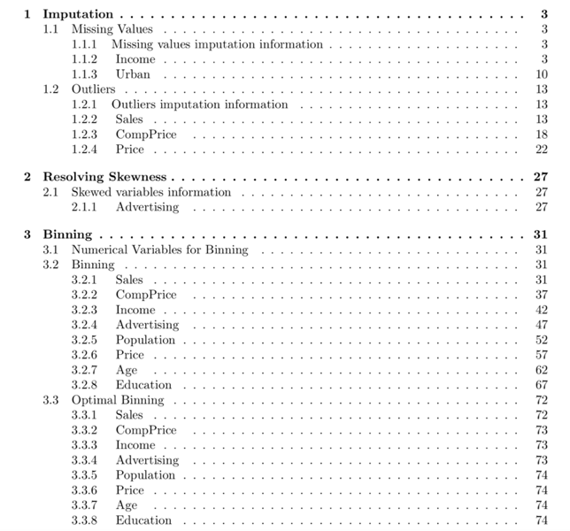
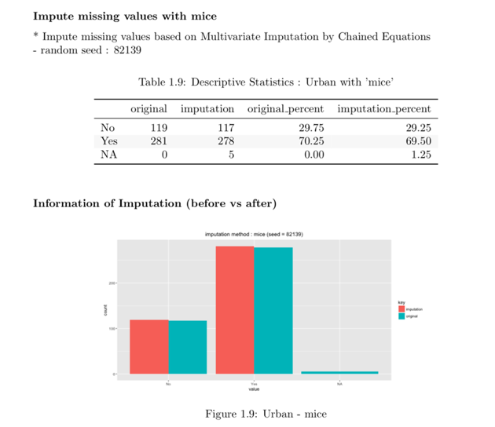
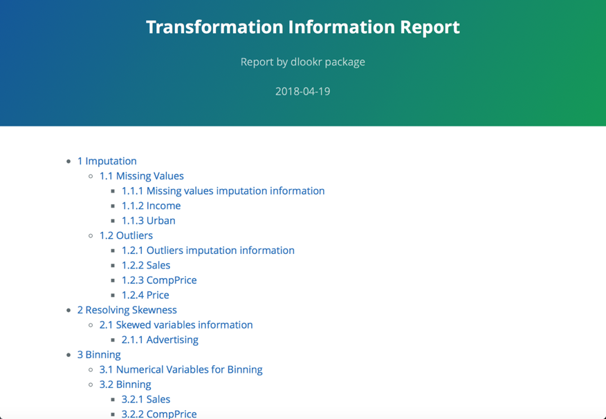
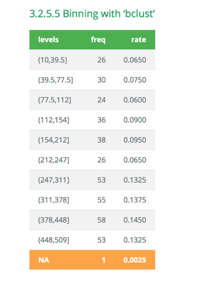
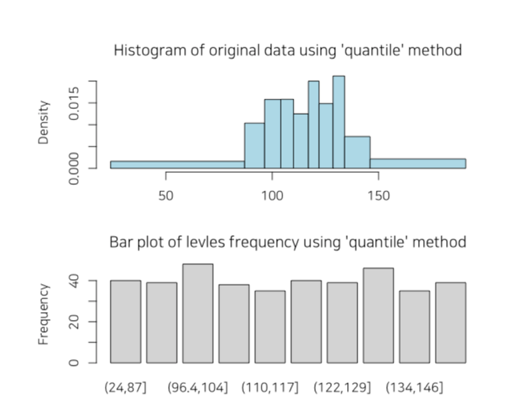

```{r environment, echo = FALSE, message = FALSE, warning=FALSE}
knitr::opts_chunk$set(collapse = TRUE, comment = "")
options(tibble.print_min = 4L, tibble.print_max = 4L)

library(dlookr)
library(dplyr)
library(ggplot2)
```

## 일러두기
분석을 위한 데이터를 획득한 후에는 다음을 수행해야 한다.:

* 데이터의 품질을 진단한다.
    + 만약 데이터 품질의 문제를 발견한다면,
    + 문제의 데이터를 보완하거나 경우에 따라서는 재획득을 수행햐야 한다.
* **데이터를 이해하기 위한 탐색을 수행하여, 분석의 전개 방향에 대한 시나리오를 수립한다.**
* 분석에 효과적인 변수를 파생하거나 변수의 변환을 수행한다.

dlookr 패키지는 다음의 과정을 빠르고 쉽게 수행하도록 도움을 준다.

* 데이터의 진단을 수행하거나 데이터 품질 진단 리포트를 자동으로 생성한다.
* 다양한 방법으로 데이터를 탐색하고 EDA(탐색적 데이터 분석) 보고서를 생성한다.
* **결측치와 이상치를 대체하고, 치우친 데이터를 보정하며, 연속형 변수를 비닝(binning)하여 범주형 변수로 만든다. 그리고 이를 지원하는 자동화된 리포트를 생성한다.**

이 문서는 dlookr 기능 중에서 **데이터 변환** 기능을 소개한다. 여러분은 dlookr에서 제공하는 함수로 데이터 프레임과 데이터 프레임을 상속한 tbl_df 데이터의 데이터 변환을 수행하는 방법을 일힐 수 있을 것이다.

dlookr 패키지는 `dplyr` 패키지와 함께 사용하면 시너지가 증가된다. 특히 데이터 변환에서 `tidyverse` 패키지 그룹의 효율성을 높여준다.

## 데이터
dlookr 패키지로 EDA를 수행하는 기초적인 사용 방법을 설명하기 위해서 `Carseats`를 사용한다.
`ISLR` 패키지의 `Carseats`는 400개의 매장에서 아동용 카시트를 판매하는 시뮬레이션 데이터다. 이 데이터는 판매량을 예측하는 목적으로 생성한 데이터 프레임이다.

```{r import_data}
library(ISLR)
str(Carseats)
```

개별 변수들의 의미는 다음과 같다. (ISLR::Carseats Man page 참고)

* Sales
    + 지역의 단위 판매량 (단위: 천개)
* CompPrice
    + 지역의 경쟁 업체가 부과하는 가격
* Income
    + 지역 공동체 수입 수준 (단위: 천달러)
* Advertising
    + 회사의 지역에 대한 광고 예산 (단위: 천달러)
* Population
    + 지역의 인구 규모 (단위: 천명)
* Price
    + 지역의 자동차 좌석 요금
* ShelveLoc
    + 각 사이트에서 자동차 좌석의 선반 위치의 품질을 나타내는 수준. "Bad", "Good", "Medium".
* Age
    + 각 지역의 평균 연령
* Education
    + 각 지역의 교육 수준
* Urban
    + 점포의 도시 또는 농촌 소재 여부. Yes는 도시, No는 농촌.
* US
    + 점포의 미국 소재 여부. Yes는 미국 소재, No는 미국 외 소재.

데이터 분석을 수행할 때, 결측치가 포함된 데이터를 자주 접한다. 그러나 Carseats는 결측치가 없은 완전한 데이터다. 그래서 다음과 같이 결측치를 생성하였다. 그리고 carseats라는 이름의 데이터 프레임 객체를 생성한다.

```{r missing}
carseats <- ISLR::Carseats

set.seed(123)
carseats[sample(seq(NROW(carseats)), 20), "Income"] <- NA

set.seed(456)
carseats[sample(seq(NROW(carseats)), 10), "Urban"] <- NA
```


## 데이터 변환
dlookr은 결측치와 이상치의 대체, 치우친 데이터를 보정해준다. 또한 연속형 변수를 범주형 변수로 비닝하는 것을 도와준다.

다음은 dlookr이 제공하는 데이터 변환 함수와 함수의 기능 목록이다.:

* `find_na()`는 결측치가 포함된 변수를 찾아주고, `imputate_na()`는 결측치를 대체한다.
* `find_outliers()`는 이상치가 포함된 변수를 찾아주고, `imputate_outlier()`는 이상치를 대체한다.
* `summary.imputation()`와 `plot.imputation()`는 대체된 변수의 정보를 보혀주고 시각화를 제공한다.
* `find_skewness()`는 치우친 데이터의 변수를 찾아주고, `transform()`는 치우친 데이터의 보정을 수행한다.
* 또한 `transform()`는 수치형 변수의 표준화를 수행한다.
* `summary.transform()`와 `plot.transform()`는 변환된 변수의 정보를 보혀주고 시각화를 제공한다.
* `binning()`와 `binning_by()`는 수치 데이터를 비닝하여 범주형 데이터로 변환한다.
* `print.bins()`와 `summary.bins()`는 비닝 결과를 보여주고 요약해 준다.
* `plot.bins()`와 `plot.optimal_bins()`는 비닝 결과의 시각화를 제공한다.
* `transformation_report()`는 데이터 변환을 수행한 후 그 결과를 보고서로 만들어 준다.


## 결측치의 대체
### `imputate_na()`을 이용한 결측치의 대체

`imputate_na()`는 변수에 포함된 결측치를 대체한다. 결측치가 포함된 예측변수(predictor)는 수치형 변수와 범주형 변수 모두 지원하며, 다음과 같은 method를 지원한다.

* predictor가 수치형 변수일 경우
    + "mean" : 산술평균으로 대체
    + "median" : 중위수로 대체
    + "mode" : 최빈수로 대체
    + "knn" : K-nearest neighbors를 이용한 대체
        + target 변수를 지정해야 함
    + "rpart" : Recursive Partitioning and Regression Trees를 이용한 대체
        + target 변수를 지정해야 함    
    + "mice" : Multivariate Imputation by Chained Equations를 이용한 대체
        + target 변수를 지정해야 함
        + random seed를 지정해야 함
* predictor가 범주형 변수일 경우
    + "mode" : 최빈수로 대체
    + "rpart" : Recursive Partitioning and Regression Trees를 이용한 대체
        + target 변수를 지정해야 함    
    + "mice" : Multivariate Imputation by Chained Equations를 이용한 대체
        + target 변수를 지정해야 함    
        + random seed를 지정해야 함

다음처럼 `imputate_na()`는 `carseats`의 수치형 변수인 Income를 "rpart" 방법으로 결측치를 대체한다. `summary()`는 결측치 대체 정보를 요약하고, `plot()`은 결측정보를 시각화한다.

```{r imputate_na, fig.width = 7, fig.height = 4}
income <- imputate_na(carseats, Income, US, method = "rpart")

# result of imputate
income
# summary of imputate
summary(income)
# viz of imputate
plot(income)
```


다음은 범주형 변수인 urban을 "mice" 방법으로 결측치를 대체한다. `summary()`는 결측치 대체 정보를 요약하고, `plot()`은 결측정보를 시각화한다.

```{r imputate_na2, fig.width = 7, fig.height = 4}
library(mice)

urban <- imputate_na(carseats, Urban, US, method = "mice")

# result of imputate
urban
# summary of imputate
summary(urban)
# viz of imputate
plot(urban)
```

### dplyr과의 협업
다음은 dplyr를 이용해서 이상치를 대체한 `Income` 변수를 `US`의 수준별로 산술평균을 구하는 예제다.

```{r imputate_na3}
# The mean before and after the imputation of the Income variable
carseats %>%
  mutate(Income_imp = imputate_na(carseats, Income, US, method = "knn")) %>%
  group_by(US) %>%
  summarise(orig = mean(Income, na.rm = TRUE),
    imputation = mean(Income_imp))
```


## 이상치의 대체
### `imputate_outlier()`을 이용한 이상치의 대체

`imputate_outlier()`는 변수에 포함된 이상치를 대체한다. 이상치가 포함된 예측변수(predictor)는 수치형 변수만 지원하며, 다음과 같은 method를 지원한다.

* predictor가 수치형 변수일 경우
    + "mean" : 산술평균으로 대체
    + "median" : 중위수로 대체
    + "mode" : 최빈수로 대체
    + "capping" : 상위 이상치를 95/백분위수로 대체하고 하위 이상치를 5/백분위수로 대체

다음처럼 `imputate_outlier()`는 `carseats`의 수치형 변수인 `Price`를 "capping" 방법으로 이상치를 대체한다. `summary()`는 이상치 대체 정보를 요약하고, `plot()`은 결측정보를 시각화한다.

```{r imputate_outlier, fig.width = 7, fig.height = 4}
price <- imputate_outlier(carseats, Price, method = "capping")

# result of imputate
price
# summary of imputate
summary(price)
# viz of imputate
plot(price)
```

### dplyr과의 협업
다음은 dplyr를 이용해서 이상치를 대체한 `Price` 변수를 `US`의 수준별로 산술평균을 구하는 예제다.

```{r imputate_outlier2}
# The mean before and after the imputation of the Price variable
carseats %>%
  mutate(Price_imp = imputate_outlier(carseats, Price, method = "capping")) %>%
  group_by(US) %>%
  summarise(orig = mean(Price, na.rm = TRUE),
    imputation = mean(Price_imp, na.rm = TRUE))
```


## 표준화와 치우친 데이터의 보정
### `transform()`의 기능
`transform()`는 변수를 변환한다. 수치형 변수만 지원하며, 다음과 같은 method를 제공한다.

* Standardization
    + "zscore" : z-score transformation. (x - mu) / sigma
    + "minmax" : minmax transformation. (x - min) / (max - min)
* Resolving Skewness
    + "log" : log transformation. log(x)
    + "log+1" : log transformation. log(x + 1). Used for values that contain 0.
    + "sqrt" : square root transformation.
    + "1/x" : 1 / x transformation
    + "x^2" : x square transformation
    + "x^3" : x^3 square transformation

### `transform()`을 이용한 표준화
표준화를 수행하는 method  "zscore"와 "minmax"를 이용한다.

```{r standardization, fig.width = 6, fig.height = 4}
carseats %>% 
  mutate(Income_minmax = transform(carseats$Income, method = "minmax"),
    Sales_minmax = transform(carseats$Sales, method = "minmax")) %>% 
  select(Income_minmax, Sales_minmax) %>% 
  boxplot()
```

### `transform()`을 이용한 치우친 데이터의 보정
`find_skewness()`는 치우친 데이터를 찾기 위해서 왜도를 구한다.

```{r resolving1}
# find index of skewed variables
find_skewness(carseats)

# find names of skewed variables
find_skewness(carseats, index = FALSE)

# compute the skewness
find_skewness(carseats, value = TRUE)

# compute the skewness & filtering with threshold
find_skewness(carseats, value = TRUE, thres = 0.1)
```

`Advertising`의 왜도가 0.637로 좌측으로 어느정도 기울어져 있어서 다음처럼 `transformation()`를 이용해서 "log" 방법으로 변환한다. `summary()`는 변환정보를 요약하고, `plot()`은 변환정보를 시각화한다.

```{r resolving2, fig.width = 7, fig.height = 4}
Advertising_log = transform(carseats$Advertising, method = "log")

# result of transformation
head(Advertising_log)
# summary of transformation
summary(Advertising_log)
# viz of transformation
plot(Advertising_log)
```

log 변환된 값에 -Inf가 포함되어 있는 것으로 보아 원 데이터에 0이 포함되어 있는 듯하다. 그래서 이번에는 "log+1" 방법으로 변환한다.

```{r resolving3, fig.width = 7, fig.height = 4}
Advertising_log = transform(carseats$Advertising, method = "log+1")

# result of transformation
head(Advertising_log)
# summary of transformation
summary(Advertising_log)
# viz of transformation
plot(Advertising_log)
```

## Binning
### `binning()`을 이용한 개별 변수의 Binning

`binning()`는 수치형 변수를 비닝하여 범주형 변수로 변환한다. 다음과 같은 type의 비닝을 지원한다.

* "quantile" : 동일한 돗수가 포함되도록 quantile을 이용하여 범주화
* "equal" : 동일한 길이의 구간을 갖도록 범주화
* "pretty" : 적당히 보기 좋은 구간으로 범주화
* "kmeans" : K-means clustering 기법을 이용한 범주화
* "bclust" : Bagged clustering 기법을 이용한 범주화

`binning()`을 이용하여 `Income`을 비닝하는 몇 가지의 방법을 예시한다.

```{r binning, fig.width = 6, fig.height = 5}
# Binning the carat variable. default type argument is "quantile"
bin <- binning(carseats$Income)
# Print bins class object
bin
# Summarise bins class object
summary(bin)
# Plot bins class object
plot(bin)
# Using labels argument
bin <- binning(carseats$Income, nbins = 4,
              labels = c("LQ1", "UQ1", "LQ3", "UQ3"))
bin
# Using another type argument
binning(carseats$Income, nbins = 5, type = "equal")
binning(carseats$Income, nbins = 5, type = "pretty")
binning(carseats$Income, nbins = 5, type = "kmeans")
binning(carseats$Income, nbins = 5, type = "bclust")

# -------------------------
# Using pipes & dplyr
# -------------------------
library(dplyr)

carseats %>%
 mutate(Income_bin = binning(carseats$Income)) %>%
 group_by(ShelveLoc, Income_bin) %>%
 summarise(freq = n()) %>%
 arrange(desc(freq)) %>%
 head(10)
```
    
### `binning_by()`을 이용한 Optimal Binning

`binning_by()`는 수치형 변수를 Optimal Binning하여 범주형 변수로 변환한다. 이 방법은 `스코어카드 모형`을 개발할때 자주 사용하는 방법이다.

다음의 `binning_by()` 예제는 `US`가 binary class를 갖는 target 변수일 경우에 `Advertising`를 Optimal Binning하는 방법의 예시다.

```{r binning_by, fig.width = 6, fig.height = 5}
# optimal binning
bin <- binning_by(carseats, "US", "Advertising")
bin

# summary optimal_bins class
summary(bin)

# information value 
attr(bin, "iv")

# information value table
attr(bin, "ivtable")

# visualize optimal_bins class
plot(bin, sub = "bins of Advertising variable")
```


## `transformation_report()`를 이용한 데이터변환 보고서 작성
`transformation_report()`는 데이터 프레임이나 데이터 프레임을 상속받은 객체(`tbl_df`, `tbl` 등)의 모든 변수들에 대해서 데이터변환 보고서를 작성한다.

`transformation_report()`는 데이터변환 보고서를 다음과 같은 두 개의 형태로 작성한다.

* Latex에 기반한 pdf 파일
* html 파일

보고서의 목차는 다음과 같다.

* Imputation
    + Missing Values
        + Missing values imputation information
        + (variable names)
    + Outliers
        + Outliers imputation information
        + (variable names)
* Resolving Skewness
    + Skewed variables information
        + (variable names)
* Binning
    + Numerical Variables for Binning
    + Binning
        + (variable names)
    + Optimal Binning
        + (variable names)

다음은 `carseats`의 데이터변환 보고서를 작성한다. 파일 형식은 pdf이며, 파일이름은 `Transformation_Report.pdf`다.

```{r trans_report, eval=FALSE}
carseats %>%
  transformation_report(target = US)
```

다음은 `transformation.html`라는 이름의 html 형식의 보고서를 생성한다.

```{r, eval=FALSE}
carseats %>%
  transformation_report(target = US, output_format = "html", 
    output_file = "transformation.html")
```

데이터변환 보고서는 데이터 변환 과정에 도움을 주기 위한 자동화 보고서다. 보고서 결과를 참고하여 데이터 변환 시나리오를 설계한다.

### 데이터변환 리포트 내용
#### pdf 파일의 내용
* 보고서의 표지는 다음 그림과 같다.

```{r trans_title_pdf, echo=FALSE, out.width='70%', fig.align='center', fig.pos="!h", fig.cap="데이터변환 보고서 표지"}
knitr::include_graphics('img/trans_title_pdf.png')
```

* 보고서의 차례는 다음 그림과 같다.

```{r trans_agenda_pdf, echo=FALSE, out.width='70%', fig.align='center', fig.pos="!h", fig.cap="데이터변환 보고서 차례"}

```

* 많은 정보는 보고서에서 표와 시각화 결과로 표현된다. 예시는 다음 그림과 같다.

```{r trans_content_pdf, echo=FALSE, out.width='70%', fig.align='center', fig.pos="!h", fig.cap="데이터변환 보고서 도표 및 시각화 예시"}

```

#### html 파일의 내용
* 보고서의 타이틀과 목차는 다음 그림과 같다.

```{r trans_agenda_html, echo=FALSE, out.width='80%', fig.align='center', fig.pos="!h", fig.cap="데이터변환 보고서 타이틀과 목차"}

```

* 많은 정보는 보고서에서 표로 표현된다. html 파일에서 표의 예시는 다음 그림과 같다.

```{r trans_table_html, echo=FALSE, out.width='50%', fig.align='center', fig.pos="!h", fig.cap="데이터변환 보고서 도표 예시 (웹)"}

```

* 데이터변환 보고서에서 Binning 정보는 시각화 결과를 포함한다. html 파일의 결과는 다음 그림과 같다.

```{r trans_viz_html, echo=FALSE, out.width='75%', fig.align='center', fig.pos="!h", fig.cap="데이터변환 보고서 Binning 정보 (웹)"}

```


